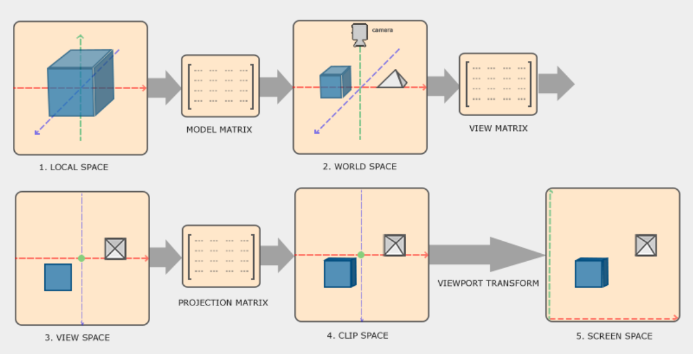

# 2. Vertex Shader
가상의 3D 공간에 있는 꼭지점(vertex)들의 위치를 2차원 화면의 좌표로 변환하는 작업을 수행

---

# Vertex Shader Overview
버텍스 쉐이더의 흐름

---

1. **로컬 좌표(local coordinates)** 
    - 오브젝트의 로컬 원점(local origin)을 기준으로 한 좌표를 의미
    - 오브젝트가 처음 위치하는 좌표계
2. **월드 좌표(World-space coordinates)**
   - 더 큰 세계의 글로벌 원점(global origin)을 기준으로 한 좌표
   - 여러 오브젝트들이 모두 이 원점을 기준으로 위치함
3. **뷰 공간 좌표 (view-space coordinates)**
   - 카메라나 뷰어의 시점에서 바라본 좌표
4. **클립 좌표(clip coordinates)**
   - `-1.0` 과 `1.0` 범위로 정규화된 좌표
   - 어떤 버텍스가 화면에 나타날지 결정하는 역할을 한다
5. **스크린 좌표(screen coordinates)**
   - Viewport 
   - 에서 정의한 화면 좌표계 범위로 변환된 좌표

---

# 좌표 변환 과정
## Object Space → World Space

**참고 링크**
- [learnopengl : CoordinateSystems](https://learnopengl.com/Getting-started/Coordinate-Systems)
- [songho.ca : gl_transform](https://www.songho.ca/opengl/gl_transform.html)