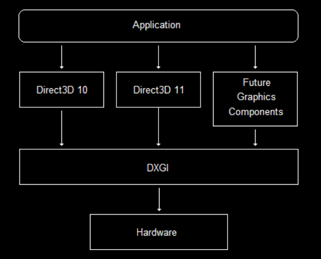

# 2. Direct3D Getting Started

---

# Understanding Graphics Concepts

---

## Graphics Hardware
- CPU : 계산을 수행하고 컴퓨터 전체를 제어
- GPU : GPU는 그래픽/병렬 연산을 수행하고, 결과를 프레임버퍼에 기록하고 출력은 OS/드라이버/디스플레이엔진을 통해 전송
> - CPU가 GPU를 지휘한다

{: width="80%" height="80%"}

- GPU는 별도의 프로세서를 가지며 비디오 메모리라는 분리된 메모리 영역을 사용함
- 비디오 메모리
  - 비디오 카드에 위치하여 GPU가 빠르게 접근 가능
  - 비디오 메모리는 화면에 표시되는 현재 이미지를 저장한다
  - 비디오 메모리는 다음 이미지를 생성하는데 사용될 수 있는 데이터도 저장한다

---

## DirectX Graphics Infrastructure (DXGI)
Direct3D가 GPU와 효율적으로 통신할 수 있게 관리하는 Microsoft의 API

{: width="70%" height="70%"}

### 주요 역할
1. **스왑 체인(SwapChain) 관리**
    - 더블/트리플 버퍼링을 지원하여 화면 깜빡임을 줄이고 부드러운 렌더링을 가능하게 함
2. **디스플레이 모드 및 출력 관리**
    - 연결된 모니터의 해상도, 새로 고침 빈도, 픽셀 형식(RGB, YUV 등) 등을 설정/조회
    - `IDXGIOutput`을 통해 다중 모니터 환경을 지원
3. **하드웨어 어댑터(GPU) 정보 조회**
    - 시스템에 설치된 GPU(`IDXGIAdapter`)를 열거하고, VRAM 크기, 지원 기능 등을 확인
        - 예: NVIDIA/AMD/Intel GPU 식별
4. **리소스 공유 및 형식 호환성**
    - Direct3D 리소스(텍스처, 버퍼 등)를 다른 API(예: Direct2D) 또는 프로세스 간에 공유할 수 있게 함
    - `DXGI_FORMAT`으로 픽셀 데이터 형식을 표준화
5. **HDR 및 고급 출력 기능 지원**
    - HDR(`High Dynamic Range`) 및 Wide Color Gamut 출력 관리

---

## SwapChain (스왑 체인)
GPU가 렌더링한 프레임을 모니터에 안정적으로 출력하기 위한 버퍼 관리 시스템
- 티어링 현상을 방지할 수 있다

{: .new-title}
> ❓티어링이 뭐야?
>
- 화면에 두 개 이상의 프레임이 동시에 나타나며 이미지가 찢어져 보이는 현상
- GPU가 모니터의 갱신 주기와 맞지 않게 프레임을 빠르게 생성하면, 모니터가 화면을 업데이트하는 도중에 새로운 프레임이 전송됨
- 결과 : 상반부는 이전 프레임, 하반부는 새 프레임으로 표시되며 "찢어진" 화면이 나타남

 

{: width="60%" height="60%"}

1. DXGI는 새 이미지를 모니터에 직접 렌더링 하지 않는다
    - 이미지를 백 버퍼라고 하는 보조 픽셀 버퍼에 그린다
2. 프런트 버퍼는 현재 모니터에 표시되고 있는 이미지 버퍼이다
    - 모든 이미지를 백 버퍼에 그려 작업이 완료되면
    - DXGI는 백 버퍼의 내용으로 프런트 버퍼를 업데이트하고 이전 이미지는 삭제한다
3. DXGI는 각 버퍼 (프런트 버퍼와 백 버퍼 모두)의 포인터 교체(Flip)로 구현하여 값을 간단히 바꾼다
    - 백 버퍼가 프런트 버퍼가 되고 (또는 그 반대가 될 수도 있다) 이는 티어링 발생을 방지한다

---

## Primitives topology
- 버퍼에 있는 버텍스 데이터를 어떻게 연결하여 어떤 형태로 구성할것인지 정의하는 규칙
- Input Assembler (IA) 단계에서 토폴로지 규칙을 설정하여 GPU에게 정점들을 어떻게 묶어 도형으로 변환할지 지시함
- 실제 프리미티브로 묶이는 것은 Vertex Shader 처리 후 래스터라이저 직전 단계에서 이루어진다

## primitive topology 유형
### 1. Point Lists
- 정점을 개별 점으로 렌더링
- 사용 예시 : 파티클 효과, 별빛 표현

{: width="60%" height="60%"}

### 2. Line Lists
- 정점을 2개씩 묶어 독립적인 선분으로 렌더링
- 정점 개수는 반드시 짝수여야 한다
- 사용 예시 : 와이어 프레임 모델, 그리드 표시

{: width="60%" height="60%"}

### 3. Line Strips
- 연속된 정점을 이어 하나의 폴리라인(Polyline)으로 렌더링
- 정점 n개는 n-1개의 선분을 생성한다
- 사용 예시 : 경로 추적

{: width="60%" height="60%"}

### 4. Triangle Lists
- 정점을 3개씩 묶어 독립적인 삼각형으로 렌더링
- 정점 개수는 3의 배수여야 함
- 사용 예시 : 폭발, 물체 조각 맞추기 등 다양한 효과

{: width="60%" height="60%"}

### 5. Triangle Strips
- 서로 연결된 일련의 삼각형을 생성
- 정점 n개 → n-2개의 삼각형 생성
- 사용 예시 : 게임의 3D 모델

{: width="60%" height="60%"}

---

## Backface Culling
- 3D 모델은 대부분 닫힌 메쉬(Closed Mesh)로 구성됨
- 즉, 내부는 보이지 않으므로 불필요한 내부 면 렌더링을 생략
    - 예: 큐브의 안쪽 면, 구의 내부는 그리지 않음

{: width="60%" height="60%"}

> 따라서 삼각형을 그릴 때 정점이 시계방향 (CW)인 경우 렌더링 (첫번째 삼각형)
> - 반시계 방향인 경우 렌더링하지 않음 (두번째 삼각형)

- D3D는 기본이 CW, OpenGL은 기본이 CCW

### Backface Culling 으로 인한 문제
- 평면이나 원판 등 한쪽 면만 있는 오브젝트는 뒤집히면 사라짐 (뒷면이 렌더링 되지 않기 때문)

### 해결 방법
1. 백페이스 컬링 비활성화
    - 간단하지만 비효율적
2. 양면 메쉬 생성
    - 정점 순서를 뒤집은 복사본을 추가한다
3. 셰이더에서 강제 렌더링
    - 프래그먼트 셰이더에서 뒷면을 강제로 색상 지정하는 경우

