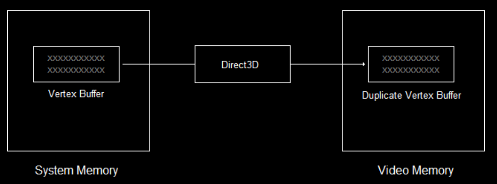

# 6. Drawing a Triangle
삼각형 그리기 과정

1. GPU에게 기하학을 렌더링하는 방법을 알려주기
2. 삼각형의 세 꼭짓점을 생성하기
3. 이 꼭짓점을 비디오 메모리에 저장하기
4. GPU에게 이 꼭짓점을 읽는 방법을 알려주기
5. 삼각형 렌더링하기

---

## Using Shaders
렌더링 과정은 렌더링 파이프라인에 의해 제어된다
- 하지만 파이프라인은 무엇을 해야할지 자동으로 알지 못한다
- 셰이더 프로그래밍을 통해 파이프라인을 제어할 수 있다

> 셰이더에는 여러 유형이 있고, 렌더링 중 여러 번 실행된다
> - 정점 셰이더 : 렌더링 되는 각 정점에 대해 한번씩 실행되는 프로그램
> - 픽셀 셰이더 : 그려지는 각 픽셀에 대해 실행되는 프로그램

### 셰이더 로딩하기
1. `.shader` 파일에서 두 개의 셰이더를 로드하고 컴파일
2. 두 개의 셰이더를 셰이더 객체로 캡슐화
3. 두 개의 셰이더를 모두 활성 셰이더로 설정하기

---

## `.shader` 파일에서 셰이더 로드
`D3DX11CompileFromFile()` 함수를 통해 셰이더를 로드하고 컴파일 한다

```c++
HRESULT D3DX11CompileFromFile(
    LPCTSTR pSrcFile,                // 코드가 포함된 파일
    D3D10_SHADER_MACRO *pDefines,    // 고급 설정
    LPD3D10INCLUDE pInclude,         // 고급 설정
    LPCSTR pFunctionName,            // 셰이더의 시작 함수 이름
    LPCSTR pProfile,                 // 셰이더 프로파일
    UINT Flags1,                     // 고급 설정
    UINT Flags2,                     // 고급 설정
    ID3DX11ThreadPump *pPump,        // 고급 설정
    ID3D10Blob **ppShader,           // 컴파일된 셰이더를 포함하는 블롭
    ID3D10Blob **ppErrorMsgs,        // 고급 설정
    HRESULT *pHResult);              // 고급 설정
```

- `blob` : Binary Large Object의 약자로, 텍스트 또는 이진 데이터를 포함하는 큰 객체를 의미함
    - 주로 DB나 파일 시스템에서 사용함

- **LPCSTSTR pSrcFile**
  - 컴파일 되지 않은 셰이더 코드가 포함된 파일의 이름
- **LPCSTR pFunctionName**
  -  셰이더의 이름
  -  셰이더는 특정 함수로 시작하며 이 함수가 셰이더의 이름으로 간주됨
- **LPCSTR pProfile**
  - 컴파일러에게 컴파일할 셰이더의 유형과 셰이더 버전을 알려주는 코드
  - 예 : `vs_4_0`
    - v : 정점 (p : 픽셸)
    - s : 셰이더
    - _4_4 : HLSL 버전 4.0 
- **ID3D10Blob **ppShader**
  - 블롭 객체에 대한 포인터
  - 해당 객체에는 셰이더의 컴파일된 코드가 저장됨
  - 데이터 버퍼를 저장하는 COM 객체이다
  - `GetBufferPointer()`와 `GetBufferSize()` 함수를 사용하여 내용에 접근할 수 있다

<br>

```c++

void InitPipeline()
{
	// 셰이더를 로드하고 컴파일
	ID3DBlob* VS = nullptr, * PS = nullptr;
	ID3DBlob* errorBlob = nullptr;

	// 버텍스 쉐이더 컴파일
	HRESULT hr = D3DCompileFromFile(
		L"shaders.shader",
		nullptr,
		nullptr,
		"VShader", // 버텍스 쉐이더
		"vs_4_0",
		D3DCOMPILE_ENABLE_STRICTNESS,
		0,
		&VS,
		&errorBlob
	);

	// 픽셀 쉐이더 컴파일
	hr = D3DCompileFromFile(
		L"shaders.shader",
		nullptr,
		nullptr,
		"PShader", // 픽셀 셰이더
		"ps_4_0",
		D3DCOMPILE_ENABLE_STRICTNESS,
		0,
		&PS,
		&errorBlob
	);

	if (errorBlob) {
		OutputDebugStringA((char*)errorBlob->GetBufferPointer());
		errorBlob->Release();
	}
}
```

---

## 셰이더를 셰이더 객체로 캡슐화
- 각 셰이더는 자체 COM 객체에 저장된다
  - `ID3D11_____Shader`

```c++
// 쉐이더 전역 선언
ID3D11VertexShader* pVS; // 버텍스 셰이더
ID3D11PixelShader* pPS; // 픽셀 셰이더
```

<br>

```c++
void InitPipeline()
{
	// 셰이더를 로드하고 컴파일
	// 버텍스 쉐이더 컴파일
	// 픽셀 쉐이더 컴파일

    // ...

	// 셰이더 객체로 캡슐화
	dev->CreateVertexShader(VS->GetBufferPointer(), VS->GetBufferSize(), NULL, &pVS);
	dev->CreatePixelShader(PS->GetBufferPointer(), PS->GetBufferSize(), NULL, &pPS);
}
```

- 셰이더를 객체로 캡슐화 하기
- `dev->Create_____Shader()` 함수 사용
  - 첫 번째 매개변수 : 컴파일된 데이터의 주소
  - 두 번째 매개변수 : 파일 데이터의 크기
  - 세 번째 매개변수 : 고급 설정이므로 나중에 다루기
  - 네 번째 매개변수 : 셰이더 객체의 주소

---

## 셰이더를 활성 셰이더로 설정하기

```c++
void InitPipeline()
{
	// 셰이더를 로드하고 컴파일
	// 버텍스 쉐이더 컴파일
	// 픽셀 쉐이더 컴파일

    //...

	// 셰이더 객체로 캡슐화

    devcon->VSSetShader(pVS, 0, 0);
	devcon->PSSetShader(pPS, 0, 0);
}
```

- `devcon->___SetShader()` 함수 사용
  - 첫 번째 매개변수 : 설정할 셰이더 객체의 주소
  - 두, 세번째 매개변수 : 고급 설정이므로 나중에 다루기

위 과정을 통해 GPU가 렌더링을 준비하도록 한다

---

# Vertex Buffers
Direct3D에서는 입력 레이아웃 (input layout) 이라는 개념을 사용한다
- 입력 레이아웃 : 버텍스가 어떤 식으로 메모리에 저장돼 있는지를 기술하는 데이터 형식 정의서

버텍스 하나는 일반적으로 구조체로 정의되며, 구조체 안에는 모델을 렌더링하는 데 필요한 모든 정보가 들어 있다
- 입력 레이아웃을 이용하면 사용할 필드만 추려서 데이터를 작게 만들어 GPU로 보내도록 최적화할 수 있다

---

## Creating Vertices

정점 구조체를 사용하여 원하는 데이터를 저장하기

```c++
struct VERTEX 
{ 
      FLOAT X, Y, Z; // 위치 
      D3DXCOLOR Color; // 색상 
};

VERTEX OurVertex = {0.0f, 0.5f, 0.0f, D3DXCOLOR(1.0f, 0.0f, 0.0f, 1.0f)};
```

- 정점 배열 만들기

```c++
VERTEX OurVertices[] =
{
    {0.0f, 0.5f, 0.0f, D3DXCOLOR(1.0f, 0.0f, 0.0f, 1.0f)},
    {0.45f, -0.5, 0.0f, D3DXCOLOR(0.0f, 1.0f, 0.0f, 1.0f)},
    {-0.45f, -0.5f, 0.0f, D3DXCOLOR(0.0f, 0.0f, 1.0f, 1.0f)}
};
```

---

## Creating a Vertex Buffer
비디오 메모리에 접근할 수 있도록 direct3D는 시스템 메모리와 비디오 메모리 모두에 버퍼를 유지할 수 있는 COM 객체를 제공한다

1. 처음엔 버퍼의 데이터가 시스템 메모리에 저장된다
2. 렌더링 시 해당 버퍼가 필요하면 direct3D가 자동으로 비디오 메모리에 데이터를 복샇나다
3. 비디오 카드의 메모리가 부족해지면 direct3D는 우선순위가 낮은 버퍼를 삭제하여 리소스를 확보한다

{: width="90%" height="90%"}

{: .new-title}
> ❓ direct3D가 비디오 메모리 관리를 대신 해주는 이유?
>
- 비디오 카드와 운영 체제 버전에 따라 비디오 메모리 접근 방식이 다르기 때문
  - GPU : GPU 마다 VRAM을 보는 방식이 제각각
  - Windows : OS 버전이 달라질 때마다 메모리 관리 규칙이 달라짐
  - → Direct3D가 표준화된 가상 VRAM을 제공하여 애플리케이션은 CreateBuffer/Draw 같은 고수준 호출만 신경 쓰면 됨

<br>

- `CreateBuffer()` 함수로 `ID3D11Buffer` COM 객체 생성하기

```c++
ID3D11Buffer* pVBuffer; 

D3D11_BUFFER_DESC bd;
ZeroMemory(&bd, sizeof(bd));

bd.Usage = D3D11_USAGE_DYNAMIC; // CPU와 GPU가 쓰기 액세스 가능
bd.ByteWidth = sizeof(VERTEX) * 3; // 크기는 VERTEX 구조체의 3배
bd.BindFlags = D3D11_BIND_VERTEX_BUFFER; // 버텍스 버퍼로 사용
bd.CPUAccessFlags = D3D11_CPU_ACCESS_WRITE; // CPU가 버퍼에 쓰기 허용

dev->CreateBuffer(&bd, NULL, &pVBuffer); // 버퍼 생성
```

- **D3D11_BUFFER_DESC bd**
  - 버퍼의 속성을 담고 있는 구조체
- **bd.Usage = D3D11_USAGE_DYNAMIC**
  - 버퍼에 어떻게 액세스할 것인지 설정

|flag|CPU Access|GPU Access|
D3D11_USAGE_DEFAULT	| None	| Read / Write| 
DXD11_USAGE_IMMUTABLE	| None| 	Read Only| 
DXD11_USAGE_DYNAMIC	| Write Only| 	Read Only| 
DXD11_USAGE_STAGING	| Read / Write| 	Read / Write|

- **bd.ByteWidth**
  - 생성될 버퍼의 크기
  - 우리가 버퍼에 넣을 정점 배열의 크기와 같음 
- **bd.BindFlags**
  - direct3D에 어떤 종류의 버퍼를 만들것인지 알림
- **bd.CPUAccessFlags**
   - direct3D에 CPU 접근 방식 알림
   - 시스템 메모리에서 버퍼로 데이터를 복사하려고 하므로 `D3D11_CPU_ACCESS_WRITE` 사용함
- **dev->CreateBuffer(&bd, NULL, &pVBuffer)**
  - 버퍼 생성 함수
  - 첫 번째 매개변수 : 버퍼 속성 구조체의 주소
  - 두 번째 매개변수 : 버퍼 생성 시 특정 데이터로 초기화하는데 사용
  - 세 번째 매배견수 : 버퍼 객체의 주소

---

## Filling the Vertex Buffer
direct3D는 **버퍼에 대한 직접적인 CPU 액세스를 허용하지 않는다**
- CPU가 데이터를 쓸 때 GPU가 사용 중인 메모리를 건드리지 않도록 데이터 경쟁을 방지하기 위함
- 따라서 direct3D는 **Map/Unmap을 통해 메모리 접근을 중재**한다

---

## Map/Unmap 작동 과정
1. **Map (매핑)**
   - CPU가 GPU의 리소스(예: 버퍼)에 접근할 수 있도록 임시 권한을 얻는 과정
     - `ID3D11DeviceContext::Map()` 함수 호출
   - GPU가 해당 리소스를 사용 중인 경우, 명령 큐가 비워질 때까지 대기
   - 명령 큐가 비워지면 CPU가 접근할 수 있는 포인터를 반환 (이 포인터로 버퍼 읽기/쓰기 가능)
     - 이때, GPU는 해당 리소스에 대한 접근을 잠시 중지함
2. **데이터 수정**
   - 반환된 포인터로 CPU가 직접 데이터를 수정합니다 (예: 정점 데이터 업데이트, 상수 버퍼 값 변경)
3. **Unmap (언매핑)**
	- `ID3D11DeviceContext::Unmap()` 함수 호출
	- CPU의 수정 사항이 리소스에 반영되고, GPU가 다시 해당 리소스를 사용할 수 있게됨
	- 필요에 따라 DMA(Direct Memory Access)를 통해 데이터가 GPU 메모리로 복사됨

해당 과정을 통해 CPU와 GPU 간의 안전한 데이터 교환이 가능하다

### 핵심
- **Map** : CPU가 수정 가능한 메모리 블록(원본 또는 임시)을 확보하고, GPU가 그 블록을 잠시 건드리지 못하도록 예약함
- **Unmap** : CPU 수정이 끝났음을 알리고, 필요 시 DMA 복사 후 GPU 접근을 재개

---

## 버퍼의 메모리 위치
버퍼의 실제 물리적 위치는 생성 시 지정한 `D3D11_USAGE` 플래그에 의해 결정됨

1. **DEFAULT 버퍼 (GPU 전용 메모리)**
   - 위치 : 오직 비디오 메모리(VRAM)에만 존재
   - CPU 접근 : 불가능 (D3D11_CPU_ACCESS_FLAG 없음)
   - Map/Unmap : 불가능
     - 대신 `CopyResource()` 또는 `UpdateSubresource()`로 데이터를 복사해야 함
   - 용도 : 자주 변경되지 않는 정적 데이터 (예: 월드 지오메트리)
2. **DYNAMIC 버퍼 (CPU ↔ GPU 공유)**
   - 위치: 시스템 메모리(RAM) + 비디오 메모리(VRAM)의 사본
     - 내부적으로 쓰기 가능한 GPU 메모리 영역이 할당됨
     - Map/Unmap 시 CPU가 시스템 메모리에 쓰고, 필요 시 GPU로 복사
   - CPU 접근: 쓰기 전용 (D3D11_CPU_ACCESS_WRITE)
   - Map/Unmap: 가능
     - Map() 시 반환되는 포인터는 시스템 메모리를 가리킴
     - Unmap() 후 드라이버/GPU가 필요 시 VRAM으로 복사
   - 용도: 프레임마다 자주 업데이트되는 데이터 (예: 애니메이션 정점 데이터)

이 외에도 `IMMUTABLE`, `STAGING` 도 있음

- **IMMUTABLE** : 생성 시 데이터 한 번 채우고 이후 불변, CPU 접근 불가 (텍스처 룩업 테이블 등)
- **STAGING** : GPU ↔ CPU 복사 전용 창고. Map(READ/WRITE) 모두 허용, 바인드플래그 없음

---

```c++
D3D11_MAPPED_SUBRESOURCE ms;
devcon->Map(pVBuffer, NULL, D3D11_MAP_WRITE_DISCARD, NULL, &ms); // 버퍼 매핑
memcpy(ms.pData, OurVertices, sizeof(OurVertices)); // 데이터 복사
devvcon->Unmap(pVBuffer, NULL); // 버퍼 매핑 해제
```

- **D3D11_MAPPED_SUBRESOURCE ms**
  - 버퍼 매핑 시 버퍼에 대한 정보로 채워지는 구조체
  - 버퍼의 위치에 대한 포인터가 포함
  - `ms.pData`를 통해 포인터에 접근 가능
- **devcon->Map()**
  - 버퍼를 매핑하여 CPU의 접근을 허용함
  - 첫 번째 매개변수 : 버퍼 객체의 주소
  - 두 번째 매개변수 : 고급 설정. 나중에 살펴보기
  - 세 번째 매개변수 : 매핑되는 동안 CPU의 버퍼 접근을 제어할 수 있는 플래그 집합

|플래그|	설명|
D3D11_MAP_READ|	버퍼는 CPU에서만 읽음|
DXD11_MAP_WRITE|	버퍼는 CPU에서만 쓸 수 있음|
DXD11_MAP_READ_WRITE	|버퍼는 CPU에 의해 읽혀지고 쓰여질 수 있음|
DXD11_MAP_WRITE_DISCARD	|버퍼의 이전 내용은 지워지고, 쓰기를 위해 새로운 버퍼가 열림|
DXD11_MAP_WRITE_NO_OVERWRITE | GPU가 파트를 사용 중일 때에도 버퍼에 더 많은 데이터를 추가할 수 있는 고급 플래그. 단, GPU가 사용 중인 파트를 사용해서는 안 됨|

  - 네 번째 매개변수 : GPU의 버퍼 작업을 어떻게 할지 결정하는 플래그
    - `NULL` 또는 `D3D11_MAP_FLAG_DO_NOT_WAIT` 선택
    - `D3D11_MAP_FLAG_DO_NOT_WAIT` :  GPU가 버퍼 작업을 계속 진행 중이더라도 프로그램을 계속 진행하도록 강제
  - 다섯 번째 매개변수 : `D3D11_MAPPED_SUBRESOURCE` 구조체 주소
    - 해당 구조체를 채워 필요한 정보를 제공함 
- **memcpy()**
  - 버텍스(`OurVertices`)의 값을 목적지 (`ms.pData`)로 카피
- **devcon->Unmap()**
  - 버퍼 매핑 해제
  - GPU가 버퍼에 다시 접근 가능
  - CPU 접근은 다시 차단됨

---

