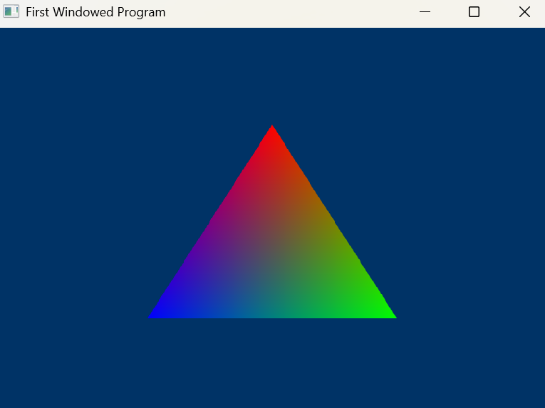

# 6. Drawing a Triangle
삼각형 그리기 과정

1. GPU에게 기하학을 렌더링하는 방법을 알려주기
2. 삼각형의 세 꼭짓점을 생성하기
3. 이 꼭짓점을 비디오 메모리에 저장하기
4. GPU에게 이 꼭짓점을 읽는 방법을 알려주기
5. 삼각형 렌더링하기

---

## Using Shaders
렌더링 과정은 렌더링 파이프라인에 의해 제어된다
- 하지만 파이프라인은 무엇을 해야할지 자동으로 알지 못한다
- 셰이더 프로그래밍을 통해 파이프라인을 제어할 수 있다

> 셰이더에는 여러 유형이 있고, 렌더링 중 여러 번 실행된다
> - 정점 셰이더 : 렌더링 되는 각 정점에 대해 한번씩 실행되는 프로그램
> - 픽셀 셰이더 : 그려지는 각 픽셀에 대해 실행되는 프로그램

### 셰이더 로딩하기
1. `.shader` 파일에서 두 개의 셰이더를 로드하고 컴파일
2. 두 개의 셰이더를 셰이더 객체로 캡슐화
3. 두 개의 셰이더를 모두 활성 셰이더로 설정하기

---

## `.shader` 파일에서 셰이더 로드
`D3DX11CompileFromFile()` 함수를 통해 셰이더를 로드하고 컴파일 한다

```c++
HRESULT D3DX11CompileFromFile(
    LPCTSTR pSrcFile,                // 코드가 포함된 파일
    D3D10_SHADER_MACRO *pDefines,    // 고급 설정
    LPD3D10INCLUDE pInclude,         // 고급 설정
    LPCSTR pFunctionName,            // 셰이더의 시작 함수 이름
    LPCSTR pProfile,                 // 셰이더 프로파일
    UINT Flags1,                     // 고급 설정
    UINT Flags2,                     // 고급 설정
    ID3DX11ThreadPump *pPump,        // 고급 설정
    ID3D10Blob **ppShader,           // 컴파일된 셰이더를 포함하는 블롭
    ID3D10Blob **ppErrorMsgs,        // 고급 설정
    HRESULT *pHResult);              // 고급 설정
```

- `blob` : Binary Large Object의 약자로, 텍스트 또는 이진 데이터를 포함하는 큰 객체를 의미함
    - 주로 DB나 파일 시스템에서 사용함

- **LPCSTSTR pSrcFile**
  - 컴파일 되지 않은 셰이더 코드가 포함된 파일의 이름
- **LPCSTR pFunctionName**
  -  셰이더의 이름
  -  셰이더는 특정 함수로 시작하며 이 함수가 셰이더의 이름으로 간주됨
- **LPCSTR pProfile**
  - 컴파일러에게 컴파일할 셰이더의 유형과 셰이더 버전을 알려주는 코드
  - 예 : `vs_4_0`
    - v : 정점 (p : 픽셸)
    - s : 셰이더
    - _4_4 : HLSL 버전 4.0 
- **ID3D10Blob **ppShader**
  - 블롭 객체에 대한 포인터
  - 해당 객체에는 셰이더의 컴파일된 코드가 저장됨
  - 데이터 버퍼를 저장하는 COM 객체이다
  - `GetBufferPointer()`와 `GetBufferSize()` 함수를 사용하여 내용에 접근할 수 있다

<br>

```c++

void InitPipeline()
{
	// 셰이더를 로드하고 컴파일
	ID3DBlob* VS = nullptr, * PS = nullptr;
	ID3DBlob* errorBlob = nullptr;

	// 버텍스 쉐이더 컴파일
	HRESULT hr = D3DCompileFromFile(
		L"shaders.shader",
		nullptr,
		nullptr,
		"VShader", // 버텍스 쉐이더
		"vs_4_0",
		D3DCOMPILE_ENABLE_STRICTNESS,
		0,
		&VS,
		&errorBlob
	);

	// 픽셀 쉐이더 컴파일
	hr = D3DCompileFromFile(
		L"shaders.shader",
		nullptr,
		nullptr,
		"PShader", // 픽셀 셰이더
		"ps_4_0",
		D3DCOMPILE_ENABLE_STRICTNESS,
		0,
		&PS,
		&errorBlob
	);

	if (errorBlob) {
		OutputDebugStringA((char*)errorBlob->GetBufferPointer());
		errorBlob->Release();
	}
}
```

---

## 셰이더를 셰이더 객체로 캡슐화
- 각 셰이더는 자체 COM 객체에 저장된다
  - `ID3D11_____Shader`

```c++
// 쉐이더 전역 선언
ID3D11VertexShader* pVS; // 버텍스 셰이더
ID3D11PixelShader* pPS; // 픽셀 셰이더
```

<br>

```c++
void InitPipeline()
{
	// 셰이더를 로드하고 컴파일
	// 버텍스 쉐이더 컴파일
	// 픽셀 쉐이더 컴파일

    // ...

	// 셰이더 객체로 캡슐화
	dev->CreateVertexShader(VS->GetBufferPointer(), VS->GetBufferSize(), NULL, &pVS);
	dev->CreatePixelShader(PS->GetBufferPointer(), PS->GetBufferSize(), NULL, &pPS);
}
```

- 셰이더를 객체로 캡슐화 하기
- `dev->Create_____Shader()` 함수 사용
  - 첫 번째 매개변수 : 컴파일된 데이터의 주소
  - 두 번째 매개변수 : 파일 데이터의 크기
  - 세 번째 매개변수 : 고급 설정이므로 나중에 다루기
  - 네 번째 매개변수 : 셰이더 객체의 주소

---

## 셰이더를 활성 셰이더로 설정하기

```c++
void InitPipeline()
{
	// 셰이더를 로드하고 컴파일
	// 버텍스 쉐이더 컴파일
	// 픽셀 쉐이더 컴파일

    //...

	// 셰이더 객체로 캡슐화

    devcon->VSSetShader(pVS, 0, 0);
	devcon->PSSetShader(pPS, 0, 0);
}
```

- `devcon->___SetShader()` 함수 사용
  - 첫 번째 매개변수 : 설정할 셰이더 객체의 주소
  - 두, 세번째 매개변수 : 고급 설정이므로 나중에 다루기

위 과정을 통해 GPU가 렌더링을 준비하도록 한다

---

# Vertex Buffers
Direct3D에서는 입력 레이아웃 (input layout) 이라는 개념을 사용한다
- 입력 레이아웃 : 버텍스가 어떤 식으로 메모리에 저장돼 있는지를 기술하는 데이터 형식 정의서

버텍스 하나는 일반적으로 구조체로 정의되며, 구조체 안에는 모델을 렌더링하는 데 필요한 모든 정보가 들어 있다
- 입력 레이아웃을 이용하면 사용할 필드만 추려서 데이터를 작게 만들어 GPU로 보내도록 최적화할 수 있다

---

## Creating Vertices

정점 구조체를 사용하여 원하는 데이터를 저장하기

```c++
struct VERTEX 
{ 
      FLOAT X, Y, Z; // 위치 
      D3DXCOLOR Color; // 색상 
};

VERTEX OurVertex = {0.0f, 0.5f, 0.0f, D3DXCOLOR(1.0f, 0.0f, 0.0f, 1.0f)};
```

- 정점 배열 만들기

```c++
VERTEX OurVertices[] =
{
    {0.0f, 0.5f, 0.0f, D3DXCOLOR(1.0f, 0.0f, 0.0f, 1.0f)},
    {0.45f, -0.5, 0.0f, D3DXCOLOR(0.0f, 1.0f, 0.0f, 1.0f)},
    {-0.45f, -0.5f, 0.0f, D3DXCOLOR(0.0f, 0.0f, 1.0f, 1.0f)}
};
```

---

## Creating a Vertex Buffer
비디오 메모리에 접근할 수 있도록 direct3D는 시스템 메모리와 비디오 메모리 모두에 버퍼를 유지할 수 있는 COM 객체를 제공한다

1. 처음엔 버퍼의 데이터가 시스템 메모리에 저장된다
2. 렌더링 시 해당 버퍼가 필요하면 direct3D가 자동으로 비디오 메모리에 데이터를 복샇나다
3. 비디오 카드의 메모리가 부족해지면 direct3D는 우선순위가 낮은 버퍼를 삭제하여 리소스를 확보한다

{: width="90%" height="90%"}

{: .new-title}
> ❓ direct3D가 비디오 메모리 관리를 대신 해주는 이유?
>
- 비디오 카드와 운영 체제 버전에 따라 비디오 메모리 접근 방식이 다르기 때문
  - GPU : GPU 마다 VRAM을 보는 방식이 제각각
  - Windows : OS 버전이 달라질 때마다 메모리 관리 규칙이 달라짐
  - → Direct3D가 표준화된 가상 VRAM을 제공하여 애플리케이션은 CreateBuffer/Draw 같은 고수준 호출만 신경 쓰면 됨

<br>

- `CreateBuffer()` 함수로 `ID3D11Buffer` COM 객체 생성하기

```c++
ID3D11Buffer* pVBuffer; 

D3D11_BUFFER_DESC bd;
ZeroMemory(&bd, sizeof(bd));

bd.Usage = D3D11_USAGE_DYNAMIC; // CPU와 GPU가 쓰기 액세스 가능
bd.ByteWidth = sizeof(VERTEX) * 3; // 크기는 VERTEX 구조체의 3배
bd.BindFlags = D3D11_BIND_VERTEX_BUFFER; // 버텍스 버퍼로 사용
bd.CPUAccessFlags = D3D11_CPU_ACCESS_WRITE; // CPU가 버퍼에 쓰기 허용

dev->CreateBuffer(&bd, NULL, &pVBuffer); // 버퍼 생성
```

- **D3D11_BUFFER_DESC bd**
  - 버퍼의 속성을 담고 있는 구조체
- **bd.Usage = D3D11_USAGE_DYNAMIC**
  - 버퍼에 어떻게 액세스할 것인지 설정

|flag|CPU Access|GPU Access|
D3D11_USAGE_DEFAULT	| None	| Read / Write| 
DXD11_USAGE_IMMUTABLE	| None| 	Read Only| 
DXD11_USAGE_DYNAMIC	| Write Only| 	Read Only| 
DXD11_USAGE_STAGING	| Read / Write| 	Read / Write|

- **bd.ByteWidth**
  - 생성될 버퍼의 크기
  - 우리가 버퍼에 넣을 정점 배열의 크기와 같음 
- **bd.BindFlags**
  - direct3D에 어떤 종류의 버퍼를 만들것인지 알림
- **bd.CPUAccessFlags**
   - direct3D에 CPU 접근 방식 알림
   - 시스템 메모리에서 버퍼로 데이터를 복사하려고 하므로 `D3D11_CPU_ACCESS_WRITE` 사용함
- **dev->CreateBuffer(&bd, NULL, &pVBuffer)**
  - 버퍼 생성 함수
  - 첫 번째 매개변수 : 버퍼 속성 구조체의 주소
  - 두 번째 매개변수 : 버퍼 생성 시 특정 데이터로 초기화하는데 사용
  - 세 번째 매배견수 : 버퍼 객체의 주소

---

## Filling the Vertex Buffer
direct3D는 **버퍼에 대한 직접적인 CPU 액세스를 허용하지 않는다**
- CPU가 데이터를 쓸 때 GPU가 사용 중인 메모리를 건드리지 않도록 데이터 경쟁을 방지하기 위함
- 따라서 direct3D는 **Map/Unmap을 통해 메모리 접근을 중재**한다

---

## Map/Unmap 작동 과정
1. **Map (매핑)**
   - CPU가 GPU의 리소스(예: 버퍼)에 접근할 수 있도록 임시 권한을 얻는 과정
     - `ID3D11DeviceContext::Map()` 함수 호출
   - GPU가 해당 리소스를 사용 중인 경우, 명령 큐가 비워질 때까지 대기
   - 명령 큐가 비워지면 CPU가 접근할 수 있는 포인터를 반환 (이 포인터로 버퍼 읽기/쓰기 가능)
     - 이때, GPU는 해당 리소스에 대한 접근을 잠시 중지함
2. **데이터 수정**
   - 반환된 포인터로 CPU가 직접 데이터를 수정합니다 (예: 정점 데이터 업데이트, 상수 버퍼 값 변경)
3. **Unmap (언매핑)**
	- `ID3D11DeviceContext::Unmap()` 함수 호출
	- CPU의 수정 사항이 리소스에 반영되고, GPU가 다시 해당 리소스를 사용할 수 있게됨
	- 필요에 따라 DMA(Direct Memory Access)를 통해 데이터가 GPU 메모리로 복사됨

해당 과정을 통해 CPU와 GPU 간의 안전한 데이터 교환이 가능하다

### 핵심
- **Map** : CPU가 수정 가능한 메모리 블록(원본 또는 임시)을 확보하고, GPU가 그 블록을 잠시 건드리지 못하도록 예약함
- **Unmap** : CPU 수정이 끝났음을 알리고, 필요 시 DMA 복사 후 GPU 접근을 재개

---

## 버퍼의 메모리 위치
버퍼의 실제 물리적 위치는 생성 시 지정한 `D3D11_USAGE` 플래그에 의해 결정됨

1. **DEFAULT 버퍼 (GPU 전용 메모리)**
   - 위치 : 오직 비디오 메모리(VRAM)에만 존재
   - CPU 접근 : 불가능 (D3D11_CPU_ACCESS_FLAG 없음)
   - Map/Unmap : 불가능
     - 대신 `CopyResource()` 또는 `UpdateSubresource()`로 데이터를 복사해야 함
   - 용도 : 자주 변경되지 않는 정적 데이터 (예: 월드 지오메트리)
2. **DYNAMIC 버퍼 (CPU ↔ GPU 공유)**
   - 위치: 시스템 메모리(RAM) + 비디오 메모리(VRAM)의 사본
     - 내부적으로 쓰기 가능한 GPU 메모리 영역이 할당됨
     - Map/Unmap 시 CPU가 시스템 메모리에 쓰고, 필요 시 GPU로 복사
   - CPU 접근: 쓰기 전용 (D3D11_CPU_ACCESS_WRITE)
   - Map/Unmap: 가능
     - Map() 시 반환되는 포인터는 시스템 메모리를 가리킴
     - Unmap() 후 드라이버/GPU가 필요 시 VRAM으로 복사
   - 용도: 프레임마다 자주 업데이트되는 데이터 (예: 애니메이션 정점 데이터)

이 외에도 `IMMUTABLE`, `STAGING` 도 있음

- **IMMUTABLE** : 생성 시 데이터 한 번 채우고 이후 불변, CPU 접근 불가 (텍스처 룩업 테이블 등)
- **STAGING** : GPU ↔ CPU 복사 전용 창고. Map(READ/WRITE) 모두 허용, 바인드플래그 없음

---

```c++
D3D11_MAPPED_SUBRESOURCE ms;
devcon->Map(pVBuffer, NULL, D3D11_MAP_WRITE_DISCARD, NULL, &ms); // 버퍼 매핑
memcpy(ms.pData, OurVertices, sizeof(OurVertices)); // 데이터 복사
devvcon->Unmap(pVBuffer, NULL); // 버퍼 매핑 해제
```

- **D3D11_MAPPED_SUBRESOURCE ms**
  - 버퍼 매핑 시 버퍼에 대한 정보로 채워지는 구조체
  - 버퍼의 위치에 대한 포인터가 포함
  - `ms.pData`를 통해 포인터에 접근 가능
- **devcon->Map()**
  - 버퍼를 매핑하여 CPU의 접근을 허용함
  - 첫 번째 매개변수 : 버퍼 객체의 주소
  - 두 번째 매개변수 : 고급 설정. 나중에 살펴보기
  - 세 번째 매개변수 : 매핑되는 동안 CPU의 버퍼 접근을 제어할 수 있는 플래그 집합

|플래그|	설명|
D3D11_MAP_READ|	버퍼는 CPU에서만 읽음|
DXD11_MAP_WRITE|	버퍼는 CPU에서만 쓸 수 있음|
DXD11_MAP_READ_WRITE	|버퍼는 CPU에 의해 읽혀지고 쓰여질 수 있음|
DXD11_MAP_WRITE_DISCARD	|버퍼의 이전 내용은 지워지고, 쓰기를 위해 새로운 버퍼가 열림|
DXD11_MAP_WRITE_NO_OVERWRITE | GPU가 파트를 사용 중일 때에도 버퍼에 더 많은 데이터를 추가할 수 있는 고급 플래그. 단, GPU가 사용 중인 파트를 사용해서는 안 됨|

  - 네 번째 매개변수 : GPU의 버퍼 작업을 어떻게 할지 결정하는 플래그
    - `NULL` 또는 `D3D11_MAP_FLAG_DO_NOT_WAIT` 선택
    - `D3D11_MAP_FLAG_DO_NOT_WAIT` :  GPU가 버퍼 작업을 계속 진행 중이더라도 프로그램을 계속 진행하도록 강제
  - 다섯 번째 매개변수 : `D3D11_MAPPED_SUBRESOURCE` 구조체 주소
    - 해당 구조체를 채워 필요한 정보를 제공함 
- **memcpy()**
  - 버텍스(`OurVertices`)의 값을 목적지 (`ms.pData`)로 카피
- **devcon->Unmap()**
  - 버퍼 매핑 해제
  - GPU가 버퍼에 다시 접근 가능
  - CPU 접근은 다시 차단됨

### 정점 버퍼 생성 및 MAP/UNMAP

```c++
// 정점 버퍼 전역 선언
ID3D11Buffer* pVBuffer; // 버텍스 버퍼

struct VERTEX
{
	float x, y, z;
	float Color[4]; // R, G, B, A
};


void InitGraphics()
{
	// VERTEX 구조체 사용하여 삼각형 생성 struct 
	VERTEX OurVertices[] =
	{
		// x, y, z,          Color 배열 [R, G, B, A]
		{ 0.0f,  0.5f, 0.0f, {1.0f, 0.0f, 0.0f, 1.0f} },
		{ 0.45f, -0.5f, 0.0f, {0.0f, 1.0f, 0.0f, 1.0f} },
		{-0.45f, -0.5f, 0.0f, {0.0f, 0.0f, 1.0f, 1.0f} }
	};

	// 정점 버퍼 생성

	D3D11_BUFFER_DESC bd;
	ZeroMemory(&bd, sizeof(bd));

	bd.Usage = D3D11_USAGE_DYNAMIC; // CPU와 GPU가 쓰기 액세스 가능
	bd.ByteWidth = sizeof(VERTEX) * 3; // 크기는 VERTEX 구조체 * 3
	bd.BindFlags = D3D11_BIND_VERTEX_BUFFER; // 버텍스 버퍼로 사용
	bd.CPUAccessFlags = D3D11_CPU_ACCESS_WRITE; // CPU가 버퍼에 쓰기 허용

	dev->CreateBuffer(&bd, NULL, &pVBuffer); // 버퍼 생성

	// 정점을 버퍼에 복사

	D3D11_MAPPED_SUBRESOURCE ms;
	devcon->Map(pVBuffer, NULL, D3D11_MAP_WRITE_DISCARD, NULL, &ms); // 버퍼 매핑
	memcpy(ms.pData, OurVertices, sizeof(OurVertices)); // 데이터 복사
	devcon->Unmap(pVBuffer, NULL); // 버퍼 매핑 해제

}
```

---

## Verifying the Input Layout
입력 레이아웃 확인하기
- 입력 레이아웃 : 정점 버퍼에 저장된 데이터가 어떻게 해석되어 정점 셰이더로 전달될지 정의한다

### 주의사항
1. 입력 레이아웃은 정점 셰이더의 입력 서명과 일치해야함
2. 정점 버퍼의 구조체와 입력 레이아웃 정의가 일치해야 함
3. 성능을 위해 가능한 한 적은 수의 입력 레이아웃을 사용하는 것이 좋음
4. 정점 셰이더가 변경되면 해당하는 입력 레이아웃도 다시 생성해야 할 수 있음

---

## Create the Input Elements
정점 레이아웃은 하나 이상의 입력 요소로 구성됨
- 입력 요소 : 위치, 색상 같은 정점의 속성 중 하나

- 입력 요소는 `D3D11_INPUT_ELEMENT_DESC` 구조체로 정의된다

```c++
typedef struct D3D11_INPUT_ELEMENT_DESC {
  LPCSTR SemanticName;       // 의미 이름 (예: "POSITION", "NORMAL", "TEXCOORD")
  UINT SemanticIndex;        // 동일한 시맨틱이 여러 개일 때 인덱스 (예: TEXCOORD0, TEXCOORD1)
  DXGI_FORMAT Format;        // 데이터 형식 (예: DXGI_FORMAT_R32G32B32_FLOAT)
  UINT InputSlot;            // 정점 버퍼 슬롯 번호 (0~15)
  UINT AlignedByteOffset;    // 정점 내에서의 바이트 오프셋
  D3D11_INPUT_CLASSIFICATION InputSlotClass; // 일반적으로 D3D11_INPUT_PER_VERTEX_DATA
  UINT InstanceDataStepRate; // 인스턴싱 사용 시 인스턴스당 데이터 증가율
} D3D11_INPUT_ELEMENT_DESC;
```
- **LPCSTR SemanticName**
  - GPU에 해당 값이 어떤 용도로 사용되는지 알려주는 문자열
- **UINT SemanticIndex**
  - 같은 시맨틱을 여러개 사용할 때 혼란을 피하기 위해 다른 번호를 할당함
  - 예를 들어, 두 가지 색상을 가진 정점이 있으면 두 색상 모두 COLOR 세미틱 사용
  - 각각 COLOR 시맨틱 마다 다른 인덱스 부여
- **DXGI_FORMAT Format**
  - 데이터 형식
  - 버텍스에서 사용하는 형식과 일치해야 함
- **UINT InputSlot**
  - 고급 설정이므로 나중에 다룰 예정 
- **UINT AlignedByteOffset**
  - 구조체 내에서 요소가 몇 번째 바이트 위치에 있는지 나타냄
- **D3D11_INPUT_CLASSIFICATION InputSlotClass**
  - 요소가 어떤 용도로 사용되는지 나타냄
- **UINT InstanceDataStepRate**
  - 위 InputSlotClass의 플래그에 따라 다름
  - 현재 사용할 `D3D11_INPUT_PER_VERTEX_DATA` 플래그와 함께 사용되지 않아 `0`으로 설정

```c++
D3D11_INPUT_ELEMENT_DESC ied[] =
{
    {"POSITION", 0, DXGI_FORMAT_R32G32B32_FLOAT, 0, 0, D3D11_INPUT_PER_VERTEX_DATA, 0},
    {"COLOR", 0, DXGI_FORMAT_R32G32B32A32_FLOAT, 0, 12, D3D11_INPUT_PER_VERTEX_DATA, 0},
};
```

---

## Create the Input Layout Object
`CreateInputLayout()` 을 호출하여 정점 레이아웃 객체 생성하기

```c++
HRESULT CreateInputLayout( 
    D3D11_INPUT_ELEMENT_DESC *pInputElementDescs, 
    UINT NumElements, 
    void *pShaderBytecodeWithInputSignature, 
    SIZE_T BytecodeLength, 
    ID3D11InputLayout **pInputLayout);
```

- **D3D11_INPUT_ELEMENT_DESC**
  - 요소 설명 배열에 대한 포인터 (예: `&ied`)
- **UINT NumElements**
  - 배열에 포함된 요소 수
- **void *pShaderBytecodeWithInputSignature**
  - 파이프라인의 셰이더
  - 현재 버텍스 셰이더를 사용해야 하므로 `VS->GetBufferPointer()` 넣기
- **SIZE_T BytecodeLength** 
  - 셰이더 파일의 길이 `VS->GetBufferSize()`
- **ID3D11InputLayout **pInputLayout**
  - 입력 레이아웃 객체에 대한 포인터

```c++
ID3D11InputLayout *pLayout;    // 입력 레이아웃 객체 전역 변수 선언

// 입력 레이아웃 구조체 설정
D3D11_INPUT_ELEMENT_DESC ied[] =
{
    {"POSITION", 0, DXGI_FORMAT_R32G32B32_FLOAT, 0, 0, D3D11_INPUT_PER_VERTEX_DATA, 0},
    {"COLOR", 0, DXGI_FORMAT_R32G32B32A32_FLOAT, 0, 12, D3D11_INPUT_PER_VERTEX_DATA, 0},
};

// 입력 레이아웃 객체 생성
dev->CreateInputLayout(ied, 2, VS->GetBufferPointer(), VS->GetBufferSize(), &pLayout);

// 입력 레이아웃 설정
devcon->IASetInputLayout(pLayout);
```

---

## Drawing the Primitive
렌더링을 수행하기 위해 호출해야 하는 함수를 알아보자

---

## IASetVertexBuffers()
입력 조립 단계(Input Assembler Stage, IA)에 하나 이상의 정점 버퍼를 바인딩하는 함수

```c++
void IASetVertexBuffers(
  UINT StartSlot,
  UINT NumBuffers,
  ID3D11Buffer **ppVertexBuffers,
  UINT *pStrides,
  UINT *pOffsets
);
```

- **StartSlot**
  - 정점 버퍼를 바인딩하기 시작할 슬롯 인덱스 (0~15)
  - 일반적으로 0부터 시작
- **NumBuffers**
  - 바인딩할 정점 버퍼의 수 (최대 16개) 
- **ID3D11Buffer **ppVertexBuffers**
  - 바인딩할 정점 버퍼 객체의 포인터 배열
- **UINT *pStrides**
  - 각 정점 버퍼의 한 정점당 크기(바이트) 배열 
  - UINT를 생성하고 `sizeof(VERTEX)`로 채운 후 해당 UINT의 주소를 여기에 입력
- **UINT *pOffsets**
  - 각 정점 버퍼의 시작 오프셋(바이트) 배열
  - 일반적으로 0으로 설정

```c++
UINT stride = sizeof(VERTEX);
UINT offset = 0;
devcon->IASetVertexBuffers(0, 1, &pBuffer, &stride, &offset);
```

---

## IASetPrimitiveTopology()
입력 조립 단계(Input Assembler Stage, IA)에 프리미티브 토폴로지(primitive topology)를 설정하는 함수
- 정점 데이터가 어떻게 해석되어 어떤 종류의 기본 도형(프리미티브)으로 조립될지 결정

```c++
void IASetPrimitiveTopology(D3D11_PRIMITIVE_TOPOLOGY Topology);
```

Flag |	설명|
D3D11_PRIMITIVE_TOPOLOGY_POINTLIST|	각 정점에 점 표시|
D3D11_PRIMITIVE_TOPOLOGY_LINELIST	|분리된 선 표시|
D3D11_PRIMITIVE_TOPOLOGY_LINESTRIP	|연결된 선 표시|
D3D11_PRIMITIVE_TOPOLOGY_TRIANGLELIST	|분리된 삼각형 표시|
D3D11_PRIMITIVE_TOPOLOGY_TRIANGLESTRIP	|연결된 삼각형 표시|

```c++
devcon->IASetPrimitiveTopology(D3D11_PRIMITIVE_TOPOLOGY_TRIANGLELIST);
```

---

## Draw()
바인딩된 정점 버퍼(Vertex Buffer)의 데이터를 사용하여 프리미티브(기본 도형)를 렌더링

```c++
void Draw(
  UINT VertexCount, // 그려질 정점의 개수 
  UINT StartVertexLocation // 그려질 첫 번째 정점
); 
```

- **UINT VertexCount**
  - 렌더링에 사용할 총 정점(vertex) 수
  - 현재 설정된 프리미티브 토폴로지에 따라 실제 그려지는 도형 수가 결정
- **UINT StartVertexLocation**
  - 정점 버퍼에서 읽기 시작할 위치의 인덱스

```c++
devcon->Draw(3, 0); // 정점 0부터 시작하여 3개의 정점 그리기
```

- 위 함수들을 `render_frame()` 함수에 추가하기

```c++
// 단일 프레임을 렌더링하는 데 사용되는 함수입니다. 
void RenderFrame(void) 
{ 
    // 백 버퍼를 진한 파란색으로 채움 
    devcon->ClearRenderTargetView(backbuffer, D3DXCOLOR(0.0f, 0.2f, 0.4f, 1.0f)); 

        // 표시할 정점 버퍼를 선택합니다. 
        UINT stride = sizeof(VERTEX); 
        UINT offset = 0; 
        devcon->IASetVertexBuffers(0, 1, &pVBuffer, &stride, &offset); 

        // 사용할 기본 유형을 선택합니다. 
        devcon->IASetPrimitiveTopology(D3D10_PRIMITIVE_TOPOLOGY_TRIANGLELIST); 

        // 정점 버퍼를 백 버퍼에 그립니다. 
        devcon->Draw(3, 0);

     // 백 버퍼와 프런트 버퍼를 전환합니다. 
    swapchain->Present(0, 0); 
}
```

---

드디어 삼각형 그리기 완성

{: width="80%", height="80%"}

