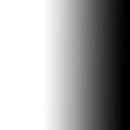
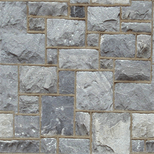
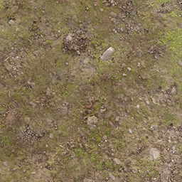
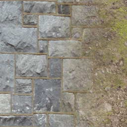

# 14. Multitexturing
멀티텍스처링은 두 개 이상의 서로 다른 텍스처를 혼합하여 최종 텍스처를 만드는 과정이다

- 두 텍스처를 **혼합하는 데 사용하는 방정식은 원하는 결과에 따라 달라짐**
- 우리가 할 것은 두 텍스처의 **평균 픽셀 색상을 결합하여 균일하게 혼합**된 최종 텍스처 만들기

---

# Texture blending
텍스처 혼합 기법

---

## 1. Alpha Blending
가장 기본적이고 널리 쓰이는 방식으로, 두 텍스처를 특정 비율로 부드럽게 섞기

---

$$ C = \text{lerp}(T_{base}, T_{decal}, \alpha)\\
= (1 - \alpha)T_{base} + \alpha T_{decal}$$

---

> 1을 빼는 이유? : 두 비율의 합이 항상 1이 되게 하려고

- 알파 = 0 → $$ C = 1 \cdot B + 0 \cdot D = B $$ → (데칼 안보임)
- 알파 = 1 → $$ C = 0 \cdot B + 1 \cdot D = B $$ → (데칼만 보임)
- 알파 = 0.5 → $$ C = 0.5B + 0.5D $$  → (둘이 반반 섞임)

---

## 2. Modulate2x
곱셈-밝기 보정 방식

- base 와 color를 곱하기만 하면 어두워져서 **2를 곱해 보정**하는 방법
- 2를 곱하는 과정을 통해 중간 밝기 영역이 원래 밝기를 유지하게 되어 결과적으로 **색감이 과하게 어두워지지 않는 '균일한' 느낌**을 줌

---

$$ C = (B \cdot C) × 2$$

---


## 3. Screen
곱셈 혼합의 반대 개념. 각 색상을 반전시켜 곱한 후, 그 결과를 다시 반전

- 여러 장의 사진 슬라이드를 하나의 스크린에 겹쳐서 투영하는 것과 유사
- 이미지가 겹칠수록 밝아지지만, 각 이미지의 형태는 유지
- 결과는 **항상 밝아짐**

---

$$ C = 1 - (1 - T_{base})(1 - T_{src}) $$

---

- base와 src의 어두운 정도를 곱해서 **겹친 어둠을 구한 다음 다시 빼서 밝기를 얻는 방식**

**예** : base = 0.7, src = 0.5 
- $$ (1-0.7)(1-0.5) = 0.3 × 0.5 = 0.15 $$ → $$ 1 - 0.15 = 0. 85$$ → 더 밝아짐

---

## 4. Overlay
밝은 부분은 더 밝게, 어두운 부분은 더 어둡게 만드는 기법

- 어두운 영역일 때는 곱해서 더 어두워짐
- 밝은 영역일 때는 스크린처럼 1에 가까워 져서 더 밝아짐

---

$$ C = \begin{cases} 2 × T_{base} × T_{src} \text{  } (T_{base} < 0.5)\\
1 - 2(1 - T_{base})(1 - T_{src}) \text{ } (T_{base} \geqq 0.5) \end{cases} $$

---

> 2를 곱하는 이유? : 연산 결과를 색상 값의 전체 범위(0.0 ~ 1.0)로 모두 사용할 수 있도록 동적으로 범위를 확장해주기 때문

바탕색의 중간 지점(0.5)을 기준
- 어두운 영역(0.0 ~ 0.5)을 전체 범위(0.0 ~ 1.0)로 확장
- 밝은 영역(0.5 ~ 1.0) 또한 전체 범위(0.0 ~ 1.0)로 확장

---

# multitexture.ps

- 텍스쳐 두개 올릴 버퍼 준비

```c++
bool ModelClass::LoadTextures(ID3D11Device* device, ID3D11DeviceContext* deviceContext, char* filename1, char* filename2)
{
	bool result;

	// 텍스쳐 오브젝트 생성 및 초기화
	m_Textures = new TextureClass[2];

	result = m_Textures[0].Initialize(device, deviceContext, filename1);
	if (!result)
	{
		return false;
	}

	result = m_Textures[1].Initialize(device, deviceContext, filename2);
	if (!result)
	{
		return false;
	}

	return true;
}
```

- `Modulate2x` 방식으로 혼합

```hlsl
//GLOBALS

// 두 개의 텍스쳐로 텍스처 생성. base = t0 / src = t1
Texture2D shaderTexture1 : register(t0);
Texture2D shaderTexture2 : register(t1);
SamplerState SampleType : register(s0);

//TYPEDEFS
struct PixelInputType
{
    float4 position : SV_POSITION;
    float2 tex : TEXCOORD0;
};

//PS
float4 MultiTexturePixelShader(PixelInputType input) : SV_TARGET
{
	float4 base;
	float4 src;
	float4 blendColor;
	 
	
	// Sample the pixel color from the textures using the sampler at this texture coordinate location.
	base = shaderTexture1.Sample(SampleType, input.tex);
	src = shaderTexture2.Sample(SampleType, input.tex);
	
	// Combine the two textures together.
    blendColor = base * src * 2.0;

	// Saturate the final color.
    blendColor = saturate(blendColor);

    return blendColor;
}
```

---

# Alpha Mapping
알파 레이어를 사용하여 각 픽셀의 혼합량을 결정

#### Alpha Map


#### base & src
 


```hlsl
Texture2D shaderTexture1 : register(t0);
Texture2D shaderTexture2 : register(t1);

// 알파 맵을 보관하기 위한 세 번째 텍스처를 추가
Texture2D shaderTexture3 : register(t2);
SamplerState SampleType : register(s0);

struct PixelInputType
{
    float4 position : SV_POSITION;
    float2 tex : TEXCOORD0;
};

float4 AlphaMapPixelShader(PixelInputType input) : SV_TARGET
{
    float4 base;
    float4 src;
    float4 alphaValue;
    float4 blendColor;
	 
	
    // base에서 텍스쳐 색상 가져옴
    base = shaderTexture1.Sample(SampleType, input.tex);

    // src에서 텍스쳐 색상 가져옴
    src = shaderTexture2.Sample(SampleType, input.tex);

    // 알파 텍스쳐에서 텍스쳐 색상 가져옴
    alphaValue  = shaderTexture3.Sample(SampleType, input.tex);

    // 알파 값을 기준으로 두 텍스쳐 섞기
    blendColor = (alphaValue * base) + ((1.0 - alphaValue) * src);

    // Saturate the final color value
    blendColor = saturate(blendColor);

    return blendColor;
}
```

#### result


