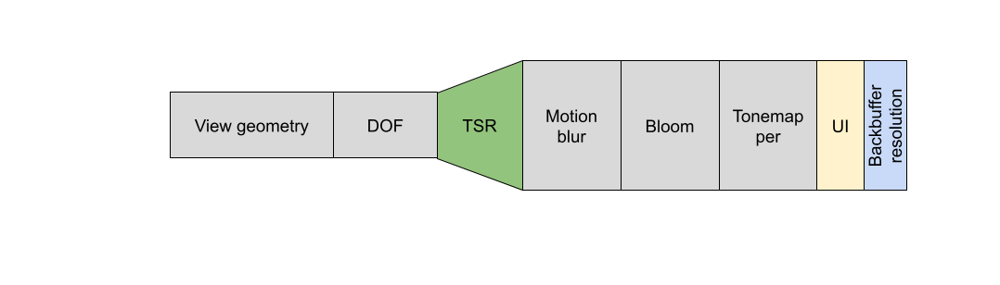
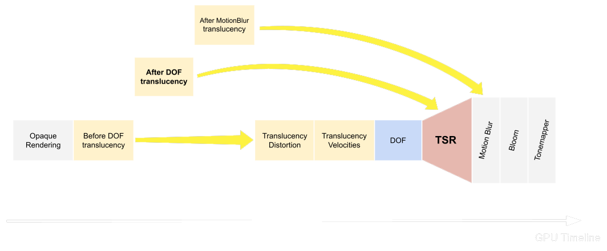

# 2. Applying to Unreal Engine
HLSL로 구현한 툰 쉐이더를 언리얼 엔진에 적용해보자

---

# Custom node
사용해봤으나 HLSL의 Forward redering 방식과 안맞아서 제대로 셀 셰이딩이 그려지지 않음.

노말 각도, 빛 방향 계산하는데서 문제가 있는듯

**참고 링크**
- [custom-material](https://dev.epicgames.com/documentation/ko-kr/unreal-engine/custom-material-expressions-in-unreal-engine)
- [Using Custom HLSL Code - Advanced Materials](https://youtu.be/qaNPY4alhQs?feature=shared)

---

## G-buffer
지연 렌더링 (Deferred Rendering) 방식의 Geometry Pass 과정에서 오브젝트를 한번 씩 그리며 
렌더링에 필요한 '재료' 정보들을 여러 장의 텍스처에 저장

> 텍스처들의 묶음이 바로 G-Buffer이다

### 텍스처 형태로 저장되는 G-Buffer 안의 정보
- **Base Color**: 물체의 기본 색상
- **World Normal**: 표면의 법선 벡터 (조명 계산에 필수)
- **Roughness**: 표면의 거칠기
- **Metallic**: 금속성
- **Specular**: 반사광의 색상 및 강도
- **Scene Depth**: 카메라로부터의 깊이(거리) 정보
- **Custom Data**: 그 외 렌더링에 필요한 다양한 데이터

> - 포스트 프로세스는 바로 이 G-Buffer의 데이터를 입력으로 받아
> - 화면 전체에 특수 효과(SSAO, 블룸, 모션 블러 등)를 적용하는 과정

---

## G-Buffer 직접 확인하기
1. UE5 에디터의 메인 뷰포트 좌측 상단에 있는 [Lit] 버튼을 클릭
2. 드롭다운 메뉴에서 [Buffer Visualization] 항목으로 마우스를 가져감
3. 다양한 G-Buffer 목록이 나타남. 여기서 보고 싶은 버퍼를 선택

### 주요 시각화 모드
- **Base Color**
  - 물체의 기본 색상 정보만 보여줌. 조명 효과가 모두 제거된 **순수한 텍스처 색상**을 볼 수 있음
- **World Normal**
  - 픽셀의 **법선 벡터를 색상으로 표현**. 주로 조명 계산 디버깅이나 외곽선 검출 같은 효과를 만들 때 이 정보를 사용
- **Roughness**
  - 표면의 거칠기를 흑백으로 보여줌.
  - **검은색(0)에 가까울수록 매끈하고, 흰색(1)에 가까울수록 거칠다**
- **Metallic**
  - 금속성을 흑백으로 보여줌.
  - **흰색(1)은 순수 금속, 검은색(0)은 비금속.**
- **Scene Depth**
  - **카메라로부터의 거리**를 흑백으로 표현. **가까울수록 어둡고 멀수록 밝게 나타남**.
  - 안개(Fog)나 심도 효과(Depth of Field) 등에 사용.
- **Ambient Occlusion**
  - 물체가 **서로 겹치거나 구석진 곳에 생기는 그림자를 계산한 결과**. (만약 SSAO가 켜져 있다면)

---

### G-buffer 데이터를 사용해 HLSL로 써보는 예시

- UE5의 포스트 프로세스 머티리얼에서는 SceneTexture 노드를 통해 G-Buffer에 접근할 수 있다

```c++
// G-Buffer 텍스처들을 샘플링하기 위한 선언 (실제 UE 코드는 더 복잡하지만 개념은 동일)
Texture2D<float4> GBufferATexture; // BaseColor가 저장된 텍스처
Texture2D<float4> GBufferBTexture; // Roughness, Metallic 등이 저장된 텍스처
Texture2D<float> SceneDepthTexture; // 씬 깊이 텍스처
SamplerState GBufferSampler;

// PostProcess 메인 함수
float4 MainPS(float2 UV : SV_Position) : SV_Target0
{
    // 현재 픽셀의 UV 좌표로 G-Buffer 샘플링
    float4 gBufferB = GBufferBTexture.Sample(GBufferSampler, UV);

    // GBufferB의 특정 채널에서 Roughness 값을 읽어옴 (예: R 채널)
    float roughness = gBufferB.r;

    // 최종 화면 색상을 가져옴 (보통 다른 텍스처에 저장되어 있음)
    float4 finalColor = GetFinalSceneColor(UV); 

    // 조건: Roughness가 0.8 이상인가?
    if (roughness > 0.8)
    {
        // 조건을 만족하면 노란색(1,1,0)과 원래 색상을 섞어줌
        finalColor.rgb = lerp(finalColor.rgb, float3(1.0, 1.0, 0.0), 0.5);
    }

    return finalColor;
}
```

---

## 외부 그래픽스 디버깅 툴
RenderDoc은 특정 프레임의 모든 렌더링 과정을 '캡처'하여, 각 단계(Draw Call)에서 어떤 데이터가 어떻게 처리되는지 분석할 수 있게 해주는 강력한 무료 툴

- [RenderDoc](https://renderdoc.org/)

## 사용 방법

### UE5 에디터와 연동
1. RenderDoc을 실행
2. File -> Launch Application을 선택
3. Executable Path에 UE5 에디터 실행 파일(.../UE_5.x/Engine/Binaries/Win64/UnrealEditor.exe)을 지정.
4. Command-line arguments에 분석하고 싶은 프로젝트 파일(.uproject)의 전체 경로를 입력.
5. [Launch] 버튼을 눌러 RenderDoc을 통해 에디터를 실행합니다.

### 프레임 캡처
1. 에디터가 실행되면 뷰포트에 RenderDoc 오버레이가 표시됨.
2. F12 또는 지정된 캡처 키를 눌러 원하는 순간의 프레임을 캡처.

### G-Buffer 확인
1. 캡처된 파일이 RenderDoc에서 열림.
2. 왼쪽의 Event Browser에서 BasePass 또는 Scene/Render/GBuffers 와 관련된 이벤트를 찾음.
3. 오른쪽의 Texture Viewer 탭을 연다.
4. Output Merger 섹션에 있는 렌더 타겟(Render Targets) 목록을 확인
5. GBufferA, GBufferB, GBufferC 등 이름으로 저장된 텍스처들을 볼 수 있음.
6. 각 텍스처를 클릭하면 해당 버퍼의 내용을 상세하게 (픽셀 단위로) 확인 가능.

> 각 G-Buffer 텍스처의 채널(R, G, B, A)에 어떤 데이터가 어떻게 압축되어 저장되는지 까지 볼 수 있다

---

# HDR vs LDR
그래픽스 파이프라인을 설계할 때, 빛과 색을 올바르게 다루기 위한 대원칙

1. 입력은 선형으로 (Decode)
- sRGB 텍스처와 같은 감마 인코딩된 애셋은 렌더링에 사용하기 전에 반드시 선형(Linear) 공간으로 변환해야 함
2. 계산은 선형으로 (Compute)
- 조명, 그림자, 블렌딩 등 모든 물리 기반 계산은 빛의 에너지를 비례적으로 표현하는 선형 공간에서 수행
3. 출력은 비선형으로 (Encode)
- 모든 계산이 끝난 최종 결과물(선형 HDR 색상)을 모니터에 표시하기 직전에만, 톤매핑과 감마 인코딩을 거쳐 LDR 공간으로 변환

즉,

> [sRGB 텍스처] → 자동 디코딩 → [선형 공간] → 조명, 블렌딩 등 모든 연산 → [선형 HDR 결과] → 노출 적용 → 톤매핑 → 감마 인코딩 → [최종 LDR 화면 출력]

---

## Dynamic Range VS Precision
- 동적 범위 (Dynamic Range)
  - 이미지가 표현할 수 있는 가장 어두운 값과 가장 밝은 값 사이의 비율
  - 이것이 높을수록 HDR에 가깝다
- 정밀도 (Precision)
  - 하나의 색상 채널을 표현하기 위해 몇 개의 비트(bit)를 사용하는지를 의미
  - 이것이 높을수록 색상 띠(Banding) 현상이 줄어든다.

> 실시간 렌더링에서는 HDR 연산을 위해 최소 16비트 부동소수점(half-precision float) 버퍼를 사용하는 것이 일반적

---

## LDR (Low Dynamic Range)
우리가 일상적으로 보는 대부분의 이미지, 영상. 모니터가 사용하는 감마(sRGB) 공간의 결과물

## LDR Color
일반적으로 색상의 각 채널(Red, Green, Blue)을 8비트(bit)로 표현

- 각 채널은 0부터 255까지의 정수 값을 가짐 (예: R:255, G:0, B:0은 순수한 빨간색)
- 그래픽스 프로그래밍에서는 이를 0.0 ~ 1.0 사이의 부동소수점 값으로 정규화(normalize)하여 사용
  - 즉, 0은 0.0으로, 255는 1.0으로 매핑

## LDR의 한계
1.0이 표현 가능한 최대 밝기이다

- 태양, 전구, 불꽃 등 1.0을 초과하는 모든 빛 정보는 모두 1.0으로 잘려나가(clamping) 디테일을 잃는다

LDR 세계에서는 이 모든 밝은 빛들이 그냥 최대 밝기(255 또는 1.0)로 뭉뚱그려져 버림

---

## HDR (High Dynamic Range)
컴퓨터가 빛을 물리적으로 사실에 가깝게 시뮬레이션하기 위해 사용하는 방식
- 이름처럼, 표현할 수 있는 밝기의 폭이 매우 넓어 현실 세계의 빛을 거의 그대로 흉내 낼 수 있음

## HDR Color
색상의 각 채널을 16비트 부동소수점(half) 또는 32비트 부동소수점(float) 으로 표현

- 실시간 렌더링에서는 메모리와 대역폭 효율을 위해 `R16G16B16A16_FLOAT` 렌더 타겟을 사용하는 것이 일반적

### HDR 장점
빛의 상호작용을 정보 손실 없이 계산할 수 있다

- LDR에서는 1.0짜리 빛 두 개를 합쳐도 여전히 1.0이 되어버리지만
- HDR에서는 정보 손실 없이 빛의 상호작용을 그대로 계산할 수 있다
  - 예 : 밝기가 10.0인 빛과 15.0인 빛을 합치면 25.0이 됨

---

## 왜 '선형 공간'에서 계산해야 하는가?
우리가 흔히 보는 이미지 파일(JPG, PNG)이나 모니터는 감마 공간(Gamma Space) 또는 sRGB 공간을 사용한다

> 인간의 시각이 어두운 부분의 변화에 더 민감하다는 특성에 맞춰
> - 제한된 비트(주로 8비트)를 효율적으로 사용하기 위해 고안된 비선형적인 방식

하지만 빛은 물리적으로 선형적(Linear)으로 작용한다

```
감마 공간에서의 덧셈: 0.5 + 0.5 = 1.0 (매우 밝아짐)
\\ 감마 공간의 0.5는 선형 공간의 약 0.214에 해당한다

선형 공간에서의 덧셈: 0.214 + 0.214 = 0.428
\\ 위 값을 감마 공간으로 다시 변환하면 약 0.68로 합리적인 밝기 증가를 보임
```

즉 감마 공간에서 색을 더하면 물리적으로 올바르지 않고, 빛이 과도하게 밝아지는 문제가 발생

> 따라서 모든 조명과 블렌딩 연산은 반드시 선형 공간에서 수행해야함

---

## 최종 화면 출력을 위한 후처리 (Post-Processing)
HDR 장면이 가진 풍부한 명암 정보를 바탕으로 인간의 눈이 인식하는 방식에 가깝게 변환하는 과정

- HDR과 LDR의 간극을 메우고 시각적으로 만족스러운 이미지를 만드는 것

### 1. 노출 (Exposure)
톤매핑을 적용하기 전에, 장면의 전반적인 밝기를 조절하는 단계

- 이는 카메라의 조리개나 셔터 스피드를 조절하는 것과 같음
- 가장 간단한 방식은 렌더링된 HDR 색상에 특정 노출 값을 곱하는 것
  - `exposedColor = hdrColor * exposure`
---

### 2. 톤매핑 (Tonemapping)
HDR의 넓은 밝기 범위를 LDR 모니터의 좁은(0.0~1.0) 범위로 자연스럽게 '압축'하는 핵심 과정

**톤매팡 옵션**
- Reinhard 채널별: `color/(1+color)` 간단하다. 하이라이트가 회색화되기 쉽다
- Reinhard Luma 보존: 휘도 기반으로 스케일. 색 바램을 완화
- Filmic(예: ACES 근사): 하이라이트 롤오프가 자연스럽다. 게임에서 널리 사용

---

### 3. 감마/인코딩 (Gamma Encoding)
선형 공간의 최종 LDR 색상을 비선형적인 모니터에 맞게 변환하는 마지막 단계

- 백버퍼가 *_SRGB면 하드웨어가 인코딩
  - 셰이더에서 pow(1/2.2)를 하지 않는다
  - 최종 출력 타겟의 포맷이 `DXGI_FORMAT_*_SRGB`
  - (예: `DXGI_FORMAT_B8G8R8A8_UNORM_SRGB`)로 설정되었다면
  - GPU가 렌더링 결과를 자동으로 sRGB 컬러 스페이스로 변환  
- 백버퍼가 선형 *_UNORM 포맷이면
  - 셰이더에서 직접 LinearToSRGB 함수를 호출해 변환

---

### 톤매핑 HLSL 예시

```c++
// Pixel Shader

// 상수 버퍼에서 노출값 등을 정의 (CPU에서 조절 가능하게)
cbuffer TonemappingCB : register(b0)
{
    float g_Exposure;
    float3 Padding;
}

// ... (샘플러 및 텍스처 정의)

float4 TonemappingPS(float4 in : SV_Position, float2 uv : TEXCOORD) : SV_Target
{
    // 1. HDR 색상 샘플링 (선형 보간이 일반적)
    float3 hdrColor = HdrSceneTexture.Sample(LinearSampler, uv).rgb;

    // 2. 노출 적용 (HDR 색상에 exposure 값을 곱함)
    hdrColor *= g_Exposure;

    // 3. Reinhard 톤매핑 공식 적용
    // 원공식: color / (color + 1.0)
    float3 ldrColor = hdrColor / (hdrColor + 1.0f);

    // 4. 감마 보정 (매직 넘버를 직접 쓰기보다 상수 사용을 권장)
    const float Gamma = 2.2;
    ldrColor = pow(ldrColor, 1.0f / Gamma);

    return float4(ldrColor, 1.0f);
}
```

**링크**
- [Filmic Tonemapping Operators](http://filmicworlds.com/blog/filmic-tonemapping-operators/)
- [Gamma-Correction](https://learnopengl.com/Advanced-Lighting/Gamma-Correction)

---

# Post Process pipeline
UE 5.5 Deferred + Lumen + TSR 기준 후처리 파이프라인의 순서



> - 베이스 렌더링 → DOF → TSR → Motion Blur → Bloom/Flare → Exposure/Local Exposure
> -  → Color Grading 컨트롤 → Tonemapper → LDR 후처리/PPM 기본·FXAA → UI

- SSAO/SSR/Lumen은 베이스 렌더링 단계에서 빛과 같이 합성됨 (픽셸 셰이더에서 같이 게산)

**참고 링크**
- [rendering-overview](https://dev.epicgames.com/documentation/en-us/unreal-engine/rendering-overview?application_version=4.27)
- [temporal-super-resolution](https://dev.epicgames.com/documentation/en-us/unreal-engine/temporal-super-resolution-in-unreal-engine)
- [tonemapper](https://dev.epicgames.com/documentation/en-us/unreal-engine/color-grading-and-the-filmic-tonemapper-in-unreal-engine)

---

## 1. 베이스 렌더링
1. **G-Buffer Pass**
  - 렌더링할 씬의 모든 표면 정보를(색상, 노멀, 재질 등) G-Buffer에 기록
2. **라이팅 합성 + Lumen GI/Reflections**
  - G-Buffer 정보를 바탕으로 직접광, 간접광을 합산해 **HDR SceneColor를 만든다**
  - 리플렉션은 Lumen Reflections(기본)을 쓰며, 필요 시 SSR(Screen Space Reflections)가 가산됨
    - SSR은 화면 공간 기반의 동적 포스트 프로세스로, 화면에 보이는 정보만 반영된다.
3. **SSAO(Screen Space Ambient Occlusion)**
  - 코너,틈새의 주변광 감쇠를 근사해 간접광 성분에 곱해 줌

### 용어
- Lumen: UE5의 동적 GI/리플렉션 시스템
  - GI와 간접 스페큘러를 실시간으로 추정해 SceneColor에 섞음
- SSAO: 화면 공간에서 법선·깊이로 근사한 주변광 음영
  - 비직접광을 어둡게 해 입체감을 높임
- SSR: 화면에 보이는 색과 깊이만으로 추적하는 반사. 프레임 경계나 화면 밖 정보는 불가

**링크**
- [Reflections Environment](https://dev.epicgames.com/documentation/en-us/unreal-engine/reflections-environment-in-unreal-engine)
- [post-process-effects](https://dev.epicgames.com/documentation/en-us/unreal-engine/post-process-effects-in-unreal-engine)

---

# Before Tonemapping (HDR/Linear 공간에서 작업)
여기서부터가 진짜 후처리 파이프라인

> 모든 연산은 물리적으로 정확한 HDR/리니어 색상 공간에서 이루어짐

---

## 2. DOF
DOF는 피사계 심도로 초점이 잡힌 곳은 선명하게 그 밖은 흐리게 하는 작업을 한다. 즉 카메라 초점 기반 블러이다

> DOF는 위 베이스 렌더링이 끝난 후 HDR SceneColor 상에서 수행됨

**링크**
- [cinematic-depth-of-field](https://dev.epicgames.com/documentation/en-us/unreal-engine/cinematic-depth-of-field-in-unreal-engine)

---

## 3. Translucency Pass (반투명 합성 위치)
반투명 재질은 DOF 심도 적용 전, DOF 적용 후(기본값), 모션 블러 적용 후 등 다양한 반투명 패스로 렌더링

- DOF 적용 후가 기본값

> 옵션으로 파이프라인 위치를 바꾸면 TSR/블러/소팅과의 상호작용이 달라짐



---

## 4. TSR(Temporal Super Resolution)
DOF 이후에 실행되는 UE의 안티 앨리어싱 작업.

- 여기서 출력 해상도로 업스케일되며, 이후 단계 전부가 업스케일된 결과를 입력으로 사용

**링크**
- [temporal-super-resolution](https://dev.epicgames.com/documentation/en-us/unreal-engine/temporal-super-resolution-in-unreal-engine)

---

## 5. Motion Blur
모션 블러 는 물체의 움직임에 따라 흐릿하게 보이는 현상

- 모션 벡터로 잔상을 합성
- 성능을 위해 TSR/MB 입력을 Half/Quarter Res로 운용하는 경로도 존재

---

## 6. Bloom/LensFlare/Auto-Exposure/Local Exposure
모션 블러 이후 실행

- Bloom, 플레어는 밝은 영역의 광학적 확산을 추가
- Eye Adaptation은 장면 휘도 분포로 노출을 동적으로 맞춤

**링크**
- [bloom](https://dev.epicgames.com/documentation/en-us/unreal-engine/bloom-in-unreal-engine)
- [auto-exposure](https://dev.epicgames.com/documentation/en-us/unreal-engine/auto-exposure-in-unreal-engine?application_version=5.5)

---

## 7. Color Grading (색 보정)
장면 색상을 조정하기 위한 톤 매핑 및 색상 보정 효과

> 언리얼 엔진 내에서 컬러 그레이딩이라는 용어는
> - HDR(High Dynamic Range) 디스플레이 출력과 함께 사용되는 톤 매핑 기능 (HDR 에서 LDR로 변환) 
> - 이미지의 색상 보정(LDR 색상에서 화면 색상으로 변환) 처리를 포괄한다

## 8. Tonemapping - LDR(Low Dynamic Range) 이미지로 변환
톤 매핑 기능의 목적

- 넓은 범위의 고명암비(HDR) 색상을
- 디스플레이가 출력할 수 있는 저명암비(LDR) 색상으로 매핑하는 것

> 후처리 과정에서 일반적인 렌더링 후 수행되는 마지막 단계

**링크**
- [color-grading-and-the-filmic-tonemapper](https://dev.epicgames.com/documentation/en-us/unreal-engine/color-grading-and-the-filmic-tonemapper-in-unreal-engine)

---

# After Tonemapping (LDR 공간에서의 작업)
톤매핑이 완료된, 우리가 흔히 보는 이미지 위에서 최종 효과들을 적용

---

## 9. LDR 후처리/커스텀 PPM
비네트, 필름 그레인, 간단한 컬러 틴트 등 LDR에서 싸게 처리 가능한 효과는 톤매퍼 이후 적용

- UE의 Post Process Material 기본 삽입점은 After Tonemapping
  - 필요 시 옵션을 통해 위치를 바꿀 수 있다
  - Scene Color Before/After DOF, Scene Color Before Bloom, Replacing the Tonemapper 등

---

## 10. UI 합성(UMG/Slate)
기본적으로 장면 포스트 프로세싱 이후에 그려져 영향을 받지 않는다

- UI에 후처리 효과를 지원하려면 Slate 포스트 버퍼를 사용한다

**링크**
- [using-slate-postbuffers](https://dev.epicgames.com/documentation/en-us/unreal-engine/using-slate-postbuffers-in-unreal-engine)

---

# Post Process material
- 포스트 프로세스
  - 3D 씬의 렌더링이 모두 끝난 최종 2D 이미지를 가지고 추가적인 효과를 적용하는 기술
  - 화면 전체에 필터를 씌우거나, 색감을 보정하는 등의 작업이 여기에 해당
  - 컴퓨터 그래픽스에서는 이를 '스크린 스페이스(Screen Space)' 연산이라고 부름

**참고 링크**
- [post-process-materials-in-unreal-engine](https://dev.epicgames.com/documentation/en-us/unreal-engine/post-process-materials-in-unreal-engine)

---

## Material Domain
머티리얼의 근본적인 용도가 무엇인가? 를 정의

- Domain 설정에 따라 머티리얼 에디터에서 사용할 수 있는 입력 핀과 출력 노드가 바뀜
-  엔진이 셰이더를 컴파일하는 방식 자체가 달라짐

## Domain 속성
- **Surface (표면)**
  - 가장 기본값. 3D 모델의 표면에 칠하는 일반적인 재질
  - Base Color, Metallic, Roughness 등의 물리 기반 렌더링(PBR) 입력들을 가짐
- **Post Process (포스트 프로세스)**
  - 렌더링이 완료된 최종 2D 화면 이미지에 적용하는 필터 용도
  - 입력으로 SceneTexture 노드를 통해 화면 색상, 깊이, 노멀 등의 데이터를 가져올 수 있음
  - 최종 결과물은 Emissive Color로 출력
- **UI**
  - UMG(Unreal Motion Graphics) 위젯에 사용되는 2D 인터페이스용 머티리얼
- **Light Function (라이트 함수)**
  - 광원의 빛에 패턴이나 마스크를 적용하여 그림자를 만들거나(예: 창살 그림자), 프로젝터처럼 이미지를 투사하는 효과를 낼 때 사용
- **Deferred Decal (디퍼드 데칼)**
  - 벽에 붙은 포스터, 핏자국, 총알 자국처럼 다른 표면 위에 추가로 이미지를 덧씌울 때 사용

---

## Blendable Location
Material Domain이 Post Process일 때만 활성화

> 포스트 프로세싱 과정의 여러 단계 중 정확히 어느 시점에 이 머티리얼을 적용할 것인가?를 결정

- 렌더링 후처리 파이프라인

```
[HDR/리니어 공간]
G-Buffer -> 조명 -> AO/반사 -> 블룸 -> 노출 -> 색 보정 -> [톤매핑]
                                                      |
                                                      V
                                                  [LDR/sRGB 공간]
                                    모션블러 -> 안티에일리어싱 -> 필름 효과 -> UI -> 최종 화면
```

## Blendable Location 종류
- Before Tonemapping (톤매핑 이전)
  - 사진 원본(RAW) 파일을 편집하는 것과 같음
  - 아직 색상 정보가 압축되거나 왜곡되지 않은, 물리적으로 정확한 HDR/선형 공간에서 머티리얼 연산을 수행
  - 색상을 더하거나 곱하는 등의 수학적 계산이 예측한 대로 정확하게 나옴
  - 대부분의 포스트 프로세스 효과(색상 보정, 커스텀 필터 등)에 권장되는 기본값이자 가장 정확한 옵션
- After Tonemapping (톤매핑 이후)
  - 최종 결과물(JPG) 파일을 편집하는 것과 같음
  - 이미 모니터에 맞게 색이 압축되고 보정된 LDR 공간의 이미지에 효과를 적용
  - 이 상태에서 색상을 연산하면, 감마 보정(Gamma Correction) 등의 영향으로 인해 결과가 어두워지거나 색이 틀어지는 등 수학적으로 부정확하고 예측하기 어려운 결과를 낳을 수 있음
  - 주로 화면에 디버그 정보를 그리거나, 최종 화면 위에 덧씌우는 스크린 이펙트(예: 빗방울, 필름 그레인)처럼 톤매핑의 영향을 받으면 안 되는 특수한 경우에 사용
- Replacing the Tonemapper (톤매퍼 대체)
  - 가장 고급 옵션으로, 언리얼의 기본 톤매핑 과정을 통째로 무시하고 내가 만든 머티리얼로 톤매핑을 직접 구현할 때 사용
  - 아주 독특한 색감의 아트 스타일을 만들 때 사용됨

---

# Custom Depth-Stencil Pass (커스텀 깊이-스텐실 패스)
특정 오브젝트만 선별하여 특별한 시각 효과를 적용하기 위한 마스킹(Masking) 데이터를 만드는 기능

### Custom Depth Pass
- 특수 효과를 줄 거라고 체크한 오브젝트들만 따로 모음
- 화면상의 깊이 값 (카메라로부터의 거리)을 흑백 이미지처럼 별도의 버퍼(메모리 공간)에 그려두는 과정

### Stencil 옵션
- 스텐실 버퍼는 픽셀마다 0부터 255까지의 정수 값을 저장할 수 있는, 화면과 똑같은 크기의 디지털 도안
- **'Enabled with Stencil' 옵션 ON**
  - Custom Depth Pass를 진행할 때 단순히 깊이 값만 그리는 게 아니라
  - **지정한 스텐실 값(정수)을 이 스텐실 도안에 함께 기록함**

---

## 사용 목적
효율적인 오브젝트 구별을 할 때 사용

> 게임에 '아군', '적군', '중립 NPC'가 있고 각각 다른 색의 외곽선을 그리고 싶다고 가정

### 스텐실 미사용 시
1. 모든 캐릭터를 Custom Depth 버퍼에 일단 다 그림
2. 그 후 포스트 프로세스에서 이들이 아군인지, 적군인지 다시 판별하는 복잡한 로직을 짜야 함
   - 매우 비효율적

### 스텐실 사용 시
1. 캐릭터 메시의 렌더링 설정에서 **Render CustomDepth Pass**를 켬
2. '아군' 캐릭터 메시의 **CustomDepth Stencil Value**를 1로 설정
3. '적군' 캐릭터는 스텐실 값을 2로 설정
4. '중립 NPC'는 스텐실 값을 3으로 설정

포스트 프로세스 외곽선 머티리얼에서 스텐실 버퍼를 사용해 아래의 로직 구현 가능
- 픽셀의 스텐실 값이 1이면 파란색 외곽선, 2면 빨간색 외곽선을, 3이면 초록색 외곽선을 그림

> 즉 오브젝트 그룹별로 픽셀에 '꼬리표(Tag)'를 붙여두는 것과 같다
> - 특정 그룹의 오브젝트만 흑백으로 만든다거나
> - 특정 무기에 맞았을 때만 잠시 빛나게 하는 등 응용이 가능

---

# MPC (Material Parameter Collection)
언리얼 엔진에서 여러 머티리얼과 블루프린트에서 전역적으로(Global) 참조하고 제어할 수 있는 파라미터(매개변수)들의 집합

**참고 링크**
- [Material Parameter Collections](https://dev.epicgames.com/documentation/en-us/unreal-engine/using-material-parameter-collections-in-unreal-engine)

---

## MPC의 특징
1. 전역 스코프 (Global Scope)
- 하나의 MPC에 정의된 파라미터는 프로젝트 내의 어떤 머티리얼, 어떤 블루프린트에서든 동일한 이름으로 접근할 수 있음
2. 중앙 관리 (Centralized Control)
- 여러 머티리얼에 영향을 주는 값을 단 하나의 에셋에서 관리할 수 있어 유지보수가 용이
3. 런타임 실시간 제어
- 게임 실행 중에도 블루프린트나 C++을 통해 값을 변경하면, 해당 값을 사용하는 모든 머티리얼에 즉시 반영
- 셰이더 프로그래밍에서 `전역 유니폼 버퍼(Global Uniform Buffer)`와 유사한 개념
4. 구성
- 스칼라(Scalar, 1float) 값
- 벡터(Vector, 4float) 값

---

## MPC 사용 목적
1. 환경 효과 일괄 제어
- 낮과 밤 사이클에서 TimeOfDay라는 하나의 스칼라 값(0.0~1.0)을 MPC로 만들어서
- 하늘, 조명, 머티리얼의 노출 정도 등을 동시에 제어
2. 월드 효과
- 강력한 폭풍우, 독가스, 매트릭스 같은 디지털 효과 등
- 월드 전체에 퍼지는 것을 하나의 Intensity(강도) 값으로 조절
3. 게임 플레이 연동
-  플레이어의 체력이 낮아지면 화면 전체에 붉은 끼가 돌게 하거나
-  특정 지역에 진입하면 채도가 바뀌는 등의 효과를 구현할 때 유용
4. 아티스트와 프로그래머의 협업
- 프로그래머는 C++나 블루프린트로 MPC 값을 바꾸는 로직을 구현
- 아티스트는 그 값을 머티리얼에서 어떻게 시각적으로 표현할지 자유롭게 디자인

---

## MPC와 연동되는 것
1. 머티리얼 에디터
- 머티리얼 그래프에서 `Material Parameter Collection` 노드를 추가
- MPC 에셋을 선택하고 원하는 파라미터를 연결
2. 블루프린트
- `Set Scalar Parameter Value on Collection`
- `Set Vector Parameter Value on Collection` 노드를 사용하여 값을 변경
3. Niagara 시스템
- 파티클 시스템에서도 MPC의 값을 읽어와 파티클의 색상, 크기, 생성률 등을 제어하는 데 사용
4. C++
- `UMaterialParameterCollectionInstance` 클래스를 통해 프로그래밍적으로 접근 및 제어가 가능

---

## Collection vs Instance
- UMaterialParameterCollection
  - 이것은 콘텐츠 브라우저에 있는 에셋 그 자체
  - 어떤 파라미터들이 있는지를 정의하는 클래스와 같음
- UMaterialParameterCollectionInstance
  - 설계도를 바탕으로 만들어진 인스턴스에 해당
  - C++나 블루프린트에서 값을 변경할 때 실제로 제어하는 대상은 바로 이 인스턴스
  - `GetWorld()->GetParameterCollectionInstance(MyMPC)` 월드에 생성된 인스턴스를 가져오기

---

# Level Blueprint (레벨 블루프린트)
특정 레벨(맵)에 종속적인 비주얼 스크립팅
- 각 레벨(.umap)마다 하나씩 존재
- 각 레벨의 전반적인 이벤트와 로직을 관리하기 위한 특별한 종류의 블루프린트

**참고 링크**
- [Level Blueprint](https://dev.epicgames.com/documentation/en-us/unreal-engine/level-blueprint-in-unreal-engine)

---

## Level Blueprint 특징
1. 레벨 종속성
- 오직 자신이 속한 레벨에서만 작동
- 다른 레벨에서는 존재하지도, 실행되지도 않음
1. 직접적인 액터 참조
- 레벨에 배치된 어떤 액터(캐릭터, 조명, 카메라 등)라도 직접 선택하여 참조를 가져올 수 있음
- 다른 블루프린트와 구별되는 가장 큰 특징
- 블루프린트 클래스에서는 일반적으로 Get All Actors Of Class나 Get Overlapping Actors와 같은 방법으로 Actor를 찾아야 함
1. 전역 이벤트 처리
- 레벨의 시작(BeginPlay), 종료(EndPlay)와 같은 레벨 단위의 이벤트를 처리

---

## Level Blueprint VS Actor Blueprint

|	 | Level Blueprint	|Actor Blueprint|
|소속|	특정 레벨 (.umap)	|독립적인 에셋 (.uasset)|
|재사용성 |	해당 레벨에만 존재하고 영향을 줌	| 여러 레벨에 배치하여 재사용 가능 |
|Actor 참조 |	레벨 내 배치된 Actor를 직접 드래그 앤 드롭으로 참조 가능 |	`Get All Actors of Class` 등으로 검색하거나, 변수에 담아 전달받아야 함 |
|용도 | 레벨 시퀀스, 레벨 배치 Actor 간 통신	| 플레이어 캐릭터, 무기, 상자, 퍼즐 등 범용적인 객체 |

---

## Level Blueprint에서 직접적인 액터 참조가 가능한 이유
레벨 블루프린트의 로직이 레벨 파일(.umap) 자체에 직접 저장되기 때문

- 레벨에 배치된 '액터 A'와 레벨 블루프린트의 'A에 대한 참조 노드'는 모두 같은 레벨 파일 안에 존재
- 따라서 레벨을 저장할 때 이들 사이의 연결 관계(포인터)가 깨지지 않고 그대로 보존될 수 있음

> 반면, 독립적인 에셋인 액터 블루프린트는 어떤 레벨에 배치될지 미리 알 수 없으므로 이런 방식의 직접 참조가 불가능

---

## Level Blueprint 사용 목적
1. 시네마틱 시퀀스
- 레벨 시작 시 시네마틱 카메라를 재생하거나, 특정 이벤트가 발생했을 때 시퀀서를 재생하는 등의 연출을 구현
2. 레벨 고유의 퍼즐 로직
- "A 스위치를 누르고 B 문을 통과하면 C 플랫폼이 움직인다" 와 같이 레벨에 배치된 특정 액터들 간의 상호작용을 구현할 때 매우 편리
3. 전역 시스템 트리거
- MPC의 값을 변경하는 로직을 레벨 블루프린트의 BeginPlay 이벤트에 넣으면
- 해당 레벨이 시작될 때 전역 시각 효과를 특정 상태로 설정
4. 레벨 스트리밍 제어
- 다른 서브 레벨을 로드하거나 언로드하는 타이밍을 조절
5. 특정 레벨의 GameMode 초기화
- 해당 레벨에서만 특별한 규칙을 적용할 때 초기 설정을 함

> 프로젝트가 커져 레벨 블루프린트에 지나치게 많은 로직을 넣으면 유지보수가 어려움
> - 가능하면 재사용 가능한 블루프린트 클래스로 기능을 분리하는 것이 좋다

---

## Event Manager 패턴
실무에서는 레벨의 주요 로직을 처리하는 `BP_LevelManager` 와 같은 일반 액터 블루프린트를 하나 만들어서 레벨에 배치하는 방식을 자주 사용

- 레벨 블루프린트는 BeginPlay 이벤트가 발생했을 때 레벨에 배치된 이 BP_LevelManager를 찾아 초기화시켜주는 역할을 맡음
- 복잡한 레벨 로직 (퍼즐, 시퀀스 트리거 등)은 BP_LevelManager 안에서 처리

> 로직이 특정 레벨 파일에 묶이지 않고, 에셋 기반으로 관리되어 재사용 및 협업이 훨씬 용이
> - 'Single Point of Entry' 또는 'Manager Pattern' 이라고도 부름

---

**한번씩은 봐둬야할 링크 목록**

- [adding-global-shaders-to-unreal-engine](https://dev.epicgames.com/documentation/en-us/unreal-engine/adding-global-shaders-to-unreal-engine)
- [overview-of-shaders-in-plugins-unreal-engine](https://dev.epicgames.com/documentation/en-us/unreal-engine/overview-of-shaders-in-plugins-unreal-engine)
- [new-shading-models-and-changing-the-gbuffer](https://dev.epicgames.com/community/learning/tutorials/2R5x/unreal-engine-new-shading-models-and-changing-the-gbuffer)

---

- [how-to-add-post-process-material](https://dev.epicgames.com/community/learning/tutorials/8kB9/unreal-engine-how-to-add-post-process-material)
- [filmic-tonemapping-with-piecewise-power-curves](http://filmicworlds.com/blog/filmic-tonemapping-with-piecewise-power-curves/)
- [luts-complete-guide](https://www.worldofleveldesign.com/categories/ue5/luts-complete-guide.php)

---

- [Articles](https://www.froyok.fr/articles.html)
- [Global shaders in Unreal without engine modification](https://itscai.us/blog/post/ue-view-extensions/)
- [UE4ShadersIntroduction](https://logins.github.io/graphics/2021/03/31/UE4ShadersIntroduction.html)