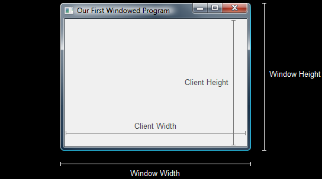

# DirectX Tutorial

---

# 1. Win32 Basics

---

## A Primer of Basic Windows
- 기본적인 Windows 애플리케이션을 만드는 방법 배우기
- 컴파일 오류 시
  - 프로젝트 속성 → Linker(링커) → System → SubSystem을 Windows (/SUBSYSTEM:WINDOWS) 로 변경

---

- "Hello World!" 창 띄우는 예시

```c++
#include <windows.h>

// 모든 Windows 프로그램의 진입점 (WINAPI WinMain)

int WINAPI WinMain(HINSTANCE hInstance,
					HINSTANCE hPrevInstance,
					LPSTR IpCmdLine,
					int nCmdShow)
{
	//MessageBox()를 사용해 메시지 상자 만들기
	MessageBox(NULL,
		L"Hello World!",
		L"Just Hello World Program!",
		MB_ICONEXCLAMATION | MB_OK);

	// windows에 0 반환
	return (0);
}

```

### int WINAPI WinMain
- **HINSTANCE hInstance** 
  - 인스턴스 핸들.객체를 식별하는 32비트 정수
  - 프로그램이 시작되면 windows는 숫자를 선택하여 hInstance 매개변수에 입력함
- **HINSTANCE hPrevInstance**
  - 과거의 유물. 현재는 사용하지 않음.이전 버전과 호환성을 위해서 존재
  - 과거에는 이전 인스턴스가 있는 경우 핸들을 제공하고, 없는 경우 (인스턴스가 유일한 경우) NULL을 반환함
- **LPSTR lpCmdLine** 
  - 프로그램 호출 명령줄을 포함하는 문자열에 대한 포인터
  - "MyApp.exe"라는 애플리케이션을 시작 메뉴의 실행 명령 프롬프트에서 실행한 경우
  - "MyApp.exe" 또는 "MyApp.exe RunA" 또는 "MyApp.exe RunB"와 같이 실행할 수 있다
  - lpCmdLine은 입력된 모든 내용을 저장하여 프로그램이 특수 매개변수를 확인할 수 있도록 한다
	- 안전 모드, 창 모드, 소프트웨어 렌더링 모드 등 특수 모드를 실행하는 데 유용
- **int nCmdShow** 
  - 창이 생성될 때 어떻게 표시될지 지정
  - 창을 최소화, 최대화 또는 일반 모드로 표시하거나, 백그라운드에서 실행 중인 창을 열도록 설정

### MessageBox
- **HWND hWnd**
  - 창의 핸들. 핸들은 색체를 식별하는 정수.
  - 현재 아직 창이 생성되지 않았으므로 NULL로 지정됨
	- NULL : 어떤 창에서도 오지 않고 바탕화면에서 옴
- **LPCTSTR lptext**
  - 메시지 박스 안에 표시될 텍스트가 담긴 16비트 문자열을 가리키는 포인터
- **LPCTSTR lpcaption**
  - 메시지 상자의 제목 표시줄이나 캡션 텍스트를 포함하는 16비트 문자열을 가리키는 포인터
- **UINT utype**
  - 메시지 상자의 스타일을 결정. 여러 값의 경우 논리 OR (`|`) 연산자와 함께 사용

---

## Creating a Window
- 이벤트 기반 (버튼 클릭, 창 크기 조절, 키 입력) WinProc() 사용하기

- 윈도우 창 생성하기 예시

```c++
#include <windows.h>
#include <windowsx.h>

// windowProc 함수 프로토 타입 (아래에 정의됨)
LRESULT CALLBACK WindowProc(HWND hWnd,
							UINT message,
							WPARAM wParam,
							LPARAM IParam);

// windows 프로그램 진입점

int WINAPI WinMain(HINSTANCE hInstance,
					HINSTANCE hPrevInstance,
					LPSTR IpCmdLine,
					int nCmdShow)
{
	// 함수로 채워진 창의 핸들
	HWND hWnd;

	// 창 클래스에 대한 정보를 보관하는 구조체

	WNDCLASSEX wc;

	// 메모리 초기화
	ZeroMemory(&wc, sizeof(WNDCLASSEX));

	// 구조체에 필요 정보 채우기
	wc.cbSize = sizeof(WNDCLASSEX);
	wc.style = CS_HREDRAW | CS_VREDRAW;
	wc.lpfnWndProc = WindowProc;
	wc.hInstance = hInstance;
	wc.hCursor = LoadCursor(NULL, IDC_ARROW);
	wc.hbrBackground = (HBRUSH)COLOR_WINDOW;
	wc.lpszClassName = L"WindowClass1";

	// 창 클래스 등록
	RegisterClassEx(&wc);

	// 창 만들고 결과를 핸들로 사용
	hWnd = CreateWindowEx(NULL,
						L"WindowClass1", // 창 클래스 이름
						L"First Windowed Program", //창 제목
						WS_OVERLAPPEDWINDOW, // 창 스타일
						300, // 창 x 위치
						300, // 창 y 위치
						500, // 창 너비
						400, // 창 높이
						NULL, // 부모 창 없음
						NULL, // 메뉴 사용 안함
						hInstance, // 애플리케이션 핸들
						NULL); // 여러 창과 함께 사용 X

	// 화면에 창 표시
	ShowWindow(hWnd, nCmdShow);

	// 메인 루프 시작

	// windows 이벤트 메시지 보관용 구조체
	MSG msg;

	// 큐에서 다음 메시지를 기다리고 결과를 msg에 저장
	while (GetMessage(&msg, NULL, 0, 0))
	{
		// 키 입력 메시지를 올바른 형식으로 변환
		TranslateMessage(&msg);

		// 메시지를 WindowProc 함수로 보냄
		DispatchMessage(&msg);
	}

	// WM_QUIT 메시지 파트를 윈도우에 반환
	return (msg.wParam);
}

// 프로그램의 메인 메세지 핸들러
LRESULT CALLBACK WindowProc(HWND hWnd, UINT message, WPARAM wParam, LPARAM IParam)
{
	// 메시지를 정렬하여 실행할 코드 찾기
	switch (message)
	{
		// 창이 닫히면 이 메시지를 읽음
		case WM_DESTROY:
				{
					// 애플리케이션 닫기
					PostQuitMessage(0);
					return (0);
				}
				break;
	}

	// switch 케이스가 아닌 메시지는 여기서 처리
	DefWindowProc(hWnd, message, wParam, IParam);
}
```

---

### 창 생성 함수
- 창을 생성하는 단계 이외에는 창을 계속 실행하는데 사용된다

1. 윈도우 클래스 등록
    - `RegisterClassEx();`
2. 윈도우 생성
    - `CreateWindowEx(); `
3. 윈도우를 표시
    - `ShowWindow();`

### 이벤트 처리
- 이벤트 처리는 두 부분으로 나뉜다

1. 메인 루프
   - `GetMessage()`, `TranslateMessage()`, `DispatchMessage()` 함수로만 구성
2. `WindowProc()` 함수
    - 특정 메시지가 전송될 때 실행되는 코드로만 구성

---

## Window Size vs Client Size
- 렌더링은 클라이언트 영역 내에 그려진다
- 따라서 클리아언트 크기를 결정한 후 적절한 창 크기를 계산하는 것이 더 좋다



- `AdjustWindowRect()` 함수로 클라이언트 영역 크기 지정하기

```c++
BOOL AdjustWindowRect(LPRECT lpRect, //RECT 구조체에 대한 포인터
                                    //RECT 구조체에는 원하는 클라이언트 영역의 좌표가 포함됨
                      DWORD dwStyle, // 창 스타일. 창 테두리의 크기를 결정함
                      BOOL bMenu); //  메뉴 사용 여부를 함수에 알려줌

// 'left'와 'top' 값에는 위치를 지정하지 않음
RECT wr = {0, 0, 500, 400}; 

// 크기 조정
AdjustWindowRect(&wr, WS_OVERLAPPEDWINDOW, FALSE); 

// 창을 설정하고 그 결과를 핸들로 사용
hWnd = CreateWindowEx(NULL, 
                      L"WindowClass1", 
                      L"First Windowed Program", 
                      WS_OVERLAPPEDWINDOW, 
                      300, // 창의 x 위치 
                      300, // 창의 y 위치 
                      wr.right - wr.left,     // 창의 너비 
                      wr.bottom - wr.top,     // 창의 높이 
                      NULL, 
                      NULL, 
                      hInstance, 
                      NULL);
```

---

## The Real-Time Message Loop
- 이전에 사용한 `GetMessage()` 함수는 메시지 큐가 비어있으면 스레드를 블로킹함
- `PeekMessage()` 함수는 메시지 큐 상태와 관계없이 즉시 반환 (비블로킹)

- `PeekMessage()` 함수를 사용한 루프

```c++

// Windows 이벤트 메시지를 보관하는 구조체 MSG
MSG msg = {0}; 

// 무한 메시지 루프
while(TRUE) 
{ 
    // 큐에 대기 중인 메시지가 있는지 확인
    if(PeekMessage(&msg, NULL, 0, 0, PM_REMOVE)) 
    { 
        // 키 입력 메시지를 올바른 형식으로 변환
        TranslateMessage(&msg); 

        // 메시지를 WindowProc 함수로 보냄
        DispatchMessage(&msg); 

        // 종료 확인 
        if(msg.message == WM_QUIT) 
            break; 
    } 
    else 
    { 
        // 여기에서 게임 코드를 실행
    } 
}
```

- `PeekMessage()`는 메시지가 있으면 TRUE를, 없으면 FALSE를 반환함

---
