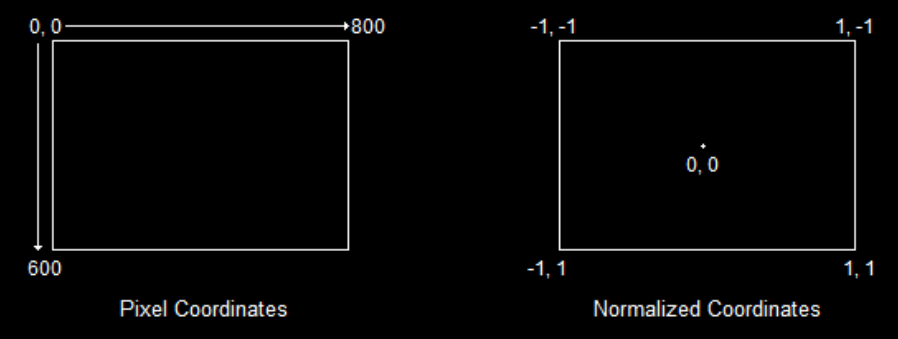

# 4. Rendering Frames
direct3D 초기화 후 실제 렌더링을 시작하기 위해 두가지 사전 작업을 수행해야 한다

1. GPU에게 최종 이미지를 생성할 메모리 위치를 알려주기
    - 대부분의 경우 백 버퍼
2. GPU에게 백 버퍼의 어느 위치에 그리도록 지시하기

위 작업이 완료되면 렌더링을 수행할 수 있다

---

## Setting the Render Target
direct3D에서 렌더링을 하기 위해서는 렌더 타겟을 설정해야 한다

- 렌더 타겟 설정 과정
1. 백 버퍼의 주소 확인하기
2. 백 버퍼 주소를 사용하여 렌더 타겟을 나타내는 COM 객체 생성하기
3. 하당 객체를 활성 렌더 타겟으로 설정하기

```c++
ID3D11RenderTargetView *backbuffer; // COM 객체 전역 선언

 // 이 함수는 Direct3D를 초기화하고 사용할 준비를 합니다 
void InitD3D(HWND hWnd) 
{ 
    // Direct3D 초기화 
    // ... 

	// 렌더 타겟 설정 시작

	// 백 버퍼의 주소 가져오기
	ID3D11Texture2D* pBackBuffer;
	swapchain->GetBuffer(0, __uuidof(ID3D11Texture2D), (LPVOID*)&pBackBuffer);

	// 백 버퍼의 주소 사용하여 렌더 타겟 생성
	dev->CreateRenderTargetView(pBackBuffer, NULL, &backbuffer);
	pBackBuffer->Release();

	// 렌더 타겟을 백 버퍼로 설정
	devcon->OMSetRenderTargets(1, &backbuffer, NULL);
 }
```

- **ID3D11RenderTargetView *backbuffer**
  - 렌더 타겟에 대한 모든 정보를 담고 있는 객체를 가리키는 포인터
  - 백버퍼에 렌더링 할 것이므로 변수 이름을 backbuffer로 지정했다
- **ID3D11Texture2D *pBackBuffer**
  - 평면 이미지를 저장하는 객체
- **swapchain->GetBuffer(0, __uuidof(ID3D11Texture2D), (LPVOID*)&pBackBuffer)**
  - `GetBuffer()` 함수가 하는 일 : 스왑 체인에서 백 버퍼를 찾아 pBackBuffer 텍스처 객체를 생성
  - 첫 번째 매개변수 : 가져올 백 버퍼의 번호 (백 버퍼를 1개만 사용하기 때문에 백 버퍼는 0)
  - 두 번째 매개변수 : ID3D11Texture2D 객체를 식별하는 숫자
    - `__uuidof()`는 COM 객체의 고유한 ID를 얻는 연산자
    - `LPVOID` : 모든 형식에 대한 포인터 (`typedef void *LPVOID;`)
- **dev->CreateRenderTargetView(pBackBuffer, NULL, &backbuffer)**
  - 렌더 타겟 객체 생성
  - 첫 번째 매개변수 : 텍스처 객체에 대한 포인터
  - 두 번째 매개변수 : 렌더 타겟을 설명하는 구조체. 백 버퍼는 이 구조체를 채울 필요가 없다
  - 세 번째 매개변수 : 렌더 타겟 객체 포인터 주소 (`&backbuffer`)
- **pBackBuffer->Release()**
  - 백 버퍼에 접근하는데 사용했던 텍스처 객체의 메모리 해제 후 스레드 닫기
- **devcon->OMSetRenderTargets(1, &backbuffer, NULL)** 
  - 렌더 타겟 설정. 여러 렌더 타겟을 설정할 수 있음
  - 첫 번째 매개변수 : 설정한 렌더 타겟의 개수
  - 두 번째 매개변수 : 렌더 타겟 뷰 객체 목록을 가리키는 포인터
  - 세 번째 매개변수 : 고급 매개변수로 이후 글에서 자세히 다룸

---

## Setting the Viewport
뷰포트 설정하기

{: width="60%" height="60%"}

- 픽셀 좌표 : 왼쪽 모서리 0,0에서 시작하여 한 픽셀씩 증가
- 정규화 좌표 : 백 버퍼 크기에 관계없이 -1,-1 에서 시작하여 1,1로 증가

```c++
void InitD3D(HWND hWnd) 
{ 
    // Direct3D 초기화 
    // ... 

    // 렌더 대상 설정 
    // ... 

    // 뷰포트 설정 
    D3D11_VIEWPORT viewport;

	ZeroMemory(&viewport, sizeof(D3D11_VIEWPORT));

	viewport.TopLeftX = 0;
	viewport.TopLeftY = 0;
	viewport.Width = 800;
	viewport.Height = 600;

	devcon->RSSetViewports(1, &viewport);
 }
```

- **RSSetViewports()**
  - 뷰포트 설정 구조체를 활성화하는 함수
  - 첫 번째 매개변수 : 사용 중인 뷰포트의 개수
  - 두 번째 매개변수 : 뷰포트 구조체 포인터 목록의 주소

---

## Rendering Frames
단일 프레임을 렌더링 하는 함수 구현

```c++
// 단일 프레임을 렌더링 하는데 사용되는 함수
void RenderFrame(void)
{
	// D3DXCOLOR 함수 더 이상 지원안함
	//devcon->ClearRenderTargetView(backbuffer, D3DXCOLOR(0.0f, 0.2f, 0.4f, 1.0f));
	
	// 컬러 지정
	const float clearColor[4] = { 0.0f, 0.2f, 0.4f, 1.0f }; // RGBA

	devcon->ClearRenderTargetView(backbuffer, clearColor);

	// 백 버퍼에 3D 렌더링 수행

	// 백 버퍼와 프론트 버퍼 스왑
	swapchain->Present(0, 0);
}

// ...

	while (TRUE)
	{
		if (PeekMessage(&msg, NULL, 0, 0, PM_REMOVE))
		{
			// 키 입력 메시지 형식 변환
			TranslateMessage(&msg);

			// 메시지를 WindowProc 함수로 보냄
			DispatchMessage(&msg);

			// 종료 확인
			if (msg.message == WM_QUIT)
				break;
		}
		// 메인 루프에 렌더링 함수 넣기
		RenderFrame();
	}
```

- **devcon->ClearRenderTargetView(backbuffer, clearColor)**
  - 렌더 타겟 버퍼를 특정 색상으로 채우는 함수
  - 첫 번째 매개변수 : 렌더 타겟 객체의 주소
  - 두 번째 매개변수 : 백 버퍼에 채울 색상
- **swapchain->Present(0, 0)**
  -  스왑 체인에서 스왑 작업을 수행하여 백 버퍼를 프론트 버퍼로 전환하는 함수


