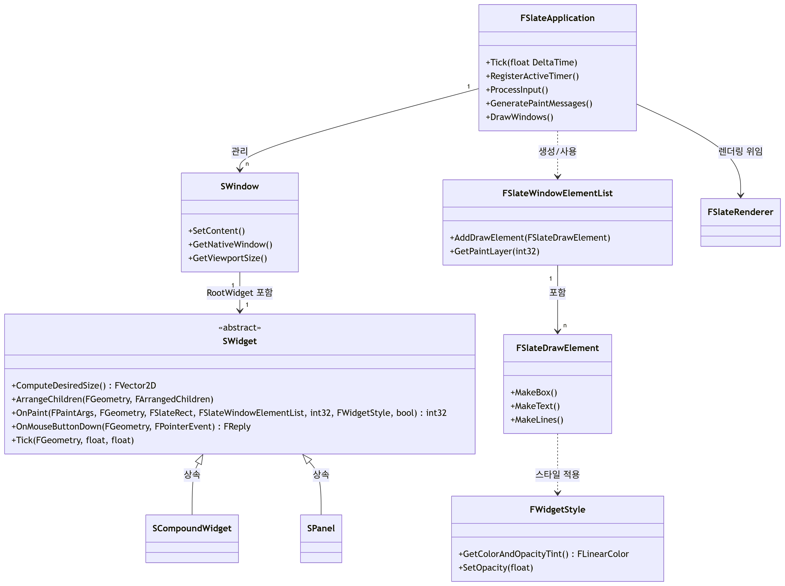

# Slate
언리얼 엔진의 로우레벨 UI 프레임워크

- SlateCore: UI 위젯, 레이아웃, 입력 처리 등 Slate의 핵심 로직을 담당
- Slate: 렌더링, 스타일링, 고수준 위젯 구현, Windows/OSX/Linux와의 통합 등 확장 기능 담당

## 슬레이트 구조 특징
- Slate의 UI는 SWidget이라는 추상 클래스를 루트로 하는 트리 구조
- 각 위젯(버튼, 텍스트, 리스트 등)은 SWidget을 상속한 C++ 클래스
  - 예: SButton, STextBlock, SListView 등
- 모든 위젯은 부모-자식 관계로 연결되어 트리 형태

## 슬레이트 동작 과정
1. Slate Application 구동
- 엔진 초기화 시 FSlateApplication 싱글턴이 생성
- 이 객체가 Slate의 메인 루프, 입력 이벤트 분배, 렌더링 등을 총괄
2. 위젯 트리 구성
- 프로그래머가 C++로 SWidget 트리를 생성 (ex. SNew(SVerticalBox) + SNew(STextBlock) 형태)
- 이 트리를 SlateApplication이 루트부터 관리
3. 입력 이벤트 처리
- OS 레벨의 입력(마우스, 키보드 등)이 SlateApplication에 전달됨
- Slate는 이를 루트 SWidget부터 트리 순회하며 적절한 위젯에 분배
- 각 위젯은 OnMouseDown, OnKeyDown 등 가상 메서드에서 처리
4. Tick & 업데이트
- Slate 트리는 매 프레임마다 Tick(갱신)됨
- 애니메이션, 상태 변화, Focus 변경 등 UI 갱신이 여기서 처리
5. 레이아웃 & 측정
- 각 SWidget은 ComputeDesiredSize, ArrangeChildren 등 메서드로 자기 크기와 자식 위치를 계산
- 위젯 트리를 재귀적으로 순회하며 레이아웃 패스를 수행
6. 렌더링
- 각 위젯의 OnPaint가 호출되어 FSlateDrawElement 명령을 발행
- Slate 렌더러가 DrawElement를 실제 GPU로 렌더링

## 슬레이트 다이어그램

### 클래스 관계
- FSlateApplication → SWindow: 여러 윈도우(에디터 창 등)를 관리
- SWindow → SWidget: 각 윈도우는 하나의 루트 위젯 트리를 가짐
- SWidget → SPanel/SCompoundWidget: 각 위젯의 파생 구조를 통해 복잡한 UI 트리를 형성
- FSlateWindowElementList → FSlateDrawElement: 각 윈도우에서 발생하는 모든 드로우 명령을 버퍼링
- FSlateDrawElement ↔ FWidgetStyle: 드로우 요소마다 스타일 정보를 가짐
- FSlateApplication → FSlateRenderer: 실제 GPU 렌더링을 위해 렌더러로 명령을 위임

### FSlateApplication
- Slate 전체의 엔트리 포인트이자 메인 루프
- 입력 이벤트(마우스, 키보드 등) 처리, UI 업데이트(Tick), 드로우 메시지 생성, 윈도우 관리, 렌더링 요청까지 Slate 관련 모든 핵심 흐름을 담당
- Tick, ProcessInput, GeneratePaintMessages, DrawWindows 등 메서드를 통해 매 프레임 UI 시스템의 상태를 갱신하고, 렌더링 파이프라인을 실행
- 여러 개의 SWindow 인스턴스를 직접적으로 관리

### SWindow
- OS 창(Window)의 추상화
- 에디터 창, 툴팁, 팝업 등 각종 윈도우를 의미
- 각 SWindow는 자신의 **루트 위젯(RootWidget, SWidget)**을 하나 포함
  -  즉, 한 SWindow의 모든 Slate UI 요소는 하나의 SWidget 트리로 구성됨
- 창의 콘텐츠 설정, 네이티브 창 객체 반환, 뷰포트(창 영역) 크기 정보 제공 등의 역할을 담당

### SWidget
- 모든 Slate 위젯(버튼, 텍스트, 패널 등)의 최상위 추상 베이스 클래스
- 모든 시각적 UI 요소는 SWidget을 상속하여 구현
- 주요 메서드:
    - ComputeDesiredSize: 위젯이 필요로 하는 최소/최적 크기 계산
    - ArrangeChildren: 자식 위젯 배치
    - OnPaint: 실제로 드로우 요소를 생성(FSlateDrawElement)하는 렌더링 엔트리 포인트
    - OnMouseButtonDown: 입력 이벤트 핸들링
    - Tick: 프레임마다 상태 갱신 등

---
SWidget 컨테이너 상속 구조 (SCompoundWidget, SPanel)
- SCompoundWidget
  - SWidget에서 파생되며, 단일 자식(Slot)만을 가질 수 있는 컨테이너
  - 복잡한 단일 구조 위젯에 적합

- SPanel
  - SWidget에서 파생되며, 여러 자식(Slot/배열)을 가질 수 있는 컨테이너
  - 리스트, 박스, 그리드 등 여러 자식 위젯을 배치하는 레이아웃 위젯에서 사용

### FSlateWindowElementList
- 실제 드로잉 명령(FSlateDrawElement)의 집합/버퍼 역할
- 각 SWindow의 OnPaint 과정에서 위젯 트리를 순회하며, SWidget들이 페인트 시 호출되는 OnPaint에서 DrawElement를 이 리스트에 기록
- Draw Call 최적화와 레이어 관리의 핵심 중간 계층

### FSlateDrawElement
- 실제 GPU로 전달되는 드로우 명령을 표현하는 구조체
- 박스, 텍스트, 선, 이미지 등 다양한 유형의 그리기 명령을 포함
- SWidget이 OnPaint에서 시각적 요소를 그리고자 할 때, FSlateDrawElement를 만들어 FSlateWindowElementList에 추가함

### FWidgetStyle
- 위젯의 시각적 스타일(컬러, 불투명도, 폰트 등)을 정의
- FSlateDrawElement와 연계되어, 각 드로우 요소에 스타일 속성을 부여
- 상위에서 하위로 스타일이 전파되어, 일관성 있는 UI 테마 구현이 가능

### FSlateRenderer
- 실제 하드웨어(DirectX/OpenGL/Vulkan 등) 렌더러와의 인터페이스
- FSlateApplication이 그리기 명령을 넘기면, FSlateRenderer가 이를 플랫폼별로 변환/렌더링
- Slate의 플랫폼 독립성과 실제 렌더링 동작을 분리하는 핵심 계층

## 정리
- FSlateApplication → SWindow → SWidget 트리 (OnPaint) → FSlateWindowElementList → FSlateDrawElement → FSlateRenderer (플랫폼별)

