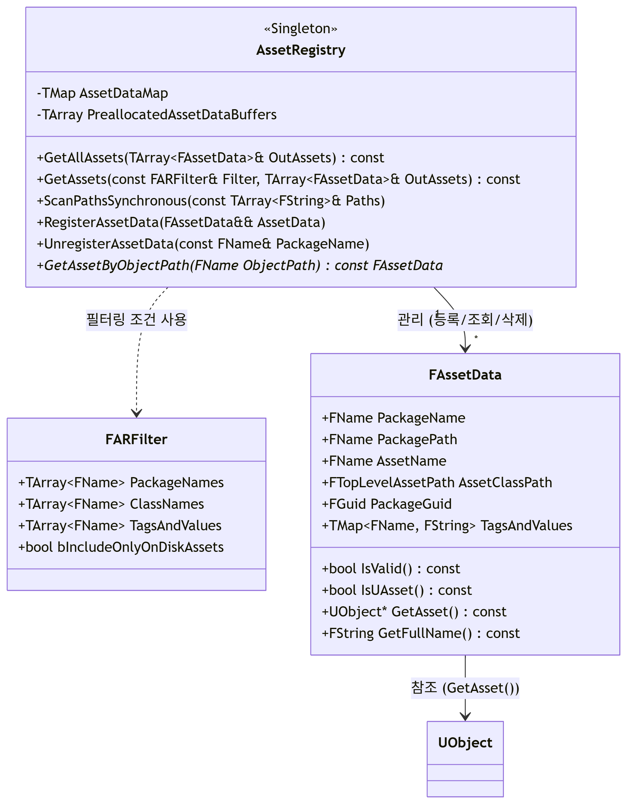

## 목표: 콘텐트 폴더에서 선택한 에셋 중 미사용 에셋 삭제하기

# Asset Referencers
- 레벨에서 사용된 에셋의 경우 Asset References(에셋 참조)가 존재함
- 즉 미사용 상태의 에셋의 경우 참조 개수 = 0

## AssetRegistry
모든 프로젝트 에셋의 메타 데이터를 인덱싱/검색/관리하는 중앙 관리 모듈

- 에디터 구동 시 **모든 프로젝트 에셋(.uasset, .umap 등)**을 빠르게 탐색/관리할 수 있도록 내부적으로 모든 에셋의 **메타데이터를 스캔**
- 에셋 인덱싱: 실제 에셋 객체(UObject 등)는 메모리에 로드하지 않고, 각 에셋의 메타 데이터를 메모리에 인덱싱 (`FAssetData 생성`)
- 빠른 검색: 이름, 클래스, 태그 등 다양한 조건으로 에셋을 빠르게 조회
- 런타임/에디터 지원: 런타임 자동화, 에디터 UI, 플러그인 등에서 활용

## FAssetData
에셋 레지스트리에서 찾은 에셋에 대한 중요한 정보를 저장하는 구조체

- Asset Registry는 FAssetData의 집합
- 실제 에셋의 전체 데이터나 객체는 아님 (일시적)
- `AssetRegistry`를 통해 조회 시 `TArray<FAssetData>`로 반환됨

### AssetRegistry 다이어그램
{: width="80%" height="80%"}

- FARFilter : AssetRegistry 에서 검색에 사용되는 필터
- FAssetData → UObject:  필요에 따라 일시적으로 참조(사용)한다 (예: GetAsset() 호출)

## Remove Unused Assets 함수 구현에 사용한 메서드
### 1. UEditorAssetLibrary::FindPackageReferencersForAsset
- 특정 에셋(Asset)을 참조하는 모든 패키지(Package)의 목록을 찾아 반환
- 에셋 의존성 분석에 사용. 특히 **에셋을 삭제하거나 수정할 때 어떤 다른 에셋들이 영향을 받을지 확인**
- 에디터 전용 기능

```c++
static TArray<FString> UEditorAssetLibrary::FindPackageReferencersForAsset(
    const FString& AssetPath,
    bool bLoadAssetsToConfirm = false
);
```
- 매개변수
  - AssetPath (필수): 분석할 대상 에셋의 경로 (Object path)
  - bLoadAssetsToConfirm (옵션, 기본값 false)
    - true: 참조하는 패키지를 메모리에 로드하여 정확성을 확인 (느리지만 정확하다)
    - false: 에셋 레지스트리(Asset Registry)의 메타데이터만 사용하여 빠르게 검색 (빠르지만 간접 참조 누락 가능)
- 반환 값
  - 참조하는 패키지의 경로 문자열(FString) 배열 (TArray<FString>)
  - 에셋이 사용되지 않으면 빈 배열 반환

### 2. Num()
- 컨테이너에 저장된 **요소의 개수(길이)**를 반환
- c++의 .Size()와 같음

### 3. ObjectTools::DeleteAssets(UnusedAssetsData);
Asset들을 안전하게 일괄 삭제하는 유틸리티

```c++
// UnrealEd 모듈 내 ObjectTools.h 선언부
static bool DeleteAssets(const TArray<FAssetData>& AssetDataList, bool bShowConfirmation = true, bool bForceDelete = false);
```
- 대표적으로 FAssetData 배열을 인자로 받음 (다른 타입 매개변수 사용 가능)

### 동작과정
1. 입력 받은 FAssetData 리스트에서 **실제 에셋 객체(UObject)를 찾아옴**
2. **에셋이 참조되는지 (Reference Graph) 검사**
  - 다른 에셋이나 오브젝트에서 참조하고 있는 경우, 경고 대화창을 띄워 사용자에게 확인 받음
  - 옵션에 따라, 강제 삭제(bForceDelete) 가능
3. 사용자에게 **삭제 확인(Confirmation) 요청**
  - bShowConfirmation 인자가 true일 경우, 실제 삭제 전에 "정말 삭제할까요?"와 같은 확인창 표시
4. **트랜잭션 생성 및 삭제 실행**
  - **삭제 과정 전체를 에디터 트랜잭션(Undo/Redo)에 등록 → 실수 시 실행 취소 가능**
  - 내부적으로 FScopedTransaction을 사용하여 트랜잭션 단위로 관리
5. 실제 삭제
  - 에셋을 Content Browser 및 파일 시스템(디스크)에서 제거
  - 참조된 경우, 일부 삭제가 제한되거나, 사용자가 강제 삭제시 후처리(레퍼런스 클린업 등) 발생
6. 결과 반환
  - 성공적으로 삭제된 경우 true, 실패 또는 취소시 false 반환

## ObjectTools.h
에디터 환경에서 UObject 관련 유틸리티 함수 집합을 정의한 헤더 파일
- 삭제/이동/복사 동작과 관련해, **사용자에게 경고 및 결과 알림 대화창을 띄워줌**
- UnrealEd 모듈에 소속
  - 런타임 환경(게임 실행)에서는 사용 불가. 에디터에서만 사용하는 기능

