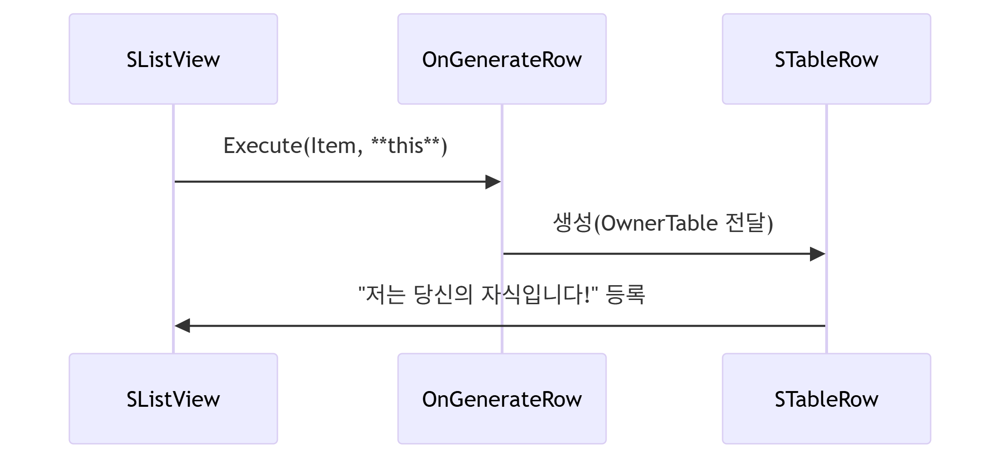
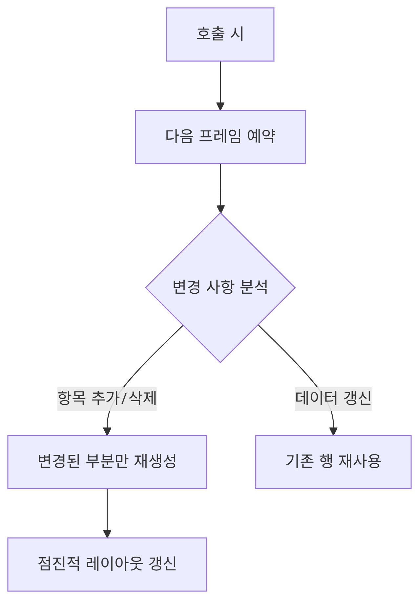
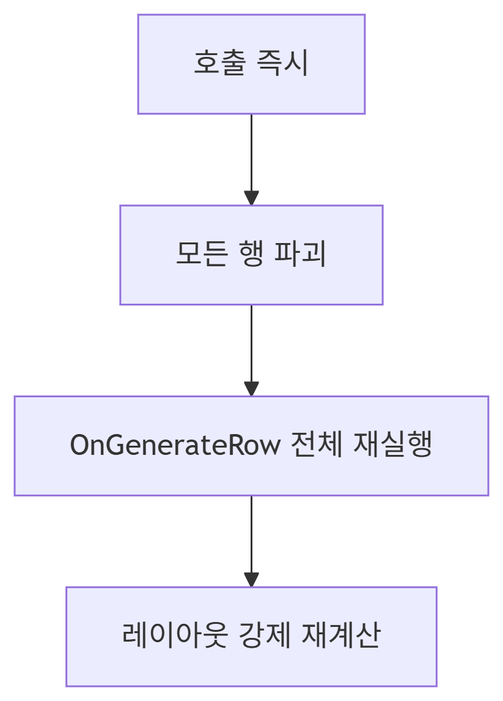

## 목표 : 에셋 이름, 클래스, 선택, 삭제 버튼이 들어간 리스트 생성하기

## 위젯 창 전체 레이아웃 구조
- 첫 번째 슬롯: 타이틀 텍스트
- 두 번째 슬롯: 리스트 조건 선택 드롭다운
- 세 번째 슬롯: 실제 에셋 리스트 -> SListView 사용
- 네 번째 슬롯: 3개의 버튼(예: Delete All 등)

# SListView
Slate UI 프레임워크에서 제공하는 리스트 위젯. 데이터 항목들을 스크롤 가능한 리스트 형태로 표시하는 데 사용

>메모리 안전성 및 레퍼런스 관리를 위해 거의 항상 `TSharedPtr<T>` 형태로 운용

## 특징
1. 템플릿 기반 디자인 : `SListView<T>` 형태로 사용. T는 표시할 데이터 항목의 타입
2. 가상화 지원 : 많은 수의 항목을 효율적으로 처리하기 위해 가상화를 지원 (화면에 보이는 항목만 렌더링)
3. 커스터마이징 : 항목 표현 방식, 선택 동작, 스크롤 동작 등을 자유롭게 커스터마이즈
4. 다양한 상호작용 : 선택, 더블 클릭, 컨텍스트 메뉴 등 다양한 사용자 상호작용을 지원

## 기본 사용법
```c++
// 데이터 소스 준비
TArray<FString> Items = {"Item 1", "Item 2", "Item 3"};

// 리스트 뷰 생성
SNew(SListView<FString>)
.ItemHeight(24) // 항목 높이
.ListItemsSource(&Items) // 데이터 소스 설정
.OnGenerateRow(this, &SMyWidget::HandleGenerateRow) // 항목 생성 핸들러
```

# 주요 속성
## .ListItemsSource()
리스트에 표시할 데이터(배열)의 포인터를 지정. **필수 속성임**
- 형식 : `TArray<T>*` 또는 `TArray<TSharedPtr<T>>*`

```c++
TArray<TSharedPtr<FMyItem>> MyItems;

ChildSlot
[
    SNew(SListView<TSharedPtr<FMyItem>>)
    .ListItemsSource(&MyItems) // <- 리스트에 표시할 아이템 배열의 포인터
    // ... 생략 ...
];
```

## .OnGenerateRow()
리스트 뷰가 스크롤 시 화면에 보이는 행(Row)을 어떻게 생성할지 정의하는 핵심 함수. **가장 중요**
>
필수 구현 사항 : 반드시 ITableRow 인터페이스를 반환

```c++
FOnGenerateRow<T>::FDelegate OnGenerateRow

TSharedRef<ITableRow> YourClass::OnGenerateRowFunc(
    TSharedPtr<T>         InItem,
    const TSharedRef<STableViewBase>& OwnerTable
);
```
- T: 리스트에 표시하는 데이터 타입
- OwnerTable : SListView가 내부적으로 자동 생성하여 전달하는 인자
  - `STableRow<T>`의 부모가 되는 리스트 뷰 
- 반환: `TSharedRef<ITableRow>`
    - SNew(`STableRow<T>`, OwnerTable)로 생성

## 특징
- 동적 생성 : 실제로 화면에 보여질 때만 행을 생성
- 메모리 효율 : 스크롤 시 보이지 않는 항목은 즉시 해제되며, 생성된 행은 풀(Pool)에서 재사용
- 가상화 : 10,000개 항목이 있어도 실제로는 10~20개의 행 위젯만 존재

## 동작 원리

1. 스크롤 발생
    - 사용자가 리스트를 스크롤하면 엔진은 화면에 새로 들어올 항목의 인덱스를 계산
2. 행 생성 요청
    - 새로 보여야 할 항목에 대해 `OnGenerateRow`를 호출
    - **기존에 생성된 행이 풀에 있으면 재사용, 없으면 새로 생성**
3. 데이터 바인딩
    - 인자로 전달된 Item 데이터로 위젯을 구성 (`TSharedRef<ITableRow>`)
4. 화면에 배치
    - 생성된 행을 적절한 위치에 배치하고 스크롤 영역에 추가함
5. 스크롤 밖으로 나간 행 처리
    - 화면에서 벗어난 행은 풀로 반환되며, 메모리에서 삭제되지 않음

> 항목 재사용 (Pooling)
- 생성된 행은 STableRow로 래핑되어 풀에서 관리된다
- 같은 타입의 행은 재사용되므로 상태 유지에 주의가 필요하다

# ITableRow
테이블/리스트의 개별 행(row)을 나타내는 인터페이스

- SListView, STreeView, STableViewBase 등에서 각 행을 추상화 함
- `STableRow<T>`가 ITableRow를 상속(구현)
    - 사용자는 STableRow만 직접 생성하면 되고, **Slate 내부에서는 ITableRow*로 Row를 관리**

## 특징
- 행의 기본 동작 정의
  - 선택(Selection), 호버(Hover), 드래그(Drag) 등의 상호작용 처리
- 행의 레이아웃 및 가시성 관리
- 부모 테이블 뷰와의 통신
- 가상화 지원

 ```c++
  // 화면 밖의 행은 자동으로 해제
virtual void ExitRow() = 0;
```
- 폴링 시스템 : 행 인스턴스 재사용

```c++
TSharedRef<ITableRow> ReuseRow(TSharedPtr<ItemType> NewItem)
```

## 정리


1. 위젯에서 스크롤 리스트 이벤트를 부름
- 사용자가 스크롤하거나, 데이터가 바뀌거나, 리스트가 처음 표시될 때 이벤트 발생

1. SListView에서 해당 스크롤에 들어갈 Row 함수 호출 (OnGenerateRow)
- SListView는 **지금 화면에 보여져야 하는 Row**에 대해서만 `.OnGenerateRow()` 콜백(델리게이트)을 호출함

1. STableRow에서 실제 Row 객체 생성
- `OnGenerateRow`에서 `STableRow<T>` 인스턴스를 생성해서 반환

1. 스크롤에 따라 Row 객체 관리
- 화면 밖으로 나간 행은 메모리에서 삭제되지 않고 풀에 보관

# SListView 에서 자주 쓰이는 메서드
## 리스트 갱신
## RequestListRefresh()
다음 프레임에 리스트를 안전하게 갱신

```c++
void SListView::RequestListRefresh()
{
    // Invalidate만 호출하고 즉시 작업 수행 X
    Invalidate(EInvalidateWidgetReason::Layout);
}
```

- RebuildList()보다 성능 부하가 적음
- 빈번한 업데이트에 적합 (예: 실시간 필터링)

```c++
ConstructedAssetListView->RequestListRefresh();
```

## 동작
{: width="50%" height="50%"}

## RebuildList()
즉시 전체 리스트 재구성
- 주의점: 대량 데이터에서 성능 저하 가능

```c++
void SListView::RebuildList()
{
    Private::TableViewBase::RebuildList(); // 전체 재생성 로직
    // 모든 행을 새로 만들고 레이아웃 재계산
}
```

## 동작
{: width="40%" height="40%"}

### RebuildList() vs RequestListRefresh() 선택 가이드

특징|RebuildList()	|RequestListRefresh()|
실행 시점	|즉시	|다음 프레임|
갱신 범위	|전체 리스트|	변경된 부분만|
행 재사용	|모든 행 새로 생성(pool 초기화)|기존 행 유지(pool 재활용)|
성능 영향	|항목 수에 선형적 부하|	변경량에 비례한 부하|
사용 시나리오	|리스트 구조 변경 시|	데이터 내용 변경 시|

- 여러 항목을 연속 삭제할 때 RebuildList()는 매 삭제마다 전체 재구성하므로 성능 저하 발생 가능
- RequestListRefresh()는 변경 사항을 모아 한 번에 처리, 렌더링 프레임과 동기화되어 깜빡임 현상 감소

## 네비게이션 & 스크롤 제어
### ScrollToTop() / ScrollToBottom()
```c++
// 리스트의 시작/끝으로 스크롤
ListView->ScrollToTop();
ListView->ScrollToBottom();
```

### ScrollToItem()

```c++
// 특정 아이템으로 스크롤 (가시 영역 보장)
ListView->ScrollToItem(SelectedItem);
```

### SetScrollOffset()
```c++
// 픽셀 단위 정밀 스크롤 제어
ListView->SetScrollOffset(200.f);
```

## 선택 관리 메서드
### SetSelection()
```c++
// 단일 아이템 선택
ListView->SetSelection(SelectedItem);

// 다중 선택 모드
ListView->SetSelection(SelectedItems, ESelectInfo::OnMouseClick);
```

### ClearSelection()
```c++
// 모든 선택 해제
ListView->ClearSelection();
```

### GetSelectedItems()
```c++
// 현재 선택된 아이템들 가져오기
TArray<TSharedPtr<FAssetData>> SelectedItems;
ListView->GetSelectedItems(SelectedItems);
```

## 데이터 소스 제어
### SetItemsSource()
```c++
// 데이터 소스 변경 (자동 갱신 X)
ListView->SetItemsSource(&NewDataArray);

// 변경 후 수동 갱신 필요
ListView->RequestListRefresh();
```

### GetNumItems()
```c++
// 아이템 총 개수 확인
int32 ItemCount = ListView->GetNumItems();
```
