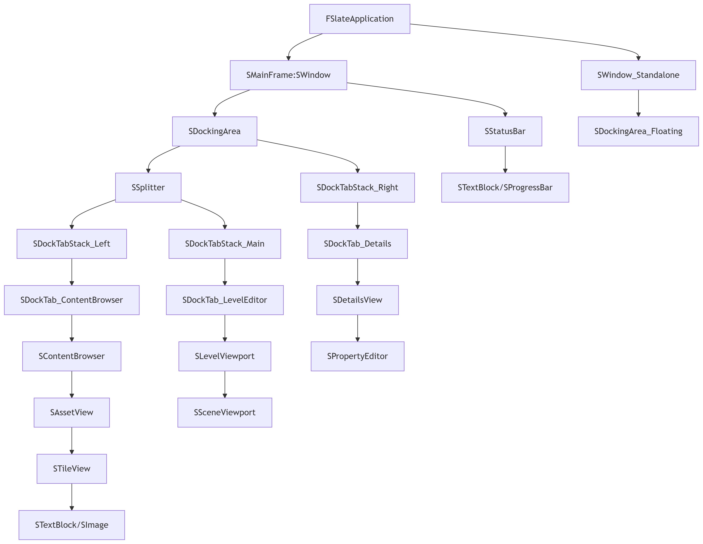

## 목표 : 에디터 확장을 더 깊게 다루기 위해 슬레이트(Slate) 코드를 직접 작성해보자

## 슬레이트가 어렵게 느껴지는 이유
1. 슬레이트 코드는 고유의 문법을 가지고 있다
- 일반적인 C++ 코드와 매우 다르다
2. 시각화가 어렵다
- 위젯 레이아웃을 전부 코드로만 해야 한다는 것이 문제
- 변경한 내용을 바로바로 미리보기로 확인할 수 없다
3. 다른 모듈과의 연동
- 다른 모듈과 데이터를 주고받고 상호작용하는 것이 바로 연동(communication)이다
- 이 부분이 슬레이트 위젯을 구현할 때 가장 어렵고 중요하다

# 스마트 포인터
모듈 간의 데이터 전달 문제(communication issue)를 해결하기 위해서는 반드시 이해해야 할 중요한 개념

>
언리얼 엔진에서는 new 키워드를 직접 써서 객체를 만들도록 허용하지 않는다
- new 키워드로 메모리를 할당할 일이 있다면, 반드시 스마트 포인터와 함께 쓴다

## UE에서 지원하는 스마트 포인터
- Shared Pointer (TSharedPtr)
- Shared Reference (TSharedRef)
- Weak Pointer (TWeakPtr)
- Unique Pointer (TUniquePtr)

## TSharedPtr (Shared Pointer, 공유 포인터)
- 소유권(Owning) 보유: Shared Pointer는 해당 객체의 소유권을 갖는다
이 포인터가 존재하는 한 객체는 삭제되지 않음

- 참조 카운팅(reference counting) 방식:
이 객체를 참조하는 Shared Pointer/Reference가 모두 사라지면 자동으로 삭제

- null 할당 가능:
아직 가리키는 대상이 없어도 선언만 할 수 있다

### 주요 메서드

메서드	|설명	|반환 타입|
Get()	|포인터가 가리키는 객체의 raw 포인터 반환|	T*|
IsValid()	|포인터가 유효한 객체를 가리키는지 확인|	bool|
Reset()	|포인터가 가리키는 객체 해제|	void|
Pin()	|TWeakPtr에서 TSharedPtr로 변환 (유효한 경우)	|`TSharedPtr<T>`|
ToSharedRef()|	TSharedPtr을 TSharedRef로 변환|	`TSharedRef<T>`|
GetSharedReferenceCount()|	참조 카운트 반환|	int32|

## TSharedRef (Shared Reference, 공유 참조)
Shared Pointer와 거의 동일하지만 **항상 유효한 객체만 가리킬 수 있다**

- null 할당 불가능:
항상 유효한 인스턴스가 존재해야 하므로, 슬레이트 함수 반환값 등에서 주로 사용

- 따라서 Shared Reference는 언제나 Shared Pointer로 변환할 수 있다

- 유효한 Shared Pointer는 언제나 Shared Reference로 변환이 가능하다

### 주요 메서드

메서드	|설명	|반환 타입|
Get()	|포인터가 가리키는 객체의 raw 포인터 반환|	T*|
IsValid()	|항상 true 반환 (TSharedRef는 null이 될 수 없음)|	bool (항상 true)|
ToSharedPtr()|	TSharedRef를 TSharedPtr로 변환	|`TSharedPtr<T>`|
GetSharedReferenceCount()	|참조 카운트 반환	|int32|

## TWeakPtr (Weak Pointer, 약한 참조)
- 소유권을 갖지 않음: Weak Pointer는 객체의 소유권이 없음
객체가 삭제되는 것을 막지 않는다

- “참조 순환(Reference Cycle)” 문제를 해결할 때 매우 유용하다
즉, 객체가 살아있을 때만 약하게 참조하고, 객체가 삭제되면 자동으로 무효(null)가 된다

- 사용할 때마다 “이 객체가 아직 살아 있나요?”라고 먼저 체크해야 하며,
살아있으면 사용할 수 있다

### 주요 메서드

메서드|	설명	|반환 타입|
Pin()|	유효한 경우 TSharedPtr로 변환, 아니면 null	|`TSharedPtr<T>`|
IsValid()	|가리키는 객체가 아직 유효한지 확인|	bool|
Expired()	|가리키는 객체가 더 이상 유효하지 않은지 확인	|bool|

{: .new-title}
> ❓게임 개발에서는 잘 안 보이는 이유?
>
> - 스마트 포인터들은 UObject 기반 오브젝트에서는 쓸 수 없다
> - UObject 시스템 자체가 고유한 메모리 관리(가비지 컬렉션)를 사용하기 때문
> - Object 포인터를 직접 스마트 포인터로 관리하면
엔진의 GC 시스템과 충돌이 생김

# 스마트 포인터 생성

## MakeShareable
- 작동 방식: 이미 힙에 할당된 객체(raw pointer)를 스마트 포인터로 감쌈
- 효율성: 객체 생성과 참조 카운트 관리를 분리해서 처리하므로 메모리 할당이 2번 발생
  - **이미 존재하는 객체를 감싸는 유일한 방법일 때 유용**
- 제한 사항: 객체가 public 생성자를 가져야 함 (private/protected 생성자 불가)
  - 객체가 이미 생성되어 있어야 함

```c++
// MakeShareable 예제
class MyClass { public: MyClass() {} }; // public 생성자 필요
TSharedPtr<MyClass> Ptr = MakeShareable(new MyClass());
```

## MakeShared
- 작동 방식: 객체와 참조 카운트 컨트롤 블록을 한 번에 할당
- 효율성: 단일 메모리 할당으로 객체와 컨트롤 블록을 함께 할당하므로 일반적으로 더 나은 캐시 지역성
  - 하지만 UE 구현상의 이유로 실제로는 MakeShareable보다 약간 느릴 수 있음
- 장점: private/protected 생성자도 사용 가능 (Friend 선언으로 접근 가능)
  - 더 현대적인 C++ 스타일

```c++
// MakeShared 예제
class MyClass { friend TSharedFromThis<MyClass>; MyClass() {} }; // private 생성자 가능
TSharedPtr<MyClass> Ptr = MakeShared<MyClass>();
```

함수|	설명	|반환 타입|
`MakeShared<T>(Args...)`|	새로운 객체를 생성하고 TSharedRef 반환|	`TSharedRef<T>`|
`MakeShareable(new T)`|기존 객체를 스마트 포인터로 감싸기	|`TSharedPtr<T>`|
`StaticCastSharedPtr<NewType>()`|	타입 안전한 static 캐스트	|`TSharedPtr<NewType>`|
`ConstCastSharedPtr<NewType>()`|	const 캐스트	|`TSharedPtr<NewType>`|

>
슬레이트 위젯을 만들 때 자주 사용됨

# 커스텀 Slate 레이아웃 구현 과정
## 1. Slate 위젯 클래스 정의
- 대부분의 커스텀 슬레이트 위젯은 SCompoundWidget을 상속

```c++
#pragma once

#include "Widgets/SCompoundWidget.h"

class SMyCustomLayout : public SCompoundWidget
{};
```
## 2. Slate 속성 매크로(Arguments) 활용

| 매크로| 역할 | 예시  |
|---|---|---|
| SLATE\_ARGUMENT  | “불변 값” 1회성 복사(생성자 인자)  | SLATE\_ARGUMENT(FText, Title) |
| SLATE\_ATTRIBUTE | “동적 값”(TAttribute 바인딩) | SLATE\_ATTRIBUTE(int32, Count)  |
| SLATE\_EVENT     | “이벤트/Delegate” (콜백 함수) | SLATE\_EVENT(FOnClicked, OnButtonClicked)|

- SLATE_ARGUMENT: 위젯의 생성자(Construct)에 전달될 “불변 값” 인자
- SLATE_ATTRIBUTE: 바인딩 가능한 동적 값(속성)
    - TAttribute로 선언되어 외부의 값을 실시간으로 바꿀 수 있음
- SLATE_EVENT: Slate Delegate/이벤트(함수, 람다 등 콜백)

```c++
// CustomButtonPanel.h
class SCustomButtonPanel : public SCompoundWidget
{
public:
    SLATE_BEGIN_ARGS(SCustomButtonPanel) {}
      // 슬레이트 속성 정의
        SLATE_ARGUMENT(FText, Title)
        SLATE_ARGUMENT(TArray<FText>, ButtonLabels)
        SLATE_EVENT(FOnInt32Selected, OnButtonSelected)
    SLATE_END_ARGS()

    void Construct(const FArguments& InArgs);
    
private:
    // 위젯 상태 변수
    TArray<FText> ButtonLabels;
    FOnInt32Selected OnButtonSelected;
};
```

## 3. Construct 함수 구현
- ChildSlot을 이용해 Slate 레이아웃 선언
- ChildSlot(컨테이너의 루트)에 원하는 레이아웃 위젯(예: SVerticalBox, SHorizontalBox 등)으로 하위 위젯을 배치

```c++
void SMyCustomLayout::Construct(const FArguments& InArgs)
{
    Title = InArgs._Title;

    ChildSlot
    [
        SNew(SVerticalBox)
        + SVerticalBox::Slot()
        .AutoHeight()
        [
            SNew(STextBlock).Text(FText::FromString(Title))
        ]
        + SVerticalBox::Slot()
        .FillHeight(1.0f)
        [
            SNew(SButton)
            .Text(NSLOCTEXT("MyCustomLayout", "Button", "Click Me"))
            // .OnClicked(....)
        ]
    ];
}
```

## 4. Slate 스타일 및 Theme 적용
- FSlateStyleSet을 사용해 스타일 정의
- FSlateBrush로 브러시 설정
- FSlateFontInfo로 폰트 설정

## 5. 이벤트 처리
- 마우스/키보드 이벤트 바인딩
- 델리게이트를 사용한 커스텀 이벤트

# 언리얼 에디터 슬레이트 계층 구조


1. 루트 레벨 (FSlateApplication)
- 모든 슬레이트 위젯의 최상위 관리자
  - 입력 이벤트, 렌더링 순서, 포커스 관리
  - SMainFrame과 독립적인 팝업 창(SWindow_Standalone)을 자식으로 가짐

1. 메인 프레임 (SMainFrame)
- 에디터 메인 창 (가장 바깥 윈도우)
  - 상속 구조: SWindow → SMainFrame

1. 도킹 시스템 (SDockingArea)
- 탭/분할 레이아웃을 관리하는 컨테이너
- 여러 SDockTabStack(탭 묶음)을 포함하는 도킹 가능 영역
  - SSplitter : 수직/수평 영역 분할
  - SDockTabStack : 탭 그룹 (ex. 왼쪽/가운데/오른쪽 스택)
  - SDockTab : 사용되는 실제 개별 패널 (ex. 콘텐츠 브라우저, 디테일 패널)

1. 탭 컨텐츠 (SDockTab → SCompoundWidget)
- 각 탭의 실제 UI 구현체
  - 커스텀 위젯은 반드시 SCompoundWidget을 상속받아 구현

1. 기본 위젯 (Leaf Nodes)
- 최하위에 위치하는 실제 UI 요소
  - SextBlock, SButton, SImage 등