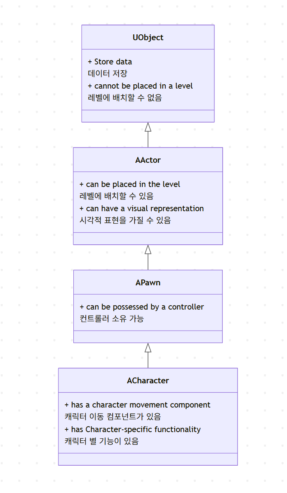
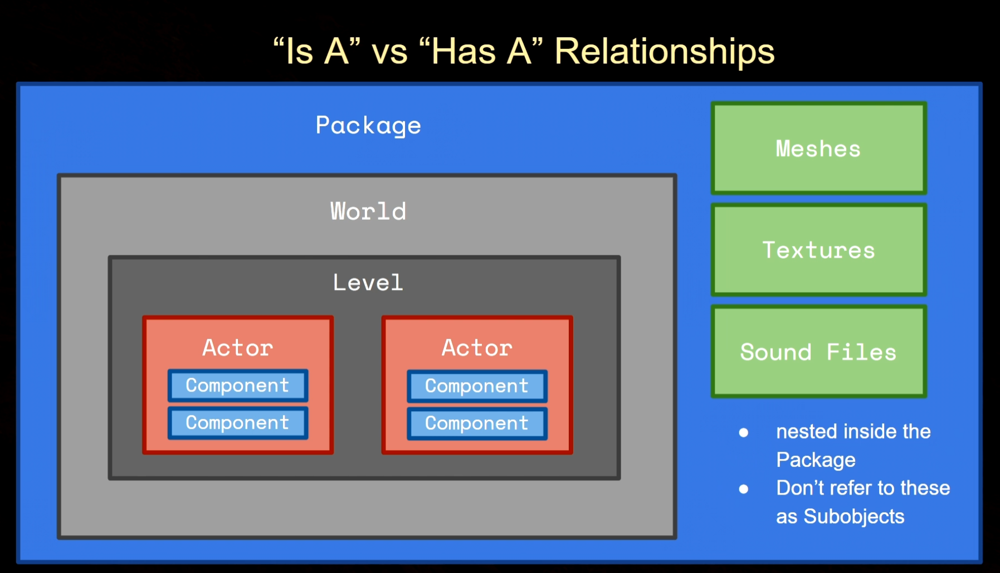

# C++ in UE
---

# Setting up Visual Studio
비주얼 스튜디오 세팅하기

## 지도 스크롤 사용
1. 상단의 도구 -> 설정
2. 텍스트 편집기 -> 모든 언어
3. 스크롤 막대 -> 세로 스크롤 막대에 지도 모드 사용 체크

## 외부 종속성 숨기기
1. 텍스트 편집기 ->  C/C++
2. 고급 -> 검색/탐색
3. 외부 종속성 폴더 숨기기 true 로 변경

## 매크로 보기
1. 텍스트 편집기 ->  C/C++
2. 뷰 -> 비활성 코드
3. 비활성 블록 표시 -> False

---

# Classes and Inheritance
클래스 상속 다이어그램

{: width="70%" height="60%"}

## 클래스에서 "Is A" VS "Has A"
- Is A : 상속 관계
  - 예 :  `a Child is a Parent`
  - 예 :  `a Child is not a Grandchild`
- Has A : 맴버 변수, 속성을 가지다
  - 예: `a Package has a World` 
  - 예: `a Level has Actors`


- 월드는 패키지의 서브 객체
- 레벨은 월드의 서브 객체
- 액터는 레벨의 서브 객체
- 컴포넌트는 액터의 서브 객체

---

# UE_LOG
로깅을 위한 핵심 매크로. UE_LOG 사용 시 로그 메시지를 파일에 자동으로 저장

- 기본적으로 최대 10MB까지 기록되며, 초과 시 새 파일 생성

```c++
#define UE_LOG(LogCategory, Verbosity, Format, ...) \
    UE_LOG_IMPL(LogCategory, Verbosity, Format, ##__VA_ARGS__)
```
### 사용 예시
```c++
UE_LOG(LogTemp, Warning, TEXT("This is a warning message!"));
```

## 주의 사항
### 1.  `TEXT()` 매크로 필수
- 모든 문자열 포맷 `TEXT()`로 감싸기

```c++
UE_LOG(..., TEXT("Value: %.2f"), 123.456); // 올바른 사용
UE_LOG(..., "Value: %.2f", 123.456);      //컴파일 오류
```
### 2. FString 전달
- FString은 반드시 `*` 연산자로 역참조하기
```c++
FString Name = "Unreal";
UE_LOG(..., TEXT("Engine: %s"), *Name);
```

### 3. 소수점 자릿수 초과 시 반올림
- 사용자가 지정한 n의 다음 자리에서 반올림

```c++
float Value = 1.23456f;

// UE_LOG 출력 테스트
UE_LOG(LogTemp, Warning, TEXT("%.0f"), Value); // 1 (1.2에서 반올림)
UE_LOG(LogTemp, Warning, TEXT("%.1f"), Value); // 1.2 (1.23에서 반올림)
```

## LOG 파일 경로
1. 개발 중 (에디터/게임 실행 시)
- `프로젝트루트/Saved/Logs/` 폴더 내에 생성
- 파일명 형식: `프로젝트명.log` (예: `MyProject.log`)

2. 패키징된 빌드 (Shipping 빌드)
- Windows: `%LOCALAPPDATA%\[프로젝트명]\Saved\Logs\`
- Mac/Linux: `~/Library/Logs/[프로젝트명]/ 또는 ~/.config/[프로젝트명]/Logs/`

3. 크래시 로그
- 크래시 발생 시 `Saved/Crashes/` 폴더에 별도 로그 저장됨

## LOG 시스템 설정
### 1. 로그 파일 설정
- DefaultEngine.ini

```c++
[Core.Log]
Global=Verbose  // 기본 로그 레벨 설정
LogConsole=Warning  // 콘솔 출력 레벨
LogFile=Log  // 파일 기록 레벨
```
### 2. 런타임 로그 필터링
```
// 특정 카테고리만 파일에 기록 (콘솔 명령어)
Log LogMyCategory Verbose  // 상세 기록
Log LogNoisyCategory Off   // 해당 카테고리 기록 중지
```

## LogCategory 정리

카테고리|	설명|	사용 예시|
|---|---|---|
LogTemp|	임시 로깅용 (별도 정의 필요 없음)|	UE_LOG(LogTemp, Warning, TEXT("Temp message"))|
LogInit|	초기화 관련 로그|	UE_LOG(LogInit, Display, TEXT("System initialized"))|
LogExit|	종료/해제 관련 로그|	UE_LOG(LogExit, Verbose, TEXT("Resource released"))|
LogStreaming	|리소스 스트리밍 관련|	UE_LOG(LogStreaming, Display, TEXT("Level streaming complete"))|
LogPhysics|	물리 시스템 관련|	UE_LOG(LogPhysics, Warning, TEXT("Collision detected"))|
LogAI|	AI 시스템 관련|	UE_LOG(LogAI, Verbose, TEXT("Behavior tree updated"))|
LogAnimation	|애니메이션 시스템	|UE_LOG(LogAnimation, Error, TEXT("Missing animation sequence"))|
LogNet	|네트워킹 관련	|UE_LOG(LogNet, Display, TEXT("Packet received"))|
LogInput|	입력 시스템 관련	|UE_LOG(LogInput, Verbose, TEXT("Controller input detected"))|
사용자 정의|	DECLARE_LOG_CATEGORY_EXTERN으로 생성|	UE_LOG(LogMyGame, Log, TEXT("Custom log"))|

## Verbosity 정리

레벨|	설명|	출력 대상|	사용 예시|
|---|---|---|---|
Fatal|	치명적 오류 (크래시 발생)|	모든 출력|	UE_LOG(..., Fatal, TEXT("Critical failure"))|
Error|	복구 불가능한 오류|	에디터/콘솔/파일|	UE_LOG(..., Error, TEXT("Invalid object"))|
Warning	|경고 (문제 가능성)|	에디터/콘솔/파일|	UE_LOG(..., Warning, TEXT("Deprecated function"))|
Display	|일반 정보 (기본 레벨)|	에디터/콘솔/파일|	UE_LOG(..., Display, TEXT("Level loaded"))|
Log	|일반 디버그 정보|	에디터/파일|	UE_LOG(..., Log, TEXT("Debug value: %d"), Value)|
Verbose	|상세 디버그 정보|	파일 (기본 설정)|	UE_LOG(..., Verbose, TEXT("Detailed trace"))|
VeryVerbose|	매우 상세한 정보|	파일 (필터링 시)|	UE_LOG(..., VeryVerbose, TEXT("Frame-by-frame data"))|

## Format 정리

데이터 타입|	포맷 스타일|사용 예시|
|---|---|---|
기본 정수|	%d	|UE_LOG(LogTemp, Display, TEXT("Score: %d"), 42)|
8진수|	%o|	UE_LOG(LogHex, Verbose, TEXT("Octal: %o"), 42) |
16진수 (소문자)|	%x|	UE_LOG(LogHex, Verbose, TEXT("Hex: 0x%x"), 255) |
16진수 (대문자)|	%X|	UE_LOG(LogHex, Verbose, TEXT("Hex: 0x%X"), 255) |
부동소수점 (기본)|	%f|	UE_LOG(LogPhysics, Warning, TEXT("Gravity: %f"), 9.8f)|
부동소수점 (고정)|	%.2f|	UE_LOG(LogMath, Display, TEXT("PI: %.2f"), 3.141592)|
과학적 표기법	|%.3e	|UE_LOG(LogSci, Log, TEXT("Atomic: %.3e"), 0.000000123)|
Bool (텍스트 변환)|	%s + 삼항 연산자|	UE_LOG(LogSystem, Log, TEXT("IsActive: %s"), bIsActive ? TEXT("True") : TEXT("False"))|
포인터 주소	|%p	|UE_LOG(LogMemory, Warning, TEXT("Ptr: %p"), MyObject)|