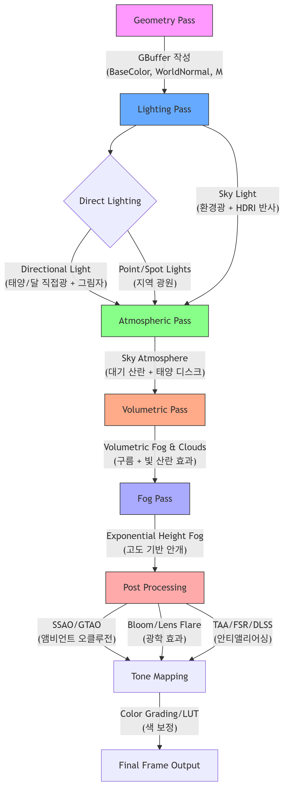

# 2. Lighting and Atmosphere
조명과 대기/환경광

## Place Actors 창 꺼내기
1. 상단의 프로젝트에 빠르게 추가하기 버튼 (네모 박스 모양+) 클릭
2. 액터 배치 패널 클릭 (리스트 최하단에 있음)

# Lighting 조명
## Directional Light
무한히 멀리 있는 광원(태양, 달 등)을 모델링하는 방향광 (실제로는 방향만 존재, 위치는 의미 없음)

- 장면 전체에 균일한 방향으로 평행하게 빛을 투사
  - 그림자 방향, 광원의 각도에 따라 환경 전체의 조명 분위기 결정
- Sky Atmosphere, Sky Light와 상호작용
  - 태양광이 대기에 산란, 전체 하늘/환경에 영향

### 이동 단축키
- 첫 번째 태양 이동: Ctrl + L을 누른 채 마우스를 움직임
- 두 번째 태양 이동: Ctrl + Shift + L을 누른 채 마우스를 움직임
  - 짐벌락 현상으로 이동이 안될 때 회전 값 0으로 리셋하면 해결됨

### Mobility 속성
1. Static
- 게임 중 이동/색상/강도 변화 불가
- 그림자와 라이팅 정보를 '베이크'(Bake, 미리 계산하여 저장)
- 가장 빠르지만 동적인 변화 불가
2. Stationary
- 색상/강도 변화 가능, 위치/회전은 불가
- 정적인 오브젝트에만 베이크, 동적 오브젝트는 실시간 그림자
- 부분적으로 베이크와 동적 그림자 혼합
3. Movable
- 위치, 회전, 색상, 강도 모두 실시간 변화 가능
- 그림자도 모두 실시간 계산(가장 비용이 크지만 동적으로 활용 가능)

## 광원 온도 조절
-  Details 패널에서 Use Temperature를 활성화
-  온도값을 변경해 광원의 색감 조절 (낮음: 빨강, 높음: 파랑) 

# Atmosphere 대기/환경광
## Sky Atmosphere
현실적인 하늘과 대기 산란 효과를 구현하는 대기 렌더링 시스템

- 최대 두 개의 Directional Light 사용
  - 예 : 하나는 태양, 또 하나는 달 / 두 번째 태양을 시뮬레이션
- Sky Atmosphere는 Directional Light와 매우 밀접하게 동작한다

## Sky Light
씬의 먼 배경(하늘, 산 등)에서 오는 간접광을 씬 전체에 균일하게 적용하는 광원

### Mobility
속성에 따라 캡처 시점이 다름
- Static: 라이팅 빌드 시 캡처
- Stationary/Movable: 한 번만 캡처하거나, 수동으로 캡처 가능
- Real-time Capture 활성화 시, 장면 변화(예: 낮/밤)에 맞춰 항상 업데이트

## Exponential Height Fog
고도에 따라 점진적으로 농도가 짙어지는 대기 안개 표현

- 지면 기준, 카메라 거리 기준으로 안개 농도 조절
  - 거리 감쇠(attenuation), 높이 감쇠(height falloff) 파라미터 제공

## Volumetric Clouds
실제 부피감을 가지는 3D 볼륨 클라우드(입체 구름) 렌더링 시스템

- 기존 스카이 스피어 메시에 머티리얼을 씌우던 방식에서 진화
- 동적으로 움직이며, 3D 볼륨 형태의 실시간/동적 구름
- 머티리얼 기반으로 효과 변형 가능
- 대기와 같이 빛 산란 효과 적용 가능

## 물리 단위 참조 테이블

파라미터|	물리 단위|	UE5 기본값|
Directional Light|	Lux	|100,000|
Sky Light|	cd/m²|	1.0|
Fog Density	|1/m	|0.02|
Cloud Albedo|	반사율|	0.8|

# 환경광/대기 효과 렌더링 파이프라인
- UE5는 Defered Rendering (지연 렌더링) 기반

> 전체 플로우의 순차적 구조
- Geometry Pass에서 GBuffer에 모든 기초 정보 기록 →
- Lighting Pass에서 모든 라이트와 GI 적용 →
- Atmosphere/Clouds/Fog 등 대기 및 볼륨 효과 순차 합성 →
- Post Processing에서 각종 시각효과 추가 →
- Tone Mapping/Color Grading으로 최종 색상 보정 →
- Final Frame으로 출력

## 환경광/대기 효과 렌더링 파이프라인 도식화 (UE 5.3 이상)
{: width="50%" height="60%"}

## 주요 단계 요약
1. **Geometry Pass (Base Pass)**
    - **모든 메쉬의 표면 정보를 G-buffer에 기록**
    - Normal, Albedo, Roughness, Metallic, Depth 등
2. **Lighting Pass**
    - Directional Light
      - 직접광, 그림자 처리 
    - Point/Spot Lights (지역 광원)
    - Sky Light
        - 환경광 및 HDRI 반사 적용
        - 하늘/환경 정보로부터 간접광 샘플링
3. **Atmospheric Pass**
    - Sky Atmosphere
        - 기본 하늘 색상, 대기 산란 계산
        - 뷰 방향, 태양 각도, 대기 매개변수로 실시간 산란 연산
4. **Volumetric Pass**
    - Volumetric Clouds
        - 구름 및 3D 볼륨 안개, 빛 산란 효과  
        - 최종적으로 구름 효과 합성
5. **Fog Pass**
    - Exponential Height Fog (안개, 빛줄기)
        - 카메라 거리/고도 기반 대기 안개
        - 공간 깊이감 추가
6. **Post Process Pass**
    - SSAO/GTAO (앰비언트 오클루전)
    - Bloom/Lens Flare (광학 효과)
    - TAA/FSR/DLSS (안티앨리어싱)
7. **Tone Mapping**
    - Color Grading/LUT (색 보정 및 최종 합성)
8. **Final Frame Output**
    - 최종 이미지 출력