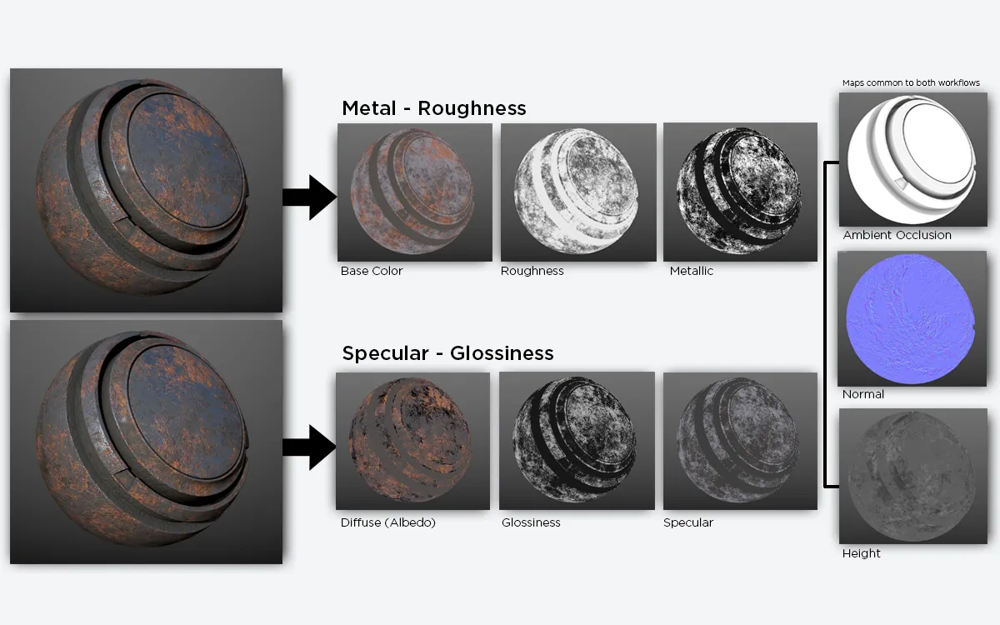

# 2. Master Material
---
## 1. Master Material
마스터 머티리얼을 만들고 이 마스터 머티리얼의 여러 인스턴스만 사용하는 방법을 통해 공간 절약, 씬의 성능 상향이 가능함.

## 2. Albedo vs Diffuse
베이스 컬러에 쓰이는 텍스쳐가 두 가지 용어를 혼합하여 쓰길래 두 키워드의 차이점이 무엇인지 궁금해졌다.

{: .new-title}
> ❓베이스 컬러에 들어가는 알베도와 디퓨즈의 차이점이 뭐지?
>
> - Albedo : 물리 기반 렌더링(PBR)에서 도입. 표면이 반사하는 확산 반사 비율 또는 색상을 의미
> - Diffuse : 전통적인 3D 그래픽스에서 디퓨즈 맵은 표면의 기본 색상을 정의한다. 빛의 영향을 받아 명암이 생기는 재질 표현에 사용

**Albedo vs Diffuse 정리**

|항목| **Albedo**| **Diffuse**|
| ---|---|---|
|정의|순수한 반사율 (빛의 간섭 없음)| 빛의 난반사로 인한 색상 + 명암|
|사용 예| PBR (물리 기반 렌더링)| 전통적 라이팅 모델 (램버트 반사 등)|
|데이터|환경광의 영향이 제거된 순수 색상| 그림자/광택 일부 포함 가능|
|예시| Unreal, Unity등에서 PBR 재질의 Base Color로 사용 | Photoshop 등에서 조명까지 표현한 diffuse map 제작 가능 |

- Diffuse 텍스처에는 실제 광원이 없어도 명암이 들어감.
  - 조명 대응 불가 (광원 위치를 바꿔도 그림자는 바뀌지 않음)

>
- **텍스처에 조명, 그림자, 반사 등을 "베이크"해서 포함시킨 것** = `diffuse map`
- 조명과 독립적인 순수한 색상. 빛은 셰이더에서 계산함 = `Albedo`

## 3. Texture Coordinate
UV 매핑을 제어하는 노드로 머티리얼이 메시 표면에 어떻게 텍스쳐를 투영할지 결정한다.
- 모델의 각 정점(Vertex)에는 UV 좌표(0~1 범위의 2D 좌표)가 할당되어 있으며, 이 노드는 해당 좌표를 조정하거나 변형할 때 사용할 수 있다.
  
>
- 기본 출력: UV 채널의 2D 벡터(X, Y). 각 성분은 일반적으로 0.0 ~ 1.0 범위
  -  X(U): 가로 축 좌표 (좌 → 우)
  -  Y(V): 세로 축 좌표 (하 → 상)
- Coordinate Index: 다중 UV 채널을 선택할 수 있다.
  -  정적 메시의 Lightmap UV(UV1) 등 추가 좌표 계층을 활용할 때 유용

## 4. Vector4
- Vector4 노드의 R,G,B,A에 각각 U tile, V tile, U offset, V offset 이라고 이름을 붙여 텍스쳐 타일링에 사용할 수 있다.
- 타일링 *= multiply
- 오프셋 += add

## 5. static swich parameter
머티리얼 그래프 내에서 **분기를 정의**하고, **머티리얼 인스턴스 에디터에서 체크박스로 설정 가능**하게 해준다.
- 정적(static) 이 붙은 이유 : 런타임에 변경되지 않고 **머티리얼 컴파일 타임에 결정**됨
- 사용되지 않는 쪽의 분기는 완전히 제거되어 실행 시간이 최적화

>
- 입력 A : A 로직 (스위치가 True일 때 적용)
- 입력 B : B 로직 (스위치가 False일 때 적용)
- 출력 : True는 A, False는 B 출력

## RGB 표현

{: .new-title}
> ❓언리얼 엔진에서는 RGB가 0~255 값이 아니라고?
>
> - 언리얼에서는 RGB 표현을 정규화된 0~1 범위로 사용한다.
> - 0~255 와 0~1 두 범위 모두 동일한 색상을 나타내지만, 사용하는 컨텍스트와 시스템에 따라 다른 스케일로 표현된다.

## 왜 언리얼 엔진은 0~1 범위를 사용할까?
1. 수학적 일관성
    - 3D 그래픽스에서는 벡터 연산이 빈번하게 일어남
    - `0~1` 범위는 퍼센트 개념과 연결되며, **모든 계산을 비율 기반으로 통일할 수 있다.**
      - 예: `0.5 = 50% 밝기` -> `0.5 * 2.0 = 1.0 (100%)` 
2. HDR (High Dynamic Range) 지원
    - `0~1` 범위를 벗어나는 값 (예: 2.0) 으로 더 밝은 빛을 표현할 수 있다.
3. GPU 친화적
    - 현대 GPU는 부동소수점(float) 계산에 최적화되어 있어 **0~1 범위가 셰이더 연산과 호환성이 좋다.**

## RGB 정규화 방법
- 0~255 -> 0~1 (정규화) = `값 / 255`

```c++
RGB(255, 127, 0) -> RGB(1.0, 0.498, 0.0)  
```

- 0~1 -> 0~255 (역정규화) = `값 * 255` (반올림 적용)

```c++
RGB(0.5, 0.75, 1.0) -> RGB(128, 191, 255)
```

## Color Control
---
## 1. 밝기: Brightness
- RGB 값에 1보다 큰 수를 곱하는 것으로 설정 가능.
- RGB는 `0.0 ~ 1.0` 범위로 표현됨
  - `0.0` = 완전한 어둠 (검정)
  - `1.0` = 최대 밝기 (순수한 색상)
- `R * 2` = R의 밝기 2배 증가  
- `R * 0.5` = R의 밝기 50% 감소

## 2. 채도: Satration
## desaturation (탈색)
**특정 색상을 흑백(grayscale)에 가깝게 변환**하는 데 사용되는 노드.
이 노드를 사용하여 채도를 조절한다.

>
- 입력 input (V3) : 일반적으로 텍스쳐의 RGB가 입력됨
- 입력 Fraction (V1) : 채도를 얼마나 줄일지 결정하는 값.
  - `0` : 원본 색상 유지
  - `1` : 완전히 회색
- 출력 (V3) : desaturation 적용 결과

**내부 연산 공식**
```c++
Gray = R * 0.3 + G * 0.59 + B * 0.11
Output = lerp(Input, Gray, Fraction)
```
- `Gray`는 NTSC 표준 기반의 가중 평균. 인간의 눈이 **가장 민감한 녹색에 높은 가중치**를 둠

## 3. 대비: Contrast
## power
입력 값의 **지수 승(power/exponentiation) 을 계산**하는 노드

```c++
Output = Base ^ Exponent
```
>
- 입력 Base (V,V3) : 일반적으로 RGB 텍스쳐 입력
- 입력 Exponent (V) : 지수 값.
- 출력 (V, V3): 계산된 결과 값 (Base의 Exponent 승)

{: .new-title}
> ❓왜 Contrast 조절에 Power를 쓰는거야?
>
> - `power`는 단순 곱셈으로는 할 수 없는 **비선형적인 변화를 제공**하기 때문이다

### 곱셈 (Multiply) vs 지수승 (Power)

|특성|곱셈|지수승|
|---|---|---|
수학적 표현|RGB × Scale|RGB ^ Gamma|
연산 유형|모든 픽셀의 밝기를 균일하게 스케일링<br> 어두운 영역과 밝은 영역이 동일한 비율로 변화|비선형변환으로 밝기 분포를 비균형적으로 조정|
밝기 변화|모든 픽셀 균일하게 스케일링|밝은 픽셀은 더 밝게 <br> 어두운 픽셀은 더 어둡게 (분포 왜곡)|
대비(Contrast) 영향| 대비 유지 | 대비 증가 (Gamma > 1) <br>대비 감소 (Gamma < 1)|
시각적 효과| 전체적으로 밝아지거나 어두워짐|어두운 영역과 밝은 영역의 차이 강조 or 완화|
사용 예시|	밝기 조정, 라이트 강도 증감 | Contrast 조정, 감마 보정|

```c++
RGB (0.2, 0.5, 0.8)
Power(2.0) -> RGB(0.04, 0.25, 0.64)

// 어두운 부분은 급격히 어두워지고 밝은 픽셀은 상대적으로 덜 영향받음. = 대비 강해짐
```

## 4. 색조: Tint
Base color의 RGB에 **다른 색상의 RGB를 곱**해서 얻을 수 있다.

- 채널별 스케일링
  - 곱해지는 색상의 각 채널 값이 원본 색상의 해당 채널을 강화하거나 약화시킴
  - `1.0` : 해당 채널 100% 유지
  - `0.5` : 해당 채널 50% 감소
  - `0.0` : 해당 채널 완전히 제거

```c++
// 원본 색상
RGB(0.8, 0.5, 0.2)  

// Tint 색상
RGB(1.0, 0.3, 0.3)

// 결과 -> R은 유지, G/B는 감소   
(0.8*1.0, 0.5*0.3, 0.2*0.3) = (0.8, 0.15, 0.06)
```

## 6. MI Organize Paramaters
파라미터 노드를 **그룹화** 하여 마테리얼 인스턴스의 **파라미터들을 원하는 순서대로 분류**할 수 있다.

1. 파라미터 노드 클릭
2. Details 창의 Material Expression 에서 Group 설정
  - 그룹은 0 - Z 알파벳 네임 순서대로 정렬되므로 `00 Global Control`, `01 Base Color` 등으로 순서를 정함.
3. 그룹에 들어가길 원하는 파라미터 노드를 설정한 그룹에 넣어줌
4. 그룹 하위 파라미터 노드들은 **Sort Priority (정렬 우선순위)의 낮은 수 순서**대로 마테리얼 인스턴스 그룹 목록에 정렬됨

## 7. Metallic
머티리얼 에디터에서 Metallic 소켓은 표면이 금속성인지 여부를 정의하는 입력값이다.

>
입력 값 범위: 0.0에서 1.0 사이의 스칼라(float) 값.
- 0.0: `비금속(non-metal) 재질`. (예: 나무, 플라스틱, 돌 등.)
- 1.0: `금속(metal) 재질`. (예: 철, 금, 알루미늄 등.)
- 0.0과 1.0 사이의 값: 녹슨 금속과 같은 재질을 표현할 때
  
## 8. Specular
표면이 반사하는 **거울 반사(specular reflection)**의 강도를 조절하는 소켓. 디폴트 값은 `0.5`이다.

Specular 값은 비금속 재질의 반사 특성을 조절하며, 금속 재질(Metallic)에는 영향을 주지 않는다.

>
- 0.0: 표면이 전혀 반사하지 않음 (완전한 확산 반사)
- 0.5: 표면이 약 4%의 빛을 반사함 (일반적인 비금속 재질의 기본값)
- 1.0: 표면이 최대 8%의 빛을 반사함 (매우 반짝이는 비금속 재질)

## 9. Roughness
**표면의 거칠기**를 정의하는 소켓으로 빛이 표면에 어떻게 반사되는지를 결정한다. 디폴트 값은 `0.5`이다.

>
- 0.0: 매우 매끄러운 표면.	반사가 거울처럼 선명함 (예: 유리, 금속)
- 0.5: 중간 정도 거칠기	반사가 흐릿하고 부드럽게 번짐
- 1.0: 매우 거친 표면.	반사가 거의 없거나 전혀 없음 (예: 콘크리트, 모래)

## Metallic vs Specular Workflow
메탈릭 워크플로우와 스페큘러 워크플로우는 **PBR에서 재질을 표현하는 두 가지 다른 방식**이며, 계산 공식과 입력값이 근본적으로 다르다.

- **UE5는 메탈릭/러프니스(Metallic/Roughness) 워크플로우에 최적화**되어있다.



## Metallic/Roughness 주요 맵 설명

|맵(Map)|설명|형식|비고|
|---|---|---|---|
|**BaseColor**| 비금속: 재질의 기본 색상(Diffuse) <br> 금속: 반사 색상(Fresnel F₀)|RGB|금속은 diffuse(산란) 사용 X. 반사 색상이 사용됨|
| **Metallic** | 재질이 금속인지 여부를 정의. <br> `0`: 비금속 <br> `1`: 금속| Grayscale | - 흰색: 금속 <br> - 검은색: 비금속 |
| **Roughness**| 표면의 거칠기를 정의 <br> `0`: 매끄러움 <br> `1`: 거칠음 | Grayscale | Glossiness와 반대|

- 메탈릭은 **Metallic 맵으로 금속/비금속을 강제 분리해 물리적 일관성을 확보**함
  - Metallic 파라미터 (0,1)로 **재질 타입을 이진화**
  - **금속** (Metallic = 1)
    - BaseColor = Fresnel 반사 색상 (F0).
    - Diffuse 성분 = 0 (물리적으로 정확한 금속 모델).
  - **비금속** (Metallic = 0)
    - BaseColor = Diffuse 알베도.
    - Specular는 고정값 (~0.04) 또는 Specular 입력으로 미세 조정
- 메모리 효율적 (Specular 맵 불필요), 실시간 렌더링에 최적화.

## Specular/Glossiness 주요 맵 설명

|맵(Map)|설명|형식|비고|
|---|---|---|---|
| **Diffuse**| 비금속 재질의 기본 색상. <br> 금속: 디퓨즈 맵 사용 X|RGB| 메탈릭 워크플로우의 BaseColor와 유사하지만, 금속에서는 무시됨.|
| **Specular**| **모든 재질**의 반사 색상 및 강도 <br> 금속: `RGB` <br> 비금속: `Grayscale`| RGB / Grayscale | 메탈릭 워크플로우의 Metallic + BaseColor 역할을 동시에 함.|
|**Glossiness**| 표면 광택도 <br> `0`: 거칠음 <br> `1`: 매끄러움| Grayscale| Roughness와 반대|

- 스페큘라는 **Specular 맵으로 반사 색상과 강도를 직접 제어**함
- 반사 색상의 자유도 높음, 오프라인 렌더링(V-Ray)과 호환됨


**참고하면 좋은 링크**
- [Metalness Maps and Workflow Explained](https://medium.com/gametextures/metallic-magic-2dce9001fe15)

- [PBR: metallic vs specular workflow](https://www.a23d.co/blog/pbr-textures-metallic-vs-specular-workflow)

- [Specular vs Metalness Workflows for PBR Shading in Blender](https://youtu.be/mrNMpqdNchY?si=Th2blnj5MBdcxS9j) 

## RMA MAP
**하나의 RGB 텍스처에 Grayscale 속성 맵 3개를 각각의 채널(R/G/B)에 패킹해서 저장하는 방식**이다.

실시간 렌더링에서 텍스처 메모리와 샘플 호출을 절약하는 데 매우 유리하다.

## RMA 텍스쳐 구성 (Metallic/Roughness 워크플로우에서만 사용)

|채널|저장 정보|설명|
|---|---|---|
| **R** | Roughness| 표면의 거칠기. 0은 매끄러움, 1은 거침|
| **G** | Metallic| 재질의 금속성. 0은 비금속, 1은 금속 |
| **B** | Ambient Occlusion (AO)| 환경광 차폐 정보. 어두운 음영 영역을 강조|

- 경우에 따라 Alpha 채널에 다른 정보(예: Height, Opacity)를 저장하기도 한다.
- RMA 패킹 시 원본 맵의 명암비, 선명도가 유지되는지 확인해야 한다.

>
- 장점
  - 메모리 절약: 3개의 별도 텍스처 대신 단일 텍스처로 관리 → VRAM 사용량 감소.
  - 성능 향상: 쉐이더에서 텍스처 샘플링 횟수 줄어듦 → 실시간 렌더링(게임)에 유리.
- 단점
  - 텍스쳐 압축 알고리즘 특성 상 채널 간 데이터가 서로 영향을 미침 → Metallic(G) 채널의 강한 경계가 Roughness(R) 채널의 값을 흐리게 만들 수 있음
  - 8비트 텍스처 (0~255)는 채널당 256단계만 표현 가능하므로 각 채널의 정밀도가 떨어진다.
    - 예: AO(B) 값의 127과 128 사이의 미세한 차이를 잃을 수 있음

따라서 고퀄리티 아트워크에서는 RMA 대신 별도 맵 사용을 고려해야 한다.
>
- 모바일 게임: RMA로 메모리 절약.
- 시네마틱 렌더링: Roughness, Metallic, AO를 별도로 관리.

## sRGB (standard Red Green Blue)
sRGB는 모니터, TV 등 대부분의 디스플레이에서 사용하는 표준 색 공간이다.

- **사람이 인지하는 색감을 기준**으로 설계됨
  - **인간의 눈은 어두운 색상의 변화에 더 민감함**
  - sRGB는 이를 반영해 암부(어두운 영역)의 색상 정보를 강조하는 **비선형 곡선**을 사용
- **감마 보정이 포함되어 있음** (약 γ = 2.2)
  - 즉 **색상 데이터가 밝게 저장됨** 

## Gamma vs inear Workflow
- 감마 워크플로우 (Gamma Workflow)
  - 전통적인 방식으로, sRGB 공간에서 렌더링을 수행
  - 텍스처와 최종 출력이 sRGB로 가정되기 때문에, 라이팅 계산 시 자동으로 리니어로 변환되지 않음
  - 실시간 라이팅 계산이 부정함 (예: 어두운 영역에서 색상 밴딩 발생)
  - PBR(물리 기반 렌더링)과 호환성이 떨어짐

- 리니어 워크플로우 (Linear Workflow)
  - 리니어 컬러 스페이스에서 렌더링을 수행
  - 텍스처는 **sRGB에서 로드될 때 자동으로 리니어로 변환**되고, **최종 출력 시 다시 sRGB로 감마 보정**
  - **물리적으로 정확한 라이팅 계산이 가능**

### 감마, 리니어 워크플로우 처리과정
>
- 감마 워크플로우
    - 텍스처(sRGB) → (감마 보정 해제 없음) → 라이팅 계산 → 출력(sRGB)
- 리니어 워크플로우
    - 텍스처(sRGB) → 자동 리니어 변환 → 물리적 라이팅 계산 → sRGB로 출력

## ☑️결론
언리얼 엔진 5에서의 동작

**텍스처**
  - **sRGB 플래그**가 켜진 텍스처 (알베도, 디퓨즈)는 **리니어로 변환**되어 쉐이더에서 사용
  - sRGB 플래그가 꺼진 텍스처 (메탈릭, 러프니스)는 변환 없이 리니어로 읽힘

**라이팅 계산**
- 모든 쉐이더 연산은 리니어 공간에서 이루어짐
- 실시간 광원, GI, 반사 등이 물리적으로 정확하게 계산

**최종 출력**
- 최종 프레임 버퍼는 **모니터 표준(sRGB)에 맞게 자동 감마 보정되어 출력**

**참고하면 좋은 링크**
- [computer color is broken](https://youtu.be/LKnqECcg6Gw?si=Y3l6RFD8elCge3Cc)
- [Gamma Vs. Linear Workflow for KeyShot Users](https://www.willgibbons.com/linear-workflow/)
- [UNDERSTANDING GAMMA CORRECTION](https://www.cambridgeincolour.com/tutorials/gamma-correction.htm)
- [Gamma Color space와 Linear Color space란?](https://youtu.be/Xwlm5V-bnBc?si=jEuY8h7rPwwkzcvr)

## Texture Compression Settings (텍스쳐 압축 세팅)
텍스쳐를 더블 클릭하면 열리는 창으로 텍스쳐 압축 세팅 설정 가능.
- 알파가 없는 텍스쳐는 알파 없이 압축 체크 (Compress Without Alpha)
- sRGB가 아닌 텍스쳐는 sRGB 체크 해제
- Compression Settings 에서 세팅 설정
  - Masks (no sRGB)

텍스쳐 샘플러 노드의 설정으로 샘플러 타입 설정 가능.
- 텍스쳐가 sRGB라면 Sampler Type = `color`
- 텍스쳐가 sRGB가 아니아면 Sampler Type = `Linear color`
  - BlackPlaceholder

>
압축 설정과 샘플러 타입 설정이 모두 같게 설정 되어야 한다. (sRGB가 아닌경우 샘플러 Linear)

**참고하면 좋은 링크**
- [Texture Compression Settings](https://dev.epicgames.com/documentation/en-us/unreal-engine/texture-compression-settings?application_version=4.27)

## 10. Normal
## 로우 폴리 vs 하이 폴리 모델
- 로우 폴리 모델은 표면이 평평하고 법선이 단순.
- 하이 폴리 모델은 표면이 복잡하고 법선이 다양.

노멀 맵은 **하이 폴리 모델의 법선 정보를 로우 폴리 모델에 "옮기는" 기술**이다.
- 로우 폴리 모델의 정점 법선은 평평해 보이지만, 노멀 맵으로 인해 픽셀 단위로 법선이 조정되어 하이 폴리 같은 디테일이 나온다.

## 노멀 맵의 좌표계 (탄젠트 공간)
노멀 맵은 탄젠트 공간에 저장된다.

- **노멀 맵의 픽셀 값 (R, G, B)은 탄젠트 공간에서의 법선 방향**을 나타냄
- **Z축은 "표면 바깥쪽"**을 가리킨다. (일반적으로 (0,0,1)이 기본 법선)
- 탄젠트 공간은 각 정점마다 다르다.
- 노멀 맵의 법선 벡터는 각 정점의 탄젠트 공간(= 각 정점의 로컬 좌표계) 기준으로 저장된다.

## 노멀 맵의 생성 과정
>
노멀 맵은 하이 폴리 모델의 법선을 로우 폴리 모델의 탄젠트 공간에 투영하여 저장한다.

1.**하이 폴리 모델의 법선 추출**
- 하이 폴리 모델의 각 정점 법선을 계산
- 하이 폴리 모델의 법선은 월드 공간 또는 오브젝트 공간에 있음

2.**로우 폴리 모델의 탄젠트 공간 계산**
- 로우 폴리 모델의 각 정점에서 TBN 기저(basis)를 계산
- 로우 폴리 모델의 각 정점은 자신만의 T, B, N 벡터를 가진다.
- **노멀 맵을 탄젠트 공간에 저장하기 위한 기준 좌표계를 제공**
> - T (Tangent): UV의 U 방향 (텍스처 가로)
> - B (Bitangent): UV의 V 방향 (텍스처 세로)
> - N (Normal): 로우 폴리 모델의 표면 법선

3.**하이 폴리의 법선 → 로우 폴리의 탄젠트 공간으로 변환**
- 하이 폴리 법선을 로우 폴리 모델의 TBN 행렬의 역행렬로 변환한다.
- 하이 폴리 법선을 탄젠트 공간으로 변환한 결과 값은 `-1 ~ 1` 범위를 가짐
- 변환된 법선을 RGB 값 (`0 ~ 1`)으로 리매핑해 저장

```glsl
  // 하이 폴리 법선 (오브젝트 공간)
  vec3 normal_high = normalize(hitNormal); 

  // 탄젠트 공간으로 변환 (TBN은 로우 폴리의 기저)
  vec3 normal_tangent = transpose(TBN) * normal_high;

  // 노멀 맵 저장 (0~1 리매핑)
  vec3 normalMapValue = normal_tangent * 0.5 + 0.5;
```

|채널|벡터 구성요소|설명|
|---|---|---|
| R| X | Tangent(가로) 방향의 법선 벡터 성분|
| G| Y | Bitangent(세로) 방향의 법선 벡터 성분|
| B| Z | Surface Normal(법선) 방향의 법선 벡터 성분|

4.**노멀 맵 데이터 생성**
- 노멀 맵에 **"하이 폴리 법선이 로우 폴리 모델의 탄젠트 공간에서 어떻게 변형되어야 하는지"가 데이터로 저장**됨.
 
5.**노멀 맵의 사용**
**렌더링 시에는 노멀맵의 값을 다시 TBN 행렬을 통해 월드 공간 법선으로 복원**한다.
- 노말맵은 법선을 0 ~ 1로 리매핑해 저장된 상태.
- 실제로 렌더링에 사용할 때는 다시 `-1 ~ 1`로 복원

```glsl
// 노멀 맵에서 법선 추출 (0~1 → -1~1)
vec3 normal_tangent = texture(normalMap, uv).rgb * 2.0 - 1.0;

// 월드 공간 법선으로 변환
vec3 normal_world = normalize(TBN * normal_tangent);

// 조명 계산 (예: Lambertian Diffuse)
float diffuse = max(0.0, dot(normal_world, lightDir));
```

### 추가로 알면 좋은 점
- 노멀맵이 대부분 **파란 이유**
  - 평평한 표면의 벡터가 (0, 0, 1)이기 때문
  - **색 변화가 의미하는 것 = 파랑 외의 색은 법선이 좌우(X), 상하(Y)로 기울어진 정도를 의미**

- **스무딩 그룹(Smoothing Groups)**
  - **로우 폴리 모델의 정점 법선을 보간할지 말지 결정**
  - 보간 O (같은 스무딩 그룹): 정점 사이가 부드럽게 연결
  - 보간 X (다른 스무딩 그룹): 정점 사이가 날카롭게 끊어짐
  - 로우 폴리의 법선이 스무딩 그룹에 따라 변하면 노멀맵에 저장되는 차이도 달라진다.

**참고하면 좋은 링크**
- [Tutorial: How Normal Maps Work & Baking Process](https://80.lv/articles/tutorial-how-normal-maps-work-baking-process?utm_source=chatgpt.com)
- [Deconstructing a Normal Map](https://youtu.be/oOOeV3IU2Yo?feature=shared)
- [Normal Mapping](https://learnopengl.com/Advanced-Lighting/Normal-Mapping)
- [OpenGL Tutorial - Normal Maps](https://youtu.be/JNj1A1bl7gg?feature=shared)

## Flatten Normal
노멀 벡터의 Z(Depth) 성분을 조절해 노멀맵을 평탄화 하는 노드

>
- 입력 Normal (V3) (XYZ) : 탄젠트 공간에서의 노멀 벡터. 원본 노말 맵
- 입력 Flatten Strength (Scalr) : Float (0.0 ~ 1.0), 평탄화 강도 (1.0에 가까울수록 Z가 약해짐)
- 출력 Result (V3) : 평탄화가 완료된 노멀 벡터터

## Flip Green Channel
텍스처의 **노멀 맵에서 G(Green) 채널을 반전시키는 옵션**

- 노멀 맵이 OpenGL 방식과 DirectX 방식 중 어떤 포맷으로 저장되었는지에 따라 옵션 사용 유무가 달라진다.
- **OpenGL과 DirectX는 Y(Green) 좌표계가 반대**기 때문

**언리얼 엔진은 DirectX 기반**이다.
1. **OpenGL 기반** 툴 (Blender, Substance Painter 등)에서 내보낸 노멀 맵을 언리얼에서 사용할 때
  - Flip Green Channel ☑️ (체크)
2. **DirectX 기반** 툴 (3ds Max, Maya 등)에서 내보낸 노멀 맵
  - Flip Green Channel ❌ (체크하지 않음)

## 11. Ambient Occlusion
곱셈 * 스칼라 강도 조절

[](https://dev.epicgames.com/community/learning/tutorials/bOEy/material-ambient-occlusion-ao-in-unreal-engine-5)
