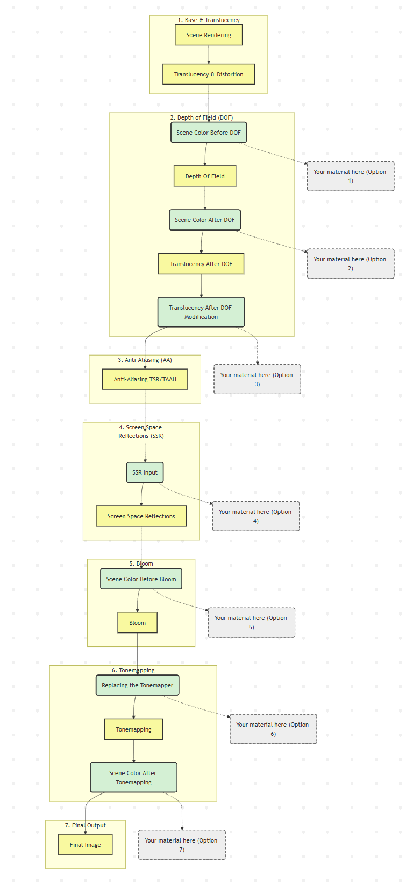

# 1. Blendable Locations
Blendable Location은 **렌더링 파이프라인의 특정 지점에 Post Process Material을 주입(inject)**하는 방식

> 파이프라인의 단계마다 이미지 데이터 상태(HDR 또는 LDR)와 효과 영향 범위가 달라진다

---

## PPM 작동 시점
PPM 작동 시점에서는 이미 **G-buffer 정보가 픽셀 셰이더를 통해 조합되어 Scene Color로 합성된 상태**

```
즉 이 시점 이후의 Post Process는 GBuffer 데이터를 직접 사용하는 게 아님!

- 최종 합성된 색 버퍼(SceneColor)를 조작
- GBuffer는 참조용으로 읽기 전용(Read-only) 접근만 가능
```

---

### 파이프라인 순서
1. **지오메트리 렌더링 (Base Pass)**
    - 버텍스 쉐이더 : 정점 위치, UV, Normal 등 전달
    - 픽셀 쉐이더 : 머티리얼 샘플링(BaseColor, NormalMap) 등 **GBuffer MRT에 기록**
    - GBuffer0: BaseColor, Specular
    - GBuffer1: World Normal
    - GBuffer2: Roughness, Metallic 등
    - Depth Buffer: Z 정보
2. **Lighting Pass (Deferred Shading)**
   - 각 픽셀 위치에 대해 GBuffer에서 머티리얼 속성 읽기
    - Light 리스트에서 광원 정보 읽기
    - 조명 방정식 계산 (Lambert, GGX 등)
    - **결과를 SceneColor에 HDR로 기록**
        - 👉 이때 SceneColor는 조명 + 머티리얼 조합 결과물
        - 👉 GBuffer는 남아 있으며, 후속 Post Process에서 참고 가능
3. **Translucency & Distortion 처리**
    - SceneColor에 반투명 오브젝트와 화면 왜곡 처리 덧씌움

> 이후 만들어진 SceneColor로 Post Process Material 작동

---

## 정리

| 단계            | VS 역할              | PS 역할                           | 출력              |
| ------------- | ------------------ | ------------------------------- | --------------- |
| Base Pass     | 정점 변환              | 머티리얼 샘플링, GBuffer 기록            | GBuffer + Depth |
| Lighting Pass | fullscreen quad 출력 | GBuffer + Light → SceneColor 합성 | SceneColor(HDR) |
| Post Process  | 없음                 | SceneColor 가공                   | 화면 최종 출력        |

---



---

## Scene Color Before DOF
DOF 미적용상태로 픽셀 단위 연산이 가장 자유롭다

**사용 예**

```
// DOF에 영향을 받는 효과들

- Depth-based color grading
- 수중 효과 (Underwater effects)
- 빛 새어나옴 효과 (Light leaking)
- 깊이에 따른 색상 변화
```

---

## Scene Color After DOF
DOF가 적용되어 포커스 밖의 영역이 흐려짐

**사용 예**

```
// DOF 영향에서 자유로운 효과들

- 아웃라인 (Outlines)
- 해칭 셰이더 (Hatching shaders)
- DOF 이후의 색보정
```

---

## Translucency After DOF
**유리/물 효과를 최종 합성할 수 있는 지점**. Translucency와 SceneColor 간 상호작용이 가능

**사용 예**

```
// 반투명 오브젝트 수정

- Translucent material 보정
- 안개 유리 효과 (Foggy glass)
- 수중 파티클 (Underwater particles)
- 색상 굴절 (Color refractions)
```

---

### Anti-Aliasing (TSR/TAA) 적용
프로젝트가 **TSR을 활성화 한 경우** 이 시점을 기준으로 렌더링 해상도가 달라짐

1. **이전 단계 (Before/After DOF 등)**: '스크린 해상도'(낮은 해상도)에서 실행
2. **이후 단계 (SSR input 등)**: '디스플레이 해상도'(업스케일링된 높은 해상도)에서 실행

---

## Screen Space Reflections (SSR input)
반사 계산 전. 반사에 영향을 주는 왜곡, 마스크, 컬러링 가능. **반사 대상에만 선택적으로 효과 적용 가능**

**사용 예**

```
// Screen Space Reflection 제어

- Reflection colorize
- Reflection desaturation
- Reflection animation
- Mask를 이용한 특정 오브젝트 reflection 제거
```

---

## Scene Color Before Bloom
반사와 Translucency가 합성된 최종 HDR 이미지. Bloom에서 퍼질 색/밝기를 조절할 수 있는 마지막 지점

**사용 예**

```
// Bloom에 영향을 주는 효과들

- Highlight 강조/감소
- Heat distortion 효과 (화염, 숯)
- Mask 적용을 통한 selective bloom
```

---

## Replace Tonemapper
HDR → LDR 변환 경계 지점

**사용 예**

```
// 톤 매퍼 변경하고 싶을 때

- Unreal color grading tools 사용
- Custom tonemapping curve 필요시만 사용
```
---

## Scene Color After Tonemapping
Tonemapping 완료된 상태. 가장 마지막 합성 단계. HDR 정보는 없음

**사용 예**

```
// 최종 출력 직전 효과들

- Colorization
- Texture overlay
- Noise/Grain 추가
- Vignetting
- 최종 색보정
```

---

## 실행 순서 제어
Blendable Priority로 순서 제어

> 블렌더블 우선순위 선택 시 숫자가 높을수록 해당 재료가 더 일찍 실행!

1. 다른 Location 간 순서 변경 불가
2. 동일한 Blendable Location 내에서만 순서 적용

 

**링크**
- [UE 5 - Explained! Blendable locations for post process materials](https://youtu.be/3HXZddRsFsY?si=2Ba6J37lPyok6tfa)