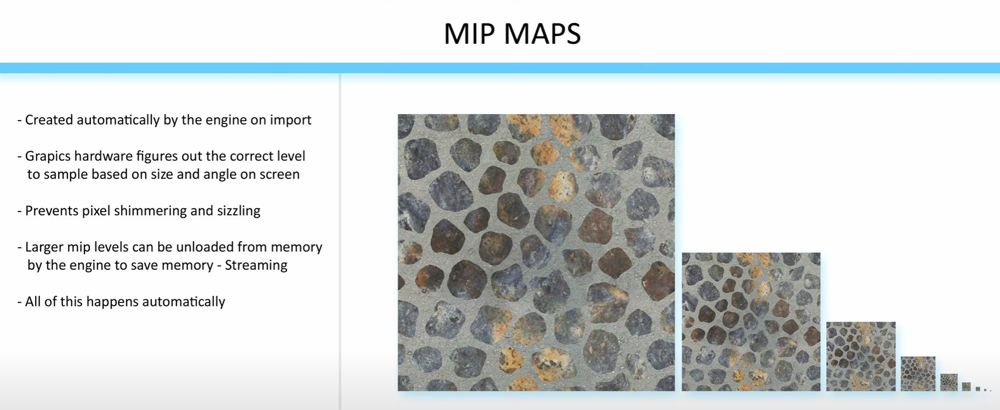

# EP 1 - 4

---

# Texture Coordinate
텍스처 좌표는 UV 좌표라고도 불림

- 모델 표면의 특정 픽셀 위치를 가리키는 2차원 주소(U,V)
- 3D 모델의 각 정점(vertex)은 이 UV 좌표를 하나씩 가지고 있음

---

## 덧셈(+) : 텍스처 이동 (Panning/Scrolling)
텍스처 좌표에 특정 값을 더하는 것은 텍스처를 표면 위에서 **이동(Scrolling)**시키는 효과

- U 만큼 가로로, V 만큼 세로로 평행 이동
- 뺄셈은 덧셈과 본질적으로 동일하며 이동 방향만 반대

---

## 곱셈(*) : 텍스처 반복 및 확대 (Tiling/Scaling)
곱셈은 텍스처의 크기를 조절. 이를 **타일링(Tiling)**이라고 부름

- 2를 곱하면 원래 [0~1] 사이에서 변하던 UV 좌표가 [0~2] 사이에서 변하게 됨
- 텍스처 샘플러는 기본적으로 **주소값이 1을 넘어가면 다시 0부터 시작하는 `Wrapping` 모드로 설정**
  - 따라서 [0~1] 범위에서 텍스처가 한번 그려지고, [1~2] 범위에서 똑같은 텍스처가 다시 한번 그려짐


### 스칼라 값에 따른 변화
1. 1보다 큰 수 곱하기
- 텍스처가 더 여러 번 반복(Tile)
- 숫자가 클수록 더 잘게 반복되어 텍스처가 작아 보임
- (예: uv * 4.0f는 텍스처를 가로, 세로로 4번씩, 총 16번 반복)

2. 1보다 작은 수 곱하기
- 텍스처의 일부분만 사용하게 되어 **이미지가 확대(Zoom-in)되어 보임**
- (예: uv * 0.5f는 텍스처의 왼쪽 위 1/4 영역만 전체 표면에 걸쳐 확대하여 보여줌)

> UV 좌표에 1보다 작은 수를 곱하는 것은 3D 모델이 참조하는 텍스처의 영역을 좁히는 행위
> - 그리고 그 좁은 영역을 원래 모델의 전체 표면에 늘려서 채우기 때문에, 결과적으로 텍스처가 확대되어 보임

---

# EP 5 : Texture Map
3D 모델의 표면에 디테일을 추가하는 이미지


## 텍스처 파일 3단계
1. **Source Files (소스 파일)**
- Photoshop, Substance, Quixel 등에서 제작
- 큰 용량, 무압축, 레이어 포함
- **수정 시 반드시 소스에서 작업**
2. **Raw/Intermediate Files (중간 포맷)**
- 보통 TGA, PNG 등
- 레이어가 플래튼(flatten) 되어 하나의 이미지로 저장
- GPU가 직접 사용하지 않음
3. **In-Game Textures (엔진 내 최종 자산)**
- Unreal/Unity로 가져오면 엔진이 플랫폼별 포맷(DDS, ASTC 등)으로 자동 변환
- GPU 메모리에 직접 올라가는 압축된 텍스처
- **실제 성능/메모리 비용은 이 최종 버전의 크기가 전부임**

⚠️ 성능/최적화에 중요한 건 엔진 내부에서 표시되는 Resource Size!
> 해상도, 채널 수, 압축 방식으로 Texture Map을 최적화 하자

---

## Compression Settings
- Texture Editor → **Maximum Texture Size 조정으로 인게임 해상도 제한**
- **Compress without Alpha** 옵션으로 알파 제거 가능 → DXT1으로 변환 → 절반 용량
  - **알파 채널 불필요하면 반드시 제거** 
- Color 데이터 → sRGB 켜기
- Roughness/Specular/AO → Mask 압축, sRGB 끄기
- Normal Map → 전용 BC5 압축
- Height Map → 압축 artifact가 심해보이면 Grayscale로 저장

---

# Mipmaps
원본 텍스처의 여러 단계 축소 버전을 미리 만들어 두는 기법



밉맵은 텍스처의 피라미드와 같다

```
레벨 0: 원본 고해상도 텍스처 (예: 512x512)
레벨 1: 원본을 가로, 세로 각각 절반으로 줄인 텍스처 (256x256)
레벨 2: 레벨 1을 다시 절반으로 줄인 텍스처 (128x128)
...
마지막 레벨: 1x1 텍스처
```

## 작동 원리
- 카메라에 가까워 화면에 크게 보이는 물체는 **밉맵 레벨 0 (원본)**을 사용
- 카메라에서 멀어져 작게 보이는 물체는 더 **높은 밉맵 레벨 (예: 레벨 4)의 저해상도 텍스처**를 사용

---

# EP 6 : Lerp (Linear Interpolation)
A와 B를 알파 값으로 섞기

## Lerp 기본 원리
```
Result = A × (1−α) + B × α
```

- α(알파)가 0 → 결과는 A
- α가 1 → 결과는 B
- α가 0.5 → A와 B의 중간값

### 알파에 텍스처를 넣었을 때 (Mask 역할)
알파가 단색 상수 대신 **그레이스케일 텍스처라면, 픽셀마다 값이 달라진다**

- 검정(=0)  → 그 픽셀에서 A만 출력
- 흰색 (=1)  → 그 픽셀에서 B만 출력
- 회색(=0.3 같은 중간값) → A와 B가 섞여서 출력

> 그래서 마스크 텍스처를 집어넣으면 부분별로 다르게 블렌딩 됨

### 알파가 0~1 범위를 벗어났을 때
원래는 **보간(interpolation)**이지만, 값이 벗어나면 **외삽(extrapolation)**이 된다

**예: α = 2**
```
식: A × (1−2) + B × 2 = A × (−1) + B × 2 = 2B − A
```

- 즉, B를 지나서 더 나간 방향으로 색이 과장됨

**예: α = −1**
```
식: A × (1−(−1)) + B × (−1) = A × 2 − B
```

- A 방향으로 반대쪽으로 더 나감

> 결과: 색이 의도보다 더 강하게, 왜곡되거나 채도가 튀는 현상이 생김
> 의도적으로 쓰면 과포화 효과처럼 활용 가능

---

# EP 7 : Dot Product Node
