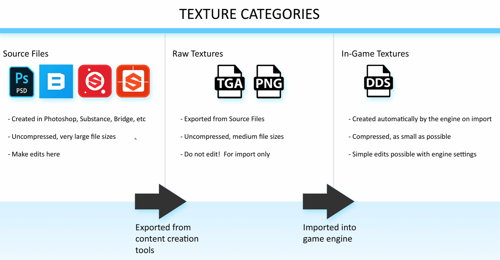
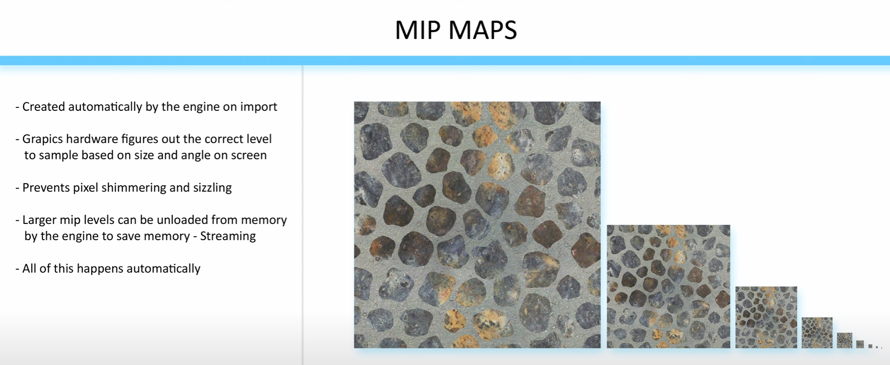

# EP 5 : Texture Map
3D 모델의 표면에 디테일을 추가하는 이미지



## 텍스처 파일 3단계
1. **Source Files (소스 파일)**
- Photoshop, Substance, Quixel 등에서 제작
- 큰 용량, 무압축, 레이어 포함
- **수정 시 반드시 소스에서 작업**
2. **Raw/Intermediate Files (중간 포맷)**
- 보통 TGA, PNG 등
- 레이어가 플래튼(flatten) 되어 하나의 이미지로 저장
- GPU가 직접 사용하지 않음
3. **In-Game Textures (엔진 내 최종 자산)**
- Unreal/Unity로 가져오면 엔진이 플랫폼별 포맷(DDS, ASTC 등)으로 자동 변환
- GPU 메모리에 직접 올라가는 압축된 텍스처
- **실제 성능/메모리 비용은 이 최종 버전의 크기가 전부임**

⚠️ 성능/최적화에 중요한 건 엔진 내부에서 표시되는 Resource Size!
> 해상도, 채널 수, 압축 방식으로 Texture Map을 최적화 하자

---

## Compression Settings
- Texture Editor → **Maximum Texture Size 조정으로 인게임 해상도 제한**
- **Compress without Alpha** 옵션으로 알파 제거 가능 → DXT1으로 변환 → 절반 용량
  - **알파 채널 불필요하면 반드시 제거** 
- Color 데이터 → sRGB 켜기
- Roughness/Specular/AO → Mask 압축, sRGB 끄기
- Normal Map → 전용 BC5 압축
- Height Map → 압축 artifact가 심해보이면 Grayscale로 저장

---

# Mipmaps
원본 텍스처의 여러 단계 축소 버전을 미리 만들어 두는 기법



밉맵은 텍스처의 피라미드와 같다

```
레벨 0: 원본 고해상도 텍스처 (예: 512x512)
레벨 1: 원본을 가로, 세로 각각 절반으로 줄인 텍스처 (256x256)
레벨 2: 레벨 1을 다시 절반으로 줄인 텍스처 (128x128)
...
마지막 레벨: 1x1 텍스처
```

## 작동 원리
- 카메라에 가까워 화면에 크게 보이는 물체는 **밉맵 레벨 0 (원본)**을 사용
- 카메라에서 멀어져 작게 보이는 물체는 더 **높은 밉맵 레벨 (예: 레벨 4)의 저해상도 텍스처**를 사용
