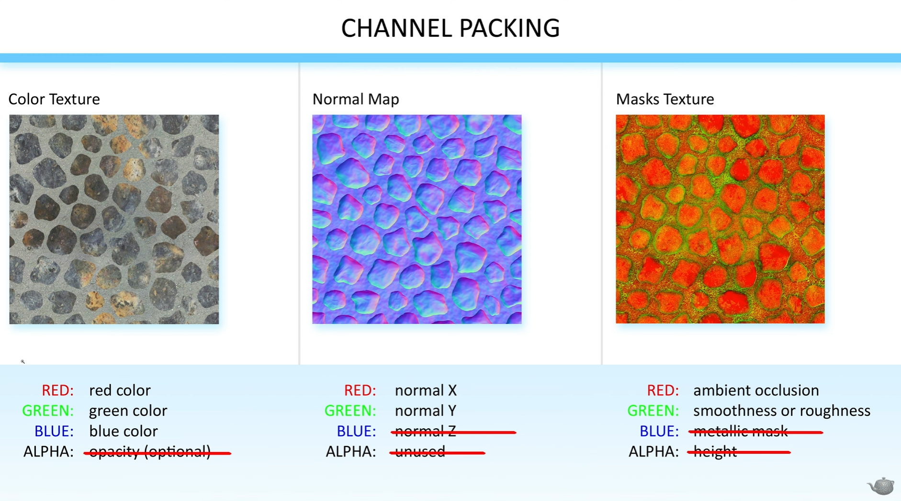
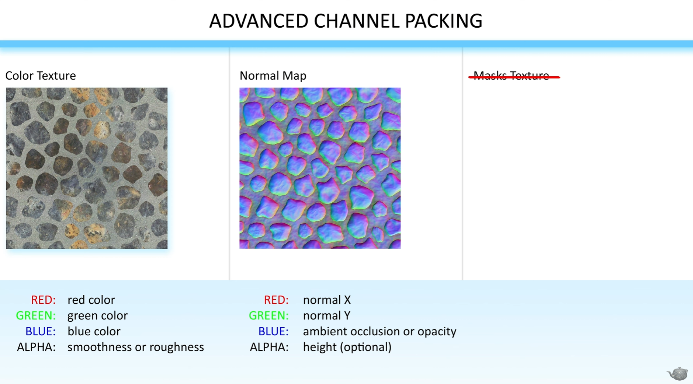

# EP 23 : Advanced Channel Packing
텍스처 샘플링 수와 메모리 절감을 위해 자주 활용되는 기법을 알아보자

### 사용 목적
- 텍스처 **샘플 수**를 줄여 셰이더 성능 개선
- **메모리 사용량 절감**
- 불필요한 채널 낭비 최소화

---

## channel packing
기본 채널 패킹

1. 총 3개의 텍스처 (Color, Normal, Mask) 의 채널들은 위 그림과 같음
2. **총 12개의 채널 중 7개만 사용 → 5개 낭비됨**
  - Color : Alpha
  - Normal Map : normal Z, Alpha
  - Mask : metallic, height

> 왜? 특정 에셋 (돌, 지형 등) 은 Metallic / Height / Opacity가 필요 없음
> - → 불필요한 채널 낭비

---

## advanced channel packing
텍스처 수 3장에서 2장으로 줄이기

1. **color**
    - Alpha : Roughness 넣기
2. **Normal Map**
    - R : normal x
    - G : normal y
    - B : AO or Opacity
    - A : Height (optional)

---

## Compression setting
위와 같이 만든 텍스쳐는 더 이상 Normal Map 타입이 아님

**압축 옵션**
- Compression: BC7 (범용 고품질 압축)
- sRGB: Off
- Normal Map Compression 옵션은 사용 불가 (데이터 손실)

## 품질 손실에 대한 고려
BC7 압축 사용 시 → 약간의 블록처럼 보이는 품질 저하 발생 가능
- Normal 전용 압축에 비해 미세한 정밀도가 손실되기 때문

> 하지만 foliage, rock, terrain 등에서는 큰 문제 없음

---

## advanced channel packing 사용 대상
1. 🌿 **Vegetation / Foliage : 나뭇잎, 풀 등**
    - 노멀보다는 불투명 형태에 영향을 더 받음
2. 🪨 **Rocks : 바위**
    - 노이즈가 많아 노멀이 큰 차이를 주지 않음
3. 🌄 **Terrain : 지형**
    - 메모리, 텍스처 샘플 수 절감 효과 큼

### 비추천 대상
1. **Character Faces** : 캐릭터 얼굴
    - 정밀한 Normal 필요
2. **Hard Surface를 쓰는 기계류**

---

# 그래프 예제

1. **기존 노멀 맵**
   - Normal Map 압축은 엔진이 자동으로 범위를 [0~1] → [-1~1] 로 확장
   - Z 채널 자동 포함
2. **NAOH 맵** (BC 7)
   - X/Y는 TextureSample로 직접 가져와서 수동 확장
   - Z는 `DeriveNormalZ` 노드로 계산
   - AO/Opacity는 B 채널에서 분리해서 사용

## NAOH 방식에서 Normal Z 계산하기
Z값을 저장하지 않아도 **X,Y로부터 Z를 수학적으로 복원할 수 있음**

---

$$
x^2 + y^2 + z^2 = 1
$$

---

$$
z = \sqrt{1 - x^2 - y^2}
$$

---

### Unreal 노드 그래프 절차
1. normal map의 R,G 채널 추출
2. `* 2 - 1` → `0 ~ 1` 범위를 `-1 ~ 1`로 확장
3. x² + y²
4. 1 - (x² + y²)
5. 결과 = z
6. Append(X, Y, Z)

> 대체 노드 : **DeriveNormalZ** → 위 계산을 그래프로 만들지 않아도 됨

---

## 정리

1. 노멀이 중요하지 않은 대상에 쓰면 텍스쳐를 줄여서 사용할 수 있다
2. 텍스쳐 메모리와 텍스쳐 샘플을 3개에서 2개로 줄일 수 있다
3. 노멀의 Z 값은 X,Y로 복원 가능하다
4. 압축 방식 변경에 따른 품질 손실을 인지하고 선택적으로 활용하자
