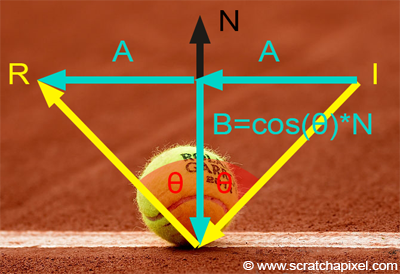

# EP 11 : Volumetric Ice
텍스처가 물체 내부에 존재하는 것처럼 부피감 또는 깊이감 부여하기

- 우리가 보는 각도에 따라 그 내부 요소들의 위치가 달라 보이는 현상을 컴퓨터 그래픽으로 모방
- 이러한 효과를 **시차(Parallax)**라고 부름
- 가까운 물체는 시점을 조금만 옮겨도 많이 움직여 보이고, 먼 물체는 적게 움직여 보이는 원리

---

## 핵심 아이디어
1. 일반 UV → 표면에 고정
2. 카메라 벡터(Camera Vector) + 법선(Normal) → 반사 벡터(Reflection Vector) 계산
3. **반사 벡터를 뒤집어 투과 벡터(Transmission Vector) 로 사용**
4. **이 XY 성분을 UV에 더해주면 카메라 이동에 따라 안쪽에서 텍스처가 움직이는 효과 발생**

---

## Parallax
**아무런 효과를 주지 않았을 때** UV 좌표는 2D 텍스처를 3D 모델 표면에 래핑. 모델 표면에 **완벽하게 밀착된 스티커와 같음**

- 반사 벡터 R은 **카메라의 시점에 따라 변하므로 시차가 만들어짐**

### 1. 정면에서 볼 때
카메라는 면의 정면. 반사 벡터 R은 거의 정면으로 되돌아옴
- 이때 R의 x,y 성분은 거의 0에 가까움
- 따라서 최종 UV = 원래 UV + (0, 0) 이므로, 텍스처는 거의 움직이지 않는다

### 2. 오른쪽에서 비스듬히 볼 때
카메라는 면의 오른쪽에 있고 반사 벡터 R은 왼쪽으로 튕겨 나감
- 이때 R의 x,y 성분은 음의 x값을 갖게 됨 (예: (-0.5, 0))
- 따라서 최종 UV = 원래 UV + (-0.5, 0) 이므로, 텍스처를 샘플링하는 위치가 텍스처 맵의 왼쪽으로 이동

### 3. 위쪽에서 비스듬히 볼 때
카메라는 면의 위쪽. 반사 벡터 R은 아래쪽으로 튕겨 나감
- 이때 R의 x,y 성분은 음의 y값을 갖게 됨 (예: (0, -0.5))
- 따라서 최종 UV = 원래 UV + (0, -0.5) 이므로, 텍스처 샘플링 위치가 텍스처 맵의 아래쪽으로 이동

---

> 모델의 표면은 정상적으로 움직이는데 그 위에 그려진 텍스처 무늬는 제멋대로 미끄러지듯 움직암
> - 표면의 움직임과 텍스처의 움직임이 분리되는 불일치가 발생

뇌는 이 불일치를 보고 이렇게 결론 내린다

"표면과 내부 무늬가 따로 움직이는군. 그렇다면 저 무늬는 표면에 붙어있는 것이 아니라, 표면 뒤의 더 깊은 곳에 있는 것이 틀림없다!"

---

## reflection vector (반사 벡터)

---

## 반사 벡터(Reflection Vector) 공식 유도 과정
- **I**: 표면을 향하는 정규화된(길이가 1인) **입사 벡터**
- **N**: 표면에서 바깥을 향하는 정규화된 **법선 벡터**
- **R**: 우리가 구하고자 하는 정규화된 **반사 벡터**

---

### 1단계: 벡터 분해 (Vector Decomposition)
입사 벡터 `I`를 법선 `N`에 평행한 성분($$I_{\parallel}$$)과 수직인 성분($$I_{\perp}$$)의 합으로 분해

> 입사 벡터 I는 위 그림처럼 노멀 벡터 N과 평행한 B, 수직인 A 성분으로 분해할 수 있다

$$I = I_{\parallel} + I_{\perp}$$

---

### 2단계: 평행 성분 계산 (Parallel Component)
`I`를 `N`에 투영(projection)하여 평행 성분 $$I_{\parallel}$$를 구하기
`N`이 단위 벡터이므로, 투영된 길이는 `I · N`, 여기에 방향 벡터 `N`을 곱

$$I_{\parallel} = (I \cdot N)N$$

---

### 3단계: 수직 성분 계산 (Perpendicular Component)
1단계의 식을 변형하여 수직 성분 $$I_{\perp}$$ 구하기

$$I_{\perp} = I - I_{\parallel}$$

2단계의 결과를 대입하면 다음과 같음

$$I_{\perp} = I - (I \cdot N)N$$

---

### 4단계: 반사 벡터 조합 (Assembling Reflection Vector)
반사 벡터는 B를 뒤집고 수직인 A인 그대로 유지하는 변환이다

- 법선에 평행한 성분($$I_{\parallel}$$)의 방향은 뒤집히고, 수직인 성분($$I_{\perp}$$)은 그대로 유지
---

$$R = - I_{\parallel} + I_{\perp} $$

---

### 5단계: 최종 공식 유도 (Final Formula)
4단계의 식에 2, 3단계에서 구한 각 성분을 대입하여 `I`와 `N`만으로 식을 정리

---

$$R = \underbrace{- ((I \cdot N)N)}_{\text{-I}_{\parallel}} + \underbrace{(I - (I \cdot N)N)}_{\text{I}_{\perp}}$$

---

이제 괄호를 풀고 정리하면,

---

$$R = - (I \cdot N)N + I - (I \cdot N)N$$

---

$$R = I - 2 (I \cdot N)N$$

---

**링크**
- [reflection-refraction-fresnel](https://www.scratchapixel.com/lessons/3d-basic-rendering/introduction-to-shading/reflection-refraction-fresnel)
- [Vector reflection at a surface](https://www.sunshine2k.de/articles/coding/vectorreflection/vectorreflection.html)

---

## Transmission Vector (단순화된 굴절 벡터)
물리적으로 계산한 굴절이 아니라, 반사 벡터를 뒤집어 투과 벡터로 정의하여 사용

---

$$ T = -R$$

---

이렇게 만든 T 벡터의 성분은 아래와 같이 쓰임

- $$T_X, T_Y$$ : 텍스처 좌표 왜곡 → “내부가 움직이는 듯한 느낌”
- $$T_Z$$ : 깊이 보정 → “얼음 속에서 층층이 구조가 있는 것처럼 보임”

---

## Camera Vector
언리얼 엔진에서 카메라 벡터는 "픽셀 → 카메라" 방향이라서, 위에서 정의한 입사벡터(I)와는 부호가 반대

- 단순히 반사 공식만 적용해도 우리가 기대하는 “굴절 비슷하게 아래(-Z)로 향하는” 벡터가 나옴

**링크**
- [UE vector expressions](https://dev.epicgames.com/documentation/en-us/unreal-engine/vector-expressions?application_version=4.27)

---

## Custom Reflection Vector
사용자가 직접 지정한 법선 벡터(Normal)와 카메라 벡터(Camera Vector)를 기반으로 반사 벡터를 계산해주는 노드

## 주요 사용처
1. **환경 맵(Environment Map) 반사**
- Cube Map(스카이박스)을 샘플링할 때, 카메라 뷰 벡터 대신 반사 벡터를 사용하면 거울 반사처럼 보이는 효과를 얻음
- 예: 금속 표면, 물 표면 반사
2. **가짜 굴절/볼륨 효과 (Parallax)**
- R의 XY 성분을 텍스처 UV에 더해주면 내부가 있는 듯한 시차 효과를 낼 수 있음
- 얼음, 유리, 볼륨 노이즈 등.
3. **커스텀 라이팅**
- 블린-퐁(Blinn-Phong)이나 쿡-토런스(Cook-Torrance) 같은 스펙큘러 셰이딩을 직접 구현할 때, R⋅V 항 계산용

## Custom Reflection Vector 노드의 입력과 출력
1. Normal 입력 : World Space → 출력 : World Space 반사 벡터
- 예: VertexNormalWS 같은 노드를 넣었을 때. CubeMap 샘플링에 쓸 수 있음
1. Normal 입력 : Tangent Space → 출력 : Tangent Space 반사 벡터
- 예: Constant3(0,0,1) 같은 기본 탄젠트 노멀을 넣었을 때
- Tangent Space에서 UV 왜곡(parallax, volumetric ice 같은 효과)에 쓸 수 있음

> 즉, 입력 좌표계가 곧 출력 좌표계

---

## 깊이 조절하기
굴절 벡터의 x,y 성분을 z 성분으로 나눠서 UV 보정

## x / T.z
T.z는 노멀 방향 (= 표면 정면)에 대한 성분  

### 정면에서 보기
- $$(T.z \approx 1)$$ 예를 들어 x = 1, T.z = 1 결과 = 1
- 분모가 늘어남 → UV 이동 거의 없음

### 비스듬히 보기
- $$(T.z \approx 0)$$ 예를 들어 x = 1, T.z = 0.2 결과 5
- 분모가 작아짐 → UV 이동이 커짐  

> 따라서 `x / T.z` 꼴은 뷰 각도에 따라 UV 오프셋 크기를 자동으로 조절하는 역할  

---

$$
\Delta u \propto \frac{T.x}{T.z}, \quad
\Delta v \propto \frac{T.y}{T.z}
$$

---

## 해상도 보정

## 1 / texRes  
UV 좌표는 0~1 사이 범위에서 정의됨  

- 하지만 우리가 곱하는 `x / T.z`는 **픽셀 단위 오프셋**처럼 동작

**예시**
1. **128x128 해상도의 텍스처**
- x축으로 16텍셀 움직이는 것 = **전체 너비의 12.5%(16 / 128)**를 움직이는 큰 변화
1. **1024x1024 해상도의 텍스처**
- x축으로 16텍셀 움직이는 것 = **전체 너비의 약 1.5%(16 / 1024)**에 불과한 변화

> 따라서 해상도 보정을 위해 한 픽셀당 이동량 = $$(1/\text{texRes})$$  
> - 이 값을 곱해주면 해상도와 무관하게 물리적으로 동일한 이동량이 보장됨  

---

$$
\Delta u = \frac{T.x}{T.z} \cdot \frac{1}{\text{texRes}_u}, \quad
\Delta v = \frac{T.y}{T.z} \cdot \frac{1}{\text{texRes}_v}
$$

---

## 3.  최종 UV (Parallax Mapping)
최종 샘플링 UV는 원래 UV에 위에서 계산한 오프셋을 더한 것

---

$$
(u', v') = (u, v) + 
\left( \frac{T.x}{T.z} \cdot \frac{1}{\text{texRes}_u}, \;
       \frac{T.y}{T.z} \cdot \frac{1}{\text{texRes}_v} \right)
$$

---

이 방식이 바로 **Parallax 효과**  
- 표면 자체는 움직이지 않는데, UV 샘플링이 카메라 시점에 따라 달라져서 텍스처가 "표면 뒤에서 움직이는 듯" 보임

---
