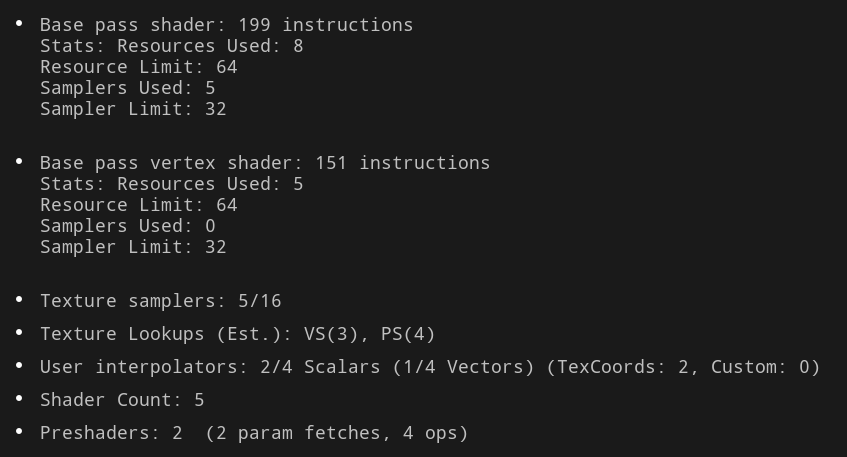

## Metallic
0 (비금속), 1(금속) 의 값을 가지는 흑백 텍스쳐

구분	| Metallic = 0 (비금속) | 	Metallic = 1 (금속) | 
Base Color  | 	Diffuse Color (재질의 고유색)	 |  Specular Color (반사광의 색) |  
Diffuse	 |  Base Color 맵의 값을 따름  | 	검은색으로 고정  | 
Specular  |  흰색 (강도는 약 4%로 고정)	 |  Base Color 맵의 값을 따름 | 

> Metallic 맵은 Base Color 맵의 데이터를 'Diffuse'로 해석할지, 아니면 'Specular'로 해석할지를 결정하는 스위치

---
# Node function

### floats
- constant : 하나의 값 (메탈릭, 러프니스, 베이스 컬러, 스페큘라같은 곳에 쓰임)
- constant 2Vector : U,V 와 같은 곳에 쓰임
- constant 3Vector : RGB or vector
- constant 4Vector : alpha

### 개수가 다른 float끼리 더하고 곱셈하기
1. floats : 0.2
2. floats[2] : R 0.5, G 0.3
3. add 노드 사용
-> floats의 값이 floats[2]의 [0],[1]에 모두 더해짐

> Vector2와 Vector3를 합하면 error
> - 이럴 때 마스크로 활용

### Masks
r,g,b,a 체크로 가져올 input 체크하기
- R에 체크 : R 값만 가져옴

### Append / Append Many
vector2에 floats push -> vector3

### swizzle
벡터의 구성 요소(component) 순서를 재배열하거나 특정 요소만 선택하여 새로운 벡터를 만든다

1. 선택 (Selection): 여러 채널 중 특정 채널 하나만 가져오기
2. 재배열 (Reordering): 채널들의 순서 바꾸기
3. 복제 (Duplication): 하나의 채널을 여러 번 사용하여 새로운 벡터 만들기
4. 조합 (Combination): 위 기능들을 모두 활용하여 원하는 대로 새로운 벡터를 생성

RGBA에서 (A, R, G) 라는 새로운 Vector3 만들기

### split Component
Vector2, Vector3와 같은 벡터 타입을 입력으로 받아, 그 안에 포함된 각 채널(R, G, B, A)을 별개의 float 출력 핀으로 나눔

### debug float value
디버깅용. base color에 넣고 값 확인 가능

---

# UV control

## 파이프라인 연결 예

```
[TextureCoordinate] → [Texture Sample] → [Base Color]
```

## hlsl 예시

```hlsl
float2 uv = input.TexCoord0.xy;                     // TextureCoordinate
float4 color = MyTexture.Sample(MySampler, uv);    // Texture Sample
return color;                                      // Base Color 출력
```

## TextureCoordinate
TextureCoordinate = "좌표 공급자" (데이터만 제공)

## TextureCoordinate 노드가 input이 없는 것처럼 보이는 이유
1. 메시 데이터에 포함된 UV
- 모델링 툴에서 내보낸 메시에는 **버텍스 속성(attribute)**들이 들어 있음.
- 위치 (Position) / 법선 (Normal) / UV 좌표 (TexCoord0, TexCoord1, …) / 색상(Vertex Color) 등
- GPU는 이 속성을 **버텍스 버퍼(vertex buffer)**에 저장하고, 버텍스 셰이더에 전달
2. 셰이더 파이프라인에서의 UV 전달
- 버텍스 셰이더 입력: 메시 버텍스 버퍼에서 TEXCOORD0, TEXCOORD1 같은 UV 세트가 들어옴. 보통 여기서는 UV에 대한 연산 없이 그대로 출력 구조체에 담음.
- 래스터라이저: 삼각형 내부 픽셀마다 바리센트릭 좌표를 사용해 전달된 UV를 보간. 일반적으로 투영 보정(perspective-correct interpolation) 포함.
- 픽셀 셰이더 입력: 보간된 UV가 input.TexCoord0 형태로 들어옴. 여기서 샘플러에 전달 가능.
3. Unreal의 TextureCoordinate 노드
- 머티리얼 그래프의 TextureCoordinate 노드는 추가 연산 없이 이 UV 입력을 그대로 참조하는 래퍼.
- 단순히 메시에서 이미 넘어오는 **TexCoord[n]**을 가져와서 옵션(타일링/오프셋)을 곱해주는 것.

---

## Texture Sample
Texture Sample 노드 = GPU의 Texture2D.Sample 호출을 래핑한 것

- Texture Sample = "샘플러" (실제 텍스처 메모리에서 읽음)

```hlsl
float4 color = Texture2D.Sample(SamplerState, uv);
```

- Texture2D: GPU 메모리에 올라간 텍스처 객체.
- SamplerState: 필터링(Nearest, Bilinear, Trilinear, Anisotropic)과 주소 모드(Wrap, Clamp 등)를 정의.
- uv: 픽셀 셰이더 입력에서 넘어온 보간된 UV.

---

## 정리
- 버텍스 → “내가 UV 공간의 어디에 붙어야 하는지” 정보 가짐
- TextureCoordinate → 그 UV 좌표를 가져와서 머티리얼 그래프의 다른 노드들이 쓸 수 있게 출력
- Texture Sample → UV 좌표를 사용해 텍스처 버퍼에서 색을 읽음

---


## time
머티리얼이 렌더링되는 동안의 경과 시간을 제공

- CPU가 마련해 둔 시간 값을 셰이더(GPU)에서 손쉽게 꺼내 쓸 수 있도록 함

```c++
float t = MaterialParameters.Time;  // 엔진에서 넘겨주는 시간 값
```

- 출력: float (단일 값)
- 단위: 초(second)
- 값: 게임 실행 시점(또는 머티리얼이 처음 활성화된 시점)부터 누적된 시간
- GPU 셰이더로 전달될 때는 보통 GameTime 같은 전역 유니폼 값으로 들어감

## 활용
- 스크롤링 텍스쳐

```c++
UV = TexCoord + float2(Time * Speed, 0);
```

- 펄싱/사인 웨이브 효과

```c++
Glow = abs(sin(Time * Frequency));
```

- 노이즈 애니메이션 : 노이즈 텍스쳐 uv에 time을 곱해 움직히는 패턴 구현

---  

# Flipbook Animation

## Animation FPS
머티리얼에서 FPS라고 쓰는 건 사실 애니메이션 재생 속도를 의미하는 가상의 프레임레이트. 실제 렌더링 FPS와는 독립적

```c++
Frame = floor(Time * FPS) % N // n = 스프라이트 시트의 전체 프레임 개수
```

- 여기서 FPS는 1초 동안 몇 개의 스프라이트 칸을 넘길지를 의미
- 렌더링 FPS에 상관없이 애니메이션을 1초에 12장(12 FPS)의 속도로 재생하라고 명령한 것

## Flipbook
내장 함수. time과 행, 열 값을 받음

# Flipbook 효과 직접 만들기
## frac
숫자의 소수점 부분만 반환

- 0~1 사이의 주기적 패턴에 매우 유용
- UV 스크롤이나 간단한 펄스 생성에 사용

```c++
Frac(3.7) = 0.7
Frac(-2.3) = 0.7  // 주의: 음수일 때 결과가 양수
```

---

## floor
소수점 이하를 버리고 정수만 남김 (항상 내림)

```c++
Floor(3.0) = 3.0
Floor(3.2) = 3.0
Floor(3.7) = 3.0
Floor(3.999) = 3.0
Floor(-2.3) = -3.0  // 주의: 음수일 때 더 작은 수로 내림
```

### Floor vs 다른 정수화 노드 비교

입력값 |	Floor (내림)|Ceil (올림)|	Round (반올림)|
2.1	|2.0 | 3.0	|2.0|
2.5	|2.0	|3.0|	3.0|
2.9	|2.0	|3.0|	3.0|
-1.2	|-2.0	|-1.0|-1.0|

**플립북에는 왜 Floor를 사용하나?**
1. 시간이 흐르면서 프레임이 순차적으로 증가해야 함
2. Ceil을 사용하면 프레임이 도약하는 문제 발생
3. Round를 사용하면 2.5초 때 3번 프레임으로 점프하는 불연속 발생

---

## Modulo
언리얼의 실수 modulo는 C의 fmod 계열이라 피제수(첫 인자)의 부호를 따름

```c++
// 주의: y == 0이면 정의되지 않음
float r = FMath::Fmod(x, y);
if (r < 0) r += FMath::Abs(y);
```

### Modulo vs Clamp 비교

|연산	| 결과	| 용도| 
|Modulo	| 0,1,2,3,0,1,2,3,...	| 무한 반복 애니메이션|
|Clamp	| 0,1,2,3,3,3,3,3,...	| 한 번 재생하고 정지하는 애니메이션|

---

## fmod
부동소수점 숫자를 위한 나머지 연산

```c++
fmod( 7.5, -3.0) =  1.5  // 피제수가 양수면 결과 양수
fmod(-7.5,  3.0) = -1.5  // 피제수가 음수면 결과 음수
```

---

## param
1. Scalar Parameter : float
2. Vector Parameter : Vec3 → A 무시 / Vec2 → ComponentMask RG로 사용
3. Material Parameter Collection(MPC) : 전역 공유 값
4. Named Reroute (Declaration/Usage) : Vec2/Vec3/Vec4 모두 가능. 인스턴스에서 값 조절은 불가

---

# Environment Blending
텍스쳐 base,src를 텍스쳐 샘플로 가져와 lerp로 보간

## lerp

```c++
Result = A * (1 - Alpha) + B * Alpha
```
- Alpha : 가중치

**알파가 - 1 ~ 0 또는 1 이상이면?**
- α < 0 : B의 가중치가 음수. 선분 밖에서 A 바깥 방향으로 나감
- α > 1 : A의 가중치가 음수. 선분 밖에서 B 바깥 방향으로 나감

1. `vertexNormalWS.z` alpha
기하학적 경사 (정점 단위). 노멀맵 미세 기복은 반영 안됨
- 성능 저렴. LOD 바뀌어도 일관성 높음
- 지오메트리의 큰 스케일 경사로 블렌드

2. `노멀 텍스처를 월드 벡터로 변환 후 z` alpha
기하 + 표면세부 (노멀맵) 경사 (픽셀 단위)

**기하가 표함되는 이유?**
노멀맵을 월드 공간으로 변환할 때, 아래와 같은 방식으로 기하학적 법선(N_geom)이 반드시 곱해짐

```
// TBN 변환
N_world = T * N_tangent + B * N_bitangent + N_geom * N_tangentZ
```

- 비용 높음(TBN 변환과 정규화 비용). 거리에 따라 반짝일 수 있음
- 미세 요철까지 블렌드에 쓰고 싶을 때

---

## vertexNomalWS (World Space)
VertexNormalWS의 각 축 범위는 [-1, 1]

**vertexNomalWS을 Alpha로 쓸 때**
- Alpha는 0 ~ 1 범위에서 의미가 있음 (두 비율의 합이 항상 1)
- 따라서 보통 `saturate()` (clamp 0 ~ 1)나 `remap` 을 해서 alpha에 사용함
- `clamp()`, `saturate()`의 경우 마이너스 축을 그냥 날려버림 → 음수 방향 노멀 구분 못함
- 음수 방향도 표현하고 싶으면 remap 방식 쓰기

---

## clamp()
0보다 작으면 0, 1보다 크면 1, 그 사이면 그대로 반환

- 범용적: 임의의 범위 clamp(x,min,max)도 가능

> saturate(x) = clamp(x,0,1)
> - clamp는 범위 임의 지정 가능, saturate는 항상 [0,1]

---

## TransformVector
좌표 공간 변환

1. Input Vector: 변환하고 싶은 float3 벡터를 연결
2. Source Space: 현재 입력된 벡터가 어떤 좌표 공간 기준인지 지정 (예: World)
3. Destination Space: 어떤 좌표 공간으로 변환할 것인지 목표를 지정 (예: Tangent)

### 좌표공간

- 로컬 공간 (Local Space or Object Space)
  - 오브젝트 자기 자신을 기준으로 하는 좌표계. 오브젝트의 피봇(pivot)이 원점(0,0,0)
- 월드 공간 (World Space)
  - 게임 레벨 전체를 아우르는 절대적인 기준의 전역 좌표계
- 뷰 공간 (View Space or Camera Space)
  - 카메라의 시점을 기준으로 하는 좌표계
- 탄젠트 공간 (Tangent Space)
  - 오브젝트 표면의 한 점을 기준으로 하는 좌표계입니다

---

## Normal Add Scalar
셰이더에게 방향을 살짝 속이는 것

## Add 연산의 구체적인 효과와 과정
월드 공간 노멀 벡터에 float3(0, 0, 1)을 더한다고 가정

1. 방향 왜곡: 원래 노멀 벡터에 (0, 0, 1)을 더하면, 새로운 벡터는 원래 방향보다 더 위쪽을 향하게 됨
- 예: 45도 기울어진 경사면의 노멀 (0.7, 0, 0.7)에 (0, 0, 1)을 더하면 (0.7, 0, 1.7). Z값이 훨씬 커짐
2. 정규화 (Normalize)
- Add 연산 후 벡터의 길이는 1이 아니게 되므로, 방향 벡터로 사용하기 위해서는 반드시 Normalize
- 이 과정을 거치면 최종적으로 '원래 방향보다 더 위쪽을 가리키는' 새로운 방향 벡터가 완성
3. 결과
- 이렇게 왜곡된 노멀의 Z값은 원래 노멀의 Z값보다 더 커지게 됨
- 따라서 Lerp의 Alpha로 사용했을 때, 더 넓은 영역이 '위를 향한 것'으로 간주되어 텍스처가 블렌딩

---

# Shader Performance Optimization
성능 측정의 대표적인 세가지 방법

### 1. Shader Complexity 뷰 모드
UE의 뷰 모드 설정 : 최적화 보기 모드 -> 라이트 복잡도 or 쉐이더 복잡도
- 씬 전체에서 어떤 머티리얼이 GPU에 부담을 주는지 빠르게 파악
- 녹색: 연산량 적음 (간단한 머티리얼)
- 빨강 ~ 흰색: 연산량 많음 (비싼 머티리얼)

### 2. Shader Compile Stats
특정 머티리얼이 실제로 몇 개의 연산을 수행하는지, 비용이 어디서 오는지 정량적으로 확인
- Shader Graph → HLSL code → Assembly instruction → Graphics Driver
- 명령어 마다 소요 시간이 다름. 따라서 명령어 수로는 절대적인 측정 불가

### 3. 타겟 플랫폼에서 측정 테스트

---

## stats



| 항목 | 의미 |적정 한도 |
| --- | --- | --- |
| **Base pass shader instructions**| 픽셀 셰이더 명령어 수    | 일반적으로 200~300 이하가 무난. 500 이상이면 최적화 고려 |
| **Stats: Resources Used**| 셰이더에서 사용하는 리소스(상수 버퍼, 텍스처 등) 개수 | 한도는 보통 64. 40 이상이면 주의 |
| **Resource Limit**       | 플랫폼이 지원하는 최대 리소스 개수     | PC/콘솔 보통 64  |
| **Samplers Used**| 사용된 고유 샘플러 개수   | 데스크톱 16~32, 모바일 8. 모바일에서 6 이상이면 부담 |
| **Sampler Limit**| 플랫폼 최대 샘플러 수    | 데스크톱 보통 16 또는 32, 모바일 8      |

| 항목 | 의미 |적정 한도 |
| --- | --- | --- |
| **Base pass vertex shader instructions** | 버텍스 셰이더 명령어 수   | 150~200 이하 보통. 400 이상이면 부담   |
| **Stats: Resources Used (VS)**   | VS에서 사용하는 리소스 개수| 한도는 64. 보통 10 미만이면 안전 |
| **Samplers Used (VS)**   | VS에서 사용하는 샘플러 개수| 대부분 0. 2~3 넘어가면 드문 케이스|

| 항목 | 의미 |적정 한도 |
| --- | --- | --- |
| **Texture samplers**     | 현재 사용 샘플러 수 / 플랫폼 한도    | 데스크톱 16~32, 모바일 8. 모바일에서 6 이상 주의     |
| **Texture Lookups (VS/PS)**      | 텍스처 조회 횟수       | PS 쪽에서 10 이하를 가급적 유지. VS 쪽은 3~4 정도 무난|
| **User interpolators**   | VS→PS로 전달되는 보간 변수 개수    | 한도는 보통 8~10 벡터. 6 이상이면 주의     |
| **Shader Count** | 머티리얼이 생성하는 셰이더 변형 수     | 10 이하 무난. 20 이상이면 컴파일·메모리 부담 |
| **Preshaders**   | 런타임 전 계산되는 연산 수 | 소수 개는 무시 가능. 수십 개 이상이면 로딩 지연 우려  |

### Sampler Used vs Texture Lookups
1. **Sampler Used** → “GPU에 바인딩된 고유한 (Texture + Sampler 상태) 조합 개수”
- 즉, **버퍼에 올라간 텍스처 리소스 슬롯** 개수
- 동일 텍스처라도 **필터링/랩 모드가 다르면 다른 Sampler로 잡힘**
2. **Texture Lookups** → 셰이더 코드 안에서 **Texture.Sample() 같은 샘플링 호출이 일어난 횟수**

---

# Optimization Shader
GPU는 대규모 병렬 연산에 특화된 장치. 쉐이더 최적화의 본질은 이 GPU 코어들이

```
1. 불필요한 연산을 하지 않고
2. 비싼(느린) 연산을 피하며
3. 최대한 한 번에 많은 데이터를 처리하고
4. 데이터 접근(메모리 I/O)을 최소화하도록
```

코드를 개선하는 것

---

## 1. 사용하지 않는 코드 제거
쉐이더 코드에 변수나 연산이 포함되어 있으면, 설령 최종 결과에 영향을 주지 않더라도 컴파일러가 이를 완전히 제거하지 못하는 경우가 있다

- 레지스터 낭비 (Register Pressure)
  - GPU 코어는 연산에 사용할 데이터를 '레지스터'라는 매우 빠른 임시 저장 공간에 보관
  - 사용하지 않는 변수나 중간 계산 결과가 레지스터를 차지하면, 정작 필요한 데이터가 레지스터에 올라오지 못하고 상대적으로 느린 캐시나 메모리를 사용하게 되어 성능 저하를 유발

---

## 2. 수학 공식 재구성
GPU에서 모든 수학 연산의 비용(수행 시간)은 동일하지 않음

```
- 저비용 (Cheap): 덧셈, 뺄셈, 곱셈, dot

- 중간 비용 (Moderate): 나눗셈

- 고비용 (Expensive): sqrt (제곱근), pow, sin, cos, log 등 초월 함수
```

고비용 연산을 간단한 연산으로 대체하면 성능 향상 가능

### 예시

- 최적화 전

```c++
// 나눗셈과 pow는 상대적으로 고비용 연산
float specular = pow(max(0.0, dot(N, L)), 128.0) / 8.0;

float result = pow(x, 3.0);
```

- 최적화 후

```c++
// 나눗셈(/ 8.0)을 곱셈(* 0.125)으로 변경
float specular = pow(max(0.0, dot(N, L)), 128.0) * 0.125;

float result = x * x * x;
```

---

## 3. 파이프라이닝 / 벡터화
GPU는 SIMD (Single Instruction, Multiple Data) 아키텍처를 기반으로 설계
> 하나의 명령으로 여러 데이터를 동시에 처리한다는 의미

```
float4 + float4 = 내부적으로는 4개의 float 덧셈(x, y, z, w 각각)이 거의 동시에 처리
```

따라서 **여러 스칼라 연산을 float4 같은 벡터 연산 하나로 묶으면, 더 적은 명령으로 같은 작업을 수행할 수 있어 효율이 극대화**

### 예시
- 최적화 전

```c++
// 비효율적인 예: 4개의 float에 각각 연산 적용
float r = BaseColor.r * LightColor.r;
float g = BaseColor.g * LightColor.g;
float b = BaseColor.b * LightColor.b;
float a = BaseColor.a * Opacity;

// 최종 색상을 float4로 조합
float4 finalColor = float4(r, g, b, a);
```

- 최적화 후

```c++
// 효율적인 예: float4로 묶어 한 번에 연산
float4 baseColor = float4(baseR, baseG, baseB, baseA);
float4 finalColor = baseColor * float4(lightIntensity, lightIntensity, lightIntensity, 1.0);
```

---

## 4. Texture Channel Packing (텍스처 채널 패킹)
텍스처에서 색상 값을 읽어오는 것(Texture Sampling)은 셰이더 연산 중 비교적 비싼 작업에 속함

- GPU가 메인 메모리(VRAM)에 저장된 텍스처 데이터에 접근해야 하기 때문
- 이 **메모리 접근 시간을 메모리 대역폭(Memory Bandwidth)과 지연 시간(Latency) 문제라고 함**

채널 패킹은 이 **흑백 맵들을 하나의 텍스처에 포장하는 기술**
1. R 채널: Roughness 맵
2. G 채널: Metallic 맵
3. B 채널: Ambient Occlusion 맵
4. A 채널: (필요하다면) 다른 맵 (예: Emissive Mask)

---

### 예시

- 최적화 전

```c++
// 3개의 텍스처를 각각 선언
Texture2D RoughnessMap : register(t0);
Texture2D MetallicMap  : register(t1);
Texture2D AOMap        : register(t2);
SamplerState MySampler : register(s0);

// ... 픽셀 셰이더 내부 ...
// 3번의 메모리 접근 발생
float roughness = RoughnessMap.Sample(MySampler, IN.UV).r;
float metallic  = MetallicMap.Sample(MySampler, IN.UV).r;
float ao        = AOMap.Sample(MySampler, IN.UV).r;
```

- 최적화 후

```c++
// 채널 패킹된 텍스처 하나만 선언 (보통 RMA 또는 ORM 맵이라 부름)
Texture2D PackedMap : register(t0);
SamplerState MySampler : register(s0);

// ... 픽셀 셰이더 내부 ...
// 단 1번의 메모리 접근으로 모든 데이터를 가져옴
float4 packedData = PackedMap.Sample(MySampler, IN.UV);

// 가져온 데이터를 각 변수에 다시 풀어줌 (swizzling)
// 이 연산은 레지스터 내에서 처리되므로 매우 저렴
float roughness = packedData.r; // R 채널 = Roughness
float metallic  = packedData.g; // G 채널 = Metallic
float ao        = packedData.b; // B 채널 = Ambient Occlusion
```

**링크**
- [게임 아티스트를 위한 GPU 성능](http://www.fragmentbuffer.com/gpu-performance-for-game-artists/)
  
---

